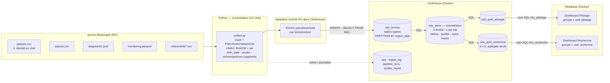

# PLAN.md — Entrepôt de Données de Santé (EDS) du CHU

> **Plan d'implémentation autosuffisant.** Ce document contient tout le contexte nécessaire : le besoin, le profilage complet des données sources (déjà réalisé — ne pas le refaire), les décisions d'architecture justifiées, les résultats des recherches techniques (versions, API, pièges), les spécifications détaillées de chaque composant, l'ordre d'implémentation et les critères d'acceptation. Le sujet officiel est dans `FICHE-SUJET.md`, les règles impératives dans `CLAUDE.md`.

---

## 1. Objectif et vision d'ensemble

Le CHU dépose chaque jour des fichiers hétérogènes (CSV, JSON, Parquet) dans `source-filestorage/` (lecture seule). On construit un EDS en architecture **médaillon** :

```
Filestorage (RO) → Lake (copie pseudonymisée) → Bronze (tables typées) → Silver (qualité) → Gold (KPI) → Metabase
```

Deux usages, **cloisonnés** : pilotage hospitalier et recherche clinique.

**Stack** : ClickHouse (Docker) = entrepôt · Python (uv) = orchestrateur · Metabase (Docker) = dashboards.

**Principes non négociables** (détaillés dans `CLAUDE.md`) :
- Toute transformation bronze→silver→gold est du **SQL exécuté dans ClickHouse**. Python copie des fichiers et envoie des requêtes, rien d'autre. Pas de pandas.
- **Aucune donnée identifiante n'entre dans l'entrepôt** : pseudonymisation à l'entrée du lake (bonus du sujet, à implémenter).
- **Idempotence** : relancer le pipeline ne duplique jamais rien.
- Les anomalies sont **écartées et tracées** (tables `*_rejets`), jamais corrigées ni supprimées en silence.

---

## 2. Profilage des données sources — RÉSULTATS COMPLETS (ne pas refaire)

3 jours de dépôt : `2026-08-26`, `2026-08-27`, `2026-08-28`. Arborescence : `source-filestorage/<domaine>/<AAAA-MM-JJ>/<fichier>`. Référentiels déposés uniquement le premier jour (`referentiels/2026-08-26/`).

### 2.1 `patients/<jour>/patients.csv` — ⚠ identité en clair

- Colonnes : `patient_id` (IPP0000000…), `nir`, `nom`, `prenom`, `birth_date` (ISO, toutes valides), `sex` (M/F, propre), `region_code` (8 départements IDF : 75,77,78,91,92,93,94,95).
- **Fichiers CUMULATIFS** : 4 800 lignes J1 → 5 400 J2 (les 4 800 de J1 + 600 nouveaux) → 6 000 J3. Aucun doublon intra-fichier, aucun champ modifié entre jours pour un même patient, aucune valeur manquante.
- → C'est **le** test de déduplication attendu : garder la version la plus récente (`argMax` sur le jour d'ingestion).
- Âges (en 2026) : 6 à 96 ans.

### 2.2 `sejours/<jour>/sejours.csv`

- Colonnes : `stay_id` (S00000001…), `patient_id`, `service_code`, `admission_ts`, `discharge_ts`, `admission_mode` (urgence/programme/mutation), `discharge_mode` (domicile/mutation/transfert/deces ou vide).
- 5 000 lignes/jour, **disjointes entre jours** (0 chevauchement de `stay_id`), admissions bornées au jour du fichier. Tous les `patient_id` existent dans patients, tous les `service_code` dans le référentiel. Timestamps tous parsables.
- **Anomalies à écarter** : `discharge_ts < admission_ts` → 44 + 50 + 42 = **136 séjours** (durées négatives ~-0,2 j).
- **Légitime, à conserver** : `discharge_ts` vide (séjour en cours) → 390 + 407 + 393 = 1 190 séjours.
- **À conserver avec NULL** : 1 992 séjours ont `discharge_ts` renseigné mais `discharge_mode` vide (et 0 cas inverse). Total `discharge_mode` vide : 3 182.
- Durées valides : 0 à 12 jours. 4 150 patients multi-séjours sur 5 366, max 10 séjours.
- ⚠ **Estimation de profilage à ne pas reprendre comme invariant** : un premier comptage donnait 491 réadmissions ≤ 30 j, sur données brutes et avec la définition naïve (« admission chronologiquement suivante »). Après nettoyage et avec la définition retenue (§9.1), le chiffre est **687**. Voir §9.1 pour l'explication de l'écart.
- **Anomalies « bonus » repérées** (à signaler/flaguer, pas à rejeter) : **220 séjours admis après un décès antérieur** du même patient.
- **Artefact de données synthétiques** : 8 362 séjours chevauchent le séjour précédent du même patient → **ne pas rejeter** (ce serait >50 % des données), documenter en limite du rapport.

### 2.3 `diagnostics/<jour>/diagnostics.json`

- Tableau JSON de `{stay_id, diagnostics: [{code_cim10, type}]}`. 5 000 séjours/jour, exactement **1 diagnostic `principal`** par séjour + 0–n `associe` (12 406 / 12 492 / 12 482 codes). 10 codes CIM-10 distincts, tous présents dans le référentiel. Tous les `stay_id` correspondent aux séjours du même jour. Aucun doublon. Données propres.

### 2.4 `monitoring/<jour>/monitoring.parquet` — le flux volumineux

- Colonnes : `stay_id` (String), `ts` (DateTime µs), `heart_rate` (int64), `spo2` (int64), `temp_c` (float64). 24 631 + 22 190 + 19 856 = **66 677 lignes**. Aucun NULL, aucun doublon `(stay_id, ts)` y compris inter-fichiers.
- Chaque fichier du jour J couvre **J → J+2** (relevés futurs des séjours admis le jour J) — pas un doublon pour autant.
- Seulement **2 services monitorés : REA et CARDIO** (1 506 séjours, ~48 relevés/séjour, un toutes les 30 min).
- **Anomalies à écarter** : **1 369 lignes (~2 %)** où FC **et** SpO2 sont hors plage **sur les mêmes lignes** (valeurs exactes : FC ∈ {0, 500}, SpO2 ∈ {0, 120}) → pattern « panne de capteur ». `temp_c` toujours dans [36.4, 40.0], jamais hors plage.
- **Anomalie « bonus »** : 520 relevés horodatés **après la sortie** du séjour (0 avant l'admission) → flaguer dans le rapport qualité, conserver.

### 2.5 `referentiels/2026-08-26/`

- `services.csv` : 8 services (CARDIO, URGENCES, PNEUMO, NEURO, ONCO, PEDIA, CHIR, REA) → libellés.
- `cim10.csv` : 10 codes (I21, J18, I50, E11, J44, I63, C34, N39, K35, F32) → libellés. Complets et propres.

### 2.6 Synthèse des règles qualité à implémenter en silver

| # | Règle | Traitement | Volume attendu |
|---|-------|------------|----------------|
| Q1 | Patients rejoués chaque jour (cumulatif) | Dédup `argMax(_ingest_date)` | 16 200 → 6 000 |
| Q2 | `discharge_ts < admission_ts` | **Rejet** → `sejours_rejets` | 136 |
| Q3 | `discharge_ts` vide | **Conserver** (séjour en cours) | 1 190 |
| Q4 | FC ∉ [20;250] ou SpO2 ∉ [50;100] ou temp ∉ [30;45] | **Rejet** → `monitoring_rejets` (raison par borne) | 1 369 |
| Q5 | `discharge_mode` vide avec sortie datée | Conserver, NULL | 1 992 |
| Q6 | Sexe normalisé, dates valides, codes dans les référentiels | Contrôles actifs (0 violation constatée, mais le contrôle tourne à chaque run) | 0 |
| Q7 | *(bonus)* Admission après décès antérieur | **Flag** `is_post_mortem_anomaly`, signalé au rapport qualité | 220 brut → **192** après nettoyage |
| Q8 | *(bonus)* Relevés monitoring après la sortie | **Flag** `is_after_discharge` (contrôle actif) | 520 brut → **0** après cascade |

> **Découverte à valoriser au rapport** : les 520 relevés « post-sortie » sont exactement les relevés des 136 séjours invalides (Q2) — une sortie antérieure à l'admission rend tout relevé « postérieur à la sortie ». Q8 est donc un **symptôme** de Q2 : après rejet en cascade des relevés de ces séjours, il reste **0** relevé post-sortie. Le flag est conservé comme contrôle actif (attendu 0 à chaque run). Chiffres définitifs post-nettoyage (recalculés, à utiliser comme invariants de test) : `fact_sejour` = **14 864** · `fact_diagnostic` = **37 040** (cascade : 340) · `fact_monitoring` = **64 799** (rejets : 1 878 = 1 369 hors plage + 520 cascade, dont 11 cumulant les deux raisons) · réadmissions ≤ 30 j = **687** sur **11 678** sorties éligibles (5,9 %) · relevés en alerte = **3 053** (4,7 %).

---

## 3. Décisions d'architecture (à justifier telles quelles dans le rapport)

| Décision | Choix | Justification |
|----------|-------|---------------|
| Entrepôt | **ClickHouse** | Colonne = taillé pour l'analytique et le volumineux (monitoring) ; SQL riche (window functions, `argMax`, `file()`) ; RBAC natif ; UI `:8123/play` ; conseillé par le sujet. |
| Chargement bronze | **`INSERT … SELECT FROM file(...)` dans ClickHouse** | Le lake est monté en volume RO dans le conteneur sous `user_files/` : les fichiers sont lus par le moteur lui-même (CSVWithNames, Parquet, JSON). Zéro donnée ne transite par la mémoire Python → pas d'anti-pattern pandas, ça passe à l'échelle. |
| Transformations | **SQL pur, fichiers versionnés `sql/`** | Exigence du sujet. Python = orchestrateur (envoi des requêtes via `clickhouse-connect`, driver officiel HTTP). |
| Modélisation silver | **Constellation Kimball : 3 étoiles, une par fait** — `fact_sejour`, `fact_diagnostic`, `fact_monitoring` — sur dimensions conformées `dim_patient`, `dim_service`, `dim_cim10` ; `stay_id` = **dimension dégénérée** portée par les 3 faits | Chaque fait forme sa propre étoile avec **ses** dimensions directes (FK propagées au build : `patient_pseudo` → fact_diagnostic, `service_code` → fact_monitoring) : chaque besoin métier = 1 fait × ses dimensions, **aucune jointure fact-to-fact** (anti-pattern Kimball). DMS/urgences/réadmissions → `fact_sejour` ⋆ ; alertes constantes → `fact_monitoring` ⋆ (dim_service) ; prévalence/cohortes/démographie → `fact_diagnostic` ⋆ (dim_patient, dim_cim10). Les libellés restent dans les dimensions. Pas de `dim_date` physique : fonctions temporelles ClickHouse (choix à justifier au rapport). |
| Incrémental | **Bronze partitionné par `_ingest_date`** + journal `ops.ingest_log` (checksum SHA-256 des fichiers sources) | Rejouer un jour = `ALTER TABLE … DROP PARTITION` puis rechargement → idempotent. Un jour déjà ingéré (même checksum) est sauté. |
| Silver/Gold | **Reconstruction complète à chaque run** (`CREATE OR REPLACE TABLE … AS SELECT`) | Déterministe, reproductible, trivial à ce volume (<100 k lignes, <2 s). La montée en charge (silver incrémental via `ReplacingMergeTree`) est documentée en évolution dans le rapport. |
| Pseudonymisation | **À l'entrée du lake**, en Python stdlib (streaming ligne à ligne) | Bonus du sujet : l'identité en clair ne quitte jamais `source-filestorage/`. HMAC-SHA256 avec sel secret → stable (jointures préservées) et non réversible. |
| Cloisonnement | **RBAC ClickHouse** (2 users SQL) + 2 connexions Metabase + 2 groupes Metabase | La sécurité est portée par le warehouse, pas seulement par l'outil de dataviz — démonstration forte pour l'évaluation. |
| Restitution | **Metabase v0.58 LTS**, dashboards **provisionnés par API** | Driver ClickHouse natif depuis Metabase 54 (aucun plugin). Provisioning API = « clone → `make demo` → tout est là », effet démo maximal. |
| Orchestration | **CLI Python `eds` (typer)** + cron | Simple, testable, rejouable ; cron documenté ; évolution Airflow/Dagster mentionnée au rapport. |

### Schéma d'architecture (à reprendre dans README et rapport, en Mermaid)



### Modèle de données

Le modèle de données complet (bronze typé, **silver en constellation** — 3 étoiles, une par fait au grain déclaré, sur dimensions conformées —, gold par usage, ops) est formalisé en PlantUML dans **`docs/data-model.puml`**, rendu en `docs/img/eds-data-model.png` (et `.svg`). Il fait foi pour les DDL : l'implémentation doit s'y conformer, et il doit être inclus dans le README et le rapport. Regénération : `plantuml -tpng -o img docs/data-model.puml`.

---

## 4. Arborescence cible du repo

```
.
├── README.md                  # quickstart, archi, démo — spec §14
├── CLAUDE.md                  # règles projet (existe déjà)
├── PLAN.md                    # ce document
├── FICHE-SUJET.md             # sujet (existe déjà)
├── .gitignore                 # existe déjà (source-filestorage/, data/, .env exclus)
├── .env.example               # toutes les variables, valeurs de démo
├── docker-compose.yml
├── Makefile                   # up, down, pipeline, provision, demo, test, reset, logs
├── pyproject.toml             # projet uv, Python ≥3.12 ; deps : clickhouse-connect, typer, requests ; dev : pytest, ruff
├── src/eds/
│   ├── __init__.py
│   ├── cli.py                 # typer : run, status, provision-warehouse, provision-metabase, reset, quality
│   ├── config.py              # lecture .env, validation fail-fast (sel manquant → erreur explicite)
│   ├── logging_setup.py       # console + logs/pipeline.log (RotatingFileHandler)
│   ├── pseudo.py              # HMAC-SHA256, généralisation date de naissance
│   ├── collect.py             # filestorage → lake (streaming stdlib csv/json/shutil)
│   ├── warehouse.py           # client clickhouse-connect, exécution des fichiers sql/, templating
│   ├── load_bronze.py         # DROP PARTITION + INSERT…SELECT FROM file() par (domaine, jour)
│   ├── transform.py           # exécute sql/20_silver puis sql/30_gold, écrit quality_report
│   ├── state.py               # ops.ingest_log / ops.pipeline_runs (découverte des jours à traiter, checksums)
│   └── metabase.py            # provisioning API Metabase (setup, dbs, groupes, users, permissions, cards, dashboards)
├── sql/
│   ├── 00_init/               # databases, tables ops, users chu_*, GRANTs (templaté pour les mots de passe)
│   ├── 10_bronze/             # DDL des tables bronze + requêtes d'insert par domaine
│   ├── 20_silver/             # étoile : dim_patient/dim_service/dim_cim10, fact_sejour/fact_diagnostic/fact_monitoring, rejets, contrôles qualité
│   └── 30_gold/               # kpi_* pilotage, cohorte_* recherche
├── scheduling/crontab.example
├── tests/
│   ├── test_pseudo.py         # déterminisme, non-réversibilité, format, généralisation année
│   ├── test_collect.py        # colonnes interdites absentes du lake, idempotence de copie
│   └── test_e2e.py            # (marqué integration, requiert docker) comptages attendus §2
├── docs/
│   ├── RAPPORT.md             # dossier Partie 1 — spec §14
│   └── EXPLOITATION.md        # doc Partie 2 : lancement, maintenance, reprise sur incident — spec §14
└── data/                      # gitignoré : lake/, clickhouse/, metabase/
```

---

## 5. Socle : `.env`, Docker Compose, Makefile

### 5.1 `.env.example` (le `.env` réel est gitignoré ; `make demo` le crée par copie si absent)

```dotenv
# Pseudonymisation — SECRET, ne jamais committer le .env réel. Générer : openssl rand -hex 32
EDS_SALT=change-me-64-hex-chars

# ClickHouse
CLICKHOUSE_HOST=localhost
CLICKHOUSE_PORT=8123
CLICKHOUSE_ETL_USER=chu_etl
CLICKHOUSE_ETL_PASSWORD=etl_change_me
CLICKHOUSE_PILOTAGE_PASSWORD=pilotage_change_me
CLICKHOUSE_RECHERCHE_PASSWORD=recherche_change_me

# Metabase (provisioning)
MB_URL=http://localhost:3000
MB_ADMIN_EMAIL=admin@chu.local
MB_ADMIN_PASSWORD=AdminChu2026!
MB_PILOTAGE_EMAIL=pilotage@chu.local
MB_PILOTAGE_PASSWORD=PilotageChu2026!
MB_RECHERCHE_EMAIL=recherche@chu.local
MB_RECHERCHE_PASSWORD=RechercheChu2026!

# Chemins
EDS_SOURCE_DIR=./source-filestorage
EDS_LAKE_DIR=./data/lake
```

### 5.2 `docker-compose.yml` — versions **vérifiées** (recherche du 2026-08-31)

- **ClickHouse : `clickhouse/clickhouse-server:26.3`** — LTS de mars 2026, mature (la 26.8 LTS vient de sortir fin août 2026, trop fraîche : 57 breaking changes).
- **Metabase : `metabase/metabase:v0.58.31`** — LTS (support → février 2027). Le driver ClickHouse est **natif depuis Metabase 54** (avril 2025) : **aucun plugin à installer**. Ne pas utiliser `:latest`.

```yaml
services:
  clickhouse:
    image: clickhouse/clickhouse-server:26.3
    container_name: eds-clickhouse
    environment:
      CLICKHOUSE_USER: ${CLICKHOUSE_ETL_USER}
      CLICKHOUSE_PASSWORD: ${CLICKHOUSE_ETL_PASSWORD}
      CLICKHOUSE_DEFAULT_ACCESS_MANAGEMENT: "1"   # permet à chu_etl de créer users/grants en SQL
    ports: ["8123:8123", "9000:9000"]
    volumes:
      - ./data/clickhouse:/var/lib/clickhouse
      - ./data/lake:/var/lib/clickhouse/user_files/lake:ro   # ← le moteur lit le lake via file()
    ulimits: { nofile: { soft: 262144, hard: 262144 } }
    healthcheck:
      test: ["CMD", "wget", "--no-verbose", "--tries=1", "--spider", "http://localhost:8123/ping"]
      interval: 5s
      timeout: 3s
      retries: 20

  metabase:
    image: metabase/metabase:v0.58.31
    container_name: eds-metabase
    ports: ["3000:3000"]
    environment:
      MB_DB_FILE: /metabase-data/metabase.db   # H2 embarqué persisté — suffisant en démo ; prod = Postgres (à noter au rapport)
    volumes:
      - ./data/metabase:/metabase-data
    depends_on:
      clickhouse: { condition: service_healthy }
    healthcheck:
      test: ["CMD", "curl", "-f", "http://localhost:3000/api/health"]
      interval: 10s
      timeout: 5s
      retries: 30
```

Points d'attention : dans Metabase, l'hôte ClickHouse est **`clickhouse`** (réseau Docker interne), port **8123**, alors que le CLI Python (hors Docker) parle à `localhost:8123`.

### 5.3 `Makefile`

```
make up         # docker compose up -d + attente healthy + eds provision-warehouse
make pipeline   # uv run eds run          (incrémental : jours non ingérés uniquement)
make provision  # uv run eds provision-metabase
make demo       # cp -n .env.example .env → up → pipeline → provision → affiche les URLs + comptes de démo
make test       # uv run pytest -m "not integration"  (+ cible test-e2e)
make reset      # down -v + rm -rf data/ (avec confirmation)
make logs       # docker compose logs -f
```

---

## 6. Étape 1 — Collecte + pseudonymisation (`collect.py`, `pseudo.py`)

**Rôle** : pour chaque `(domaine, jour)` présent dans `source-filestorage/` et absent (ou modifié) du journal d'ingestion, copier vers `data/lake/<domaine>/<jour>/` en appliquant la pseudonymisation. Lecture seule stricte sur la source. Stdlib uniquement (`csv`, `json`, `hmac`, `hashlib`, `shutil`), traitement en streaming ligne à ligne (jamais de fichier entier en mémoire → tient la charge).

**Pseudonymisation (`pseudo.py`)** — cœur du bonus :

```python
def pseudonymize_id(patient_id: str, salt: str) -> str:
    """HMAC-SHA256 tronqué : déterministe (jointures stables), non réversible sans le sel."""
    digest = hmac.new(salt.encode(), patient_id.encode(), hashlib.sha256).hexdigest()
    return f"P{digest[:16]}"
```

- `EDS_SALT` obligatoire (≥ 32 caractères) → sinon **échec immédiat avec message explicite**, on ne collecte rien. Le sel n'apparaît jamais dans les logs.
- Justification à reprendre au rapport : HMAC ≻ simple `sha256(salt+id)` (construction standard, résiste aux attaques par extension de longueur) ; troncature 64 bits = risque de collision négligeable pour 6 000 patients (≈ 10⁻¹²).

**Transformations par domaine à l'entrée du lake** :

| Domaine | Traitement |
|---------|-----------|
| `patients` | `patient_id`→`patient_pseudo` (HMAC) ; `birth_date`→`birth_year` (généralisation) ; **`nir`, `nom`, `prenom` : supprimés** ; `sex`, `region_code` conservés (minimisation : le reste ne sert pas les usages). En-tête de sortie : `patient_pseudo,birth_year,sex,region_code`. |
| `sejours` | `patient_id`→`patient_pseudo` (même HMAC → jointure préservée) ; autres colonnes inchangées. |
| `diagnostics`, `monitoring`, `referentiels` | Copie verbatim (`shutil.copyfile`) — aucune donnée identifiante (seulement `stay_id`). |

**Traçabilité** : checksum SHA-256 du fichier **source** calculé et transmis à `state.py` (sert de clé d'idempotence dans `ops.ingest_log`). Écriture atomique dans le lake (fichier `.tmp` puis `rename`) pour éviter les fichiers tronqués en cas de crash.

**Test clé (`test_collect.py`)** : après collecte, `grep`-équivalent sur le lake → aucune des chaînes d'en-tête `nir`, `nom`, `prenom`, `birth_date`, aucun motif `IPP\d+` dans `patients.csv`/`sejours.csv` du lake.

---

## 7. Étape 2 — Bronze (`load_bronze.py`, `sql/10_bronze/`)

**Principe** : ClickHouse lit lui-même le lake (monté sous `user_files/lake`) via la fonction table `file()` — formats `CSVWithNames`, `Parquet`, `JSONAsString` (vérifié : `file()` lit sous `user_files_path`, `/var/lib/clickhouse/user_files` par défaut dans l'image officielle).

**DDL** — toutes les tables bronze : `ENGINE = MergeTree`, **`PARTITION BY _ingest_date`**, colonnes de lignage `_source_file String`, `_ingest_date Date`, `_loaded_at DateTime DEFAULT now()`.

| Table | Colonnes métier | ORDER BY |
|-------|-----------------|----------|
| `eds_bronze.patients` | `patient_pseudo String, birth_year UInt16, sex LowCardinality(String), region_code LowCardinality(String)` | `(patient_pseudo)` |
| `eds_bronze.sejours` | `stay_id String, patient_pseudo String, service_code LowCardinality(String), admission_ts DateTime, discharge_ts Nullable(DateTime), admission_mode LowCardinality(String), discharge_mode LowCardinality(Nullable(String))` | `(stay_id)` |
| `eds_bronze.diagnostics` | `stay_id String, code_cim10 LowCardinality(String), diag_type LowCardinality(String)` | `(stay_id, code_cim10)` |
| `eds_bronze.monitoring` | `stay_id String, ts DateTime, heart_rate Int32, spo2 Int32, temp_c Float32` | `(stay_id, ts)` |
| `eds_bronze.services` / `eds_bronze.cim10` | référentiels tels quels | code |

**Chargement idempotent d'un `(domaine, jour)`** — séquence exécutée par `load_bronze.py` :

```sql
ALTER TABLE eds_bronze.sejours DROP PARTITION '{ingest_date}';  -- no-op si absente
INSERT INTO eds_bronze.sejours
SELECT stay_id, patient_pseudo, service_code,
       parseDateTimeBestEffort(admission_ts)            AS admission_ts,
       parseDateTimeBestEffortOrNull(discharge_ts)      AS discharge_ts,
       lowerUTF8(admission_mode)                        AS admission_mode,
       nullIf(lowerUTF8(discharge_mode), '')            AS discharge_mode,
       'lake/sejours/{ingest_date}/sejours.csv'         AS _source_file,
       toDate('{ingest_date}')                          AS _ingest_date,
       now()                                            AS _loaded_at
FROM file('lake/sejours/{ingest_date}/sejours.csv', 'CSVWithNames',
          'stay_id String, patient_pseudo String, service_code String,
           admission_ts String, discharge_ts String, admission_mode String, discharge_mode String');
```

(Lire les colonnes en `String` puis typer explicitement en SQL = le typage est un acte de la couche bronze, tracé et testable ; une date invalide devient NULL au lieu de faire échouer le fichier entier.)

- `monitoring` : `FROM file('lake/monitoring/{d}/monitoring.parquet', 'Parquet')` — schéma lu nativement.
- `diagnostics` (JSON imbriqué, **aplati en SQL**) — approche A à tester en premier :

```sql
INSERT INTO eds_bronze.diagnostics
SELECT JSONExtractString(json, 'stay_id')       AS stay_id,
       JSONExtractString(diag, 'code_cim10')    AS code_cim10,
       JSONExtractString(diag, 'type')          AS diag_type,
       ... lignage ...
FROM (
  SELECT json, arrayJoin(JSONExtractArrayRaw(json, 'diagnostics')) AS diag
  FROM file('lake/diagnostics/{d}/diagnostics.json', 'JSONAsString', 'json String')
);
```

`JSONAsString` interprète un fichier `[{…},{…}]` comme une ligne par objet. **Fallback B** (si le tableau englobant pose problème sur cette version) : `collect.py` aplatit le JSON en NDJSON (une ligne = un objet, stdlib `json`) et bronze lit en `JSONEachRow`. Tester A, basculer sur B seulement si nécessaire — documenter le choix retenu.

Après chaque insert : `SELECT count()` de contrôle sur la partition, comparé au nombre de lignes du fichier, enregistré dans `ops.ingest_log`.

---

## 8. Étape 3 — Silver : constellation en étoiles (`sql/20_silver/`)

Silver est modélisé en **constellation Kimball** : **3 étoiles, une par table de faits** (grain déclaré), partageant des **dimensions conformées**. Chaque fait porte directement les FK de **ses** dimensions — propagées au build silver depuis le séjour (`patient_pseudo` dans `fact_diagnostic`, `service_code` dans `fact_monitoring`) — si bien que chaque question du besoin métier se résout par **1 fait × ses dimensions, sans jointure fact-to-fact** (anti-pattern Kimball). `stay_id` reste dans les 3 faits comme **dimension dégénérée** (identifiant sans table de dimension) : c'est elle qui relie logiquement les étoiles (drill-across). Cf. tableau de mapping §9.0. Reconstruction complète à chaque run : `CREATE OR REPLACE TABLE eds_silver.x ENGINE = MergeTree ORDER BY … AS SELECT …`. Chaque règle Q1→Q8 (§2.6) est implémentée ici ; chaque rejet part dans une table `*_rejets` avec `reject_reason` et le lignage complet.

**Ordre de build obligatoire** : dimensions → `fact_sejour` (+ `sejours_rejets`) → puis `fact_diagnostic` et `fact_monitoring` (leurs FK propagées et leurs cascades `parent_stay_rejected` dépendent de `fact_sejour`).

### Dimensions

**`eds_silver.dim_patient`** (Q1) — dimension conformée (partagée pilotage/recherche), déduplication « dernière version » :

```sql
SELECT patient_pseudo,
       argMax(birth_year, _ingest_date)  AS birth_year,
       argMax(upper(sex), _ingest_date)  AS sex,
       argMax(region_code, _ingest_date) AS region_code,
       max(_ingest_date)                 AS last_seen_ingest_date
FROM eds_bronze.patients GROUP BY patient_pseudo
-- attendu : 6 000 lignes (16 200 en bronze)
```

**`eds_silver.dim_service`** et **`eds_silver.dim_cim10`** : reprise des référentiels bronze (code → libellé). Les libellés vivent **dans les dimensions**, pas dénormalisés dans les faits : le modèle reste une constellation lisible ; à ce volume les jointures gold sont triviales (la dénormalisation resterait une simple optimisation physique, à mentionner au rapport). Pas de `dim_date` physique : les fonctions temporelles ClickHouse en tiennent lieu (choix justifié au rapport).

### Faits

**`eds_silver.fact_sejour`** — *grain : 1 séjour hospitalier* (Q2, Q3, Q5, Q7). ⋆ Étoile 1. FK : `patient_pseudo` → dim_patient, `service_code` → dim_service ; `stay_id` = PK et dimension dégénérée.
- Rejet si `discharge_ts IS NOT NULL AND discharge_ts < admission_ts` → `eds_silver.sejours_rejets` (`reject_reason = 'discharge_before_admission'`). Attendu : 136 → **fact_sejour = 14 864**.
- Conservés : `discharge_ts` NULL (`is_ongoing = 1`) et `discharge_mode` NULL.
- Mesure & flags : `duree_heures` / `duree_jours` (NULL si en cours), `is_deces`, flag `is_post_mortem_anomaly` (admission postérieure au premier décès du patient — window `min(discharge_ts) FILTER deces` par patient). Attendu flag : **192** (220 sur données brutes ; recalculé sur les séjours conservés).

**`eds_silver.fact_diagnostic`** — *grain : 1 diagnostic posé sur 1 séjour* ; **fait sans mesure (factless)**, il sert aux comptages de cohortes. ⋆ Étoile 3. FK : `patient_pseudo` → dim_patient (**propagée** depuis le séjour au build), `code_cim10` → dim_cim10 ; `stay_id` en dimension dégénérée ; `diag_type` (principal/associé). Contrôle actif « code absent du référentiel » (attendu 0, mais tracé) ; les diagnostics d'un séjour rejeté sont écartés en cascade (raison `parent_stay_rejected`). Attendu : cascade **340** → **fact_diagnostic = 37 040** (37 380 en bronze).

**`eds_silver.fact_monitoring`** — *grain : 1 relevé de constantes* (Q4, Q8). ⋆ Étoile 2. FK : `service_code` → dim_service (**propagée** depuis le séjour au build — sert directement « alertes / jour / service ») ; `stay_id` en dimension dégénérée (REA & CARDIO uniquement, de fait). Minimisation : pas de `patient_pseudo` ici, aucun besoin métier ne l'exige.
- Rejet hors plage physiologique, **une raison précise par ligne** (`hr_out_of_range` / `spo2_out_of_range` / `temp_out_of_range`) → `eds_silver.monitoring_rejets`. Attendu : 1 369.
- Rejet **en cascade** des relevés dont le séjour parent est rejeté (`parent_stay_rejected` — nécessaire aussi pour la propagation de `service_code`). Attendu : 520, dont 11 cumulant déjà une raison hors-plage (raisons concaténées). **Total rejets = 1 878 → fact_monitoring = 64 799**.
- Flags d'alerte métier sur les lignes valides (seuils **hypothèses documentées** au rapport) : `alert_hr = hr < 40 OR hr > 130`, `alert_spo2 = spo2 < 90`, `alert_temp = temp_c >= 38.5`, `is_alert = OR` des trois. Attendu : **3 053 relevés en alerte (4,7 %)**.
- Flag `is_after_discharge` (join fact_sejour au build). **Attendu : 0** — les 520 relevés post-sortie du profilage appartenaient tous aux séjours invalides (cf. note §2.6) ; le flag reste comme contrôle actif.

**Rapport qualité** : après le build silver, `transform.py` exécute une requête de comptage par règle et insère dans `ops.quality_report` (run_id, layer, table, rule, rule_label, **rows_in, rows_kept, rows_rejected, rows_flagged**, details, checked_at). Les quatre compteurs sont distincts à dessein : une règle de **rejet** retire des lignes (`rows_rejected`), une règle de **signalement** les conserve en les marquant (`rows_flagged`), un **contrôle** est attendu à zéro. Les confondre rendrait le rapport ambigu — or c'est lui qui matérialise le critère « justifier chaque chiffre ».

---

## 9. Étape 4 — Gold (`sql/30_gold/`) — définitions exactes des KPI

### 9.0 Mapping besoin métier → modèle (l'argument central du rapport)

| Besoin métier (sujet §4) | Fait / dimension source | Table gold |
|---|---|---|
| DMS par service | `fact_sejour` × `dim_service` | `kpi_dms_service` |
| Passages urgences / jour | `fact_sejour` | `kpi_urgences_jour` |
| Taux de réadmission 30 j | `fact_sejour` (window par `patient_pseudo`) | `kpi_readmissions_30j` |
| Relevés en alerte / jour | `fact_monitoring` × `dim_service` (FK directe, pas de jointure fait-à-fait) | `kpi_alertes_monitoring` |
| Autres vues d'activité | `fact_sejour` | `kpi_activite_service`, `kpi_flux` |
| Prévalence / taille de cohortes | `fact_diagnostic` × `dim_cim10` × `dim_patient` | `cohorte_pathologie`, `prevalence_pathologie` |
| Description de cohorte (âge × sexe) | `fact_diagnostic` × `dim_patient` | `cohorte_demographie` |

### 9.1 `eds_gold_pilotage` (agrégats, aucune ligne patient)

| Table | Grain | Définition |
|-------|-------|------------|
| `kpi_dms_service` | service × jour de sortie | DMS = `avg(duree_heures)/24` sur séjours **terminés et valides** ; + `nb_sorties`. |
| `kpi_urgences_jour` | jour | `nb_passages_service_urgences` (admissions `service_code='URGENCES'`) et `nb_admissions_mode_urgence` (tous services, `admission_mode='urgence'`) — les deux lectures existent, les afficher côte à côte. |
| `kpi_readmissions_30j` | service × jour de sortie | Dénominateur : sorties vivantes (`discharge_ts` non NULL, `discharge_mode != 'deces'`). Numérateur : les séjours pour lesquels il existe **une** admission du même patient postérieure à la sortie et située dans les 30 jours — `arrayExists` sur `groupArray(admission_ts) OVER (PARTITION BY patient_pseudo)`. ⚠ **Ne pas** utiliser `leadInFrame` (admission chronologiquement suivante) : avec les nombreux séjours qui se chevauchent, l'admission « suivante » est souvent un séjour concurrent antérieur à la sortie, qui masque la réadmission réelle (370 au lieu de 687). Attendu global (sur fact_sejour nettoyé) : **687 réadmissions / 11 678 sorties éligibles = 5,9 %**. |
| `kpi_alertes_monitoring` | jour × service | `nb_releves`, `nb_alertes` (+ détail FC/SpO2/temp), `pct_alertes`. Seulement REA/CARDIO par construction. |
| `kpi_activite_service` | jour × service | admissions, sorties, décès, séjours en cours en fin de journée. |
| `kpi_flux` | jour × mode | répartition admission_mode et discharge_mode. |
| `kpi_qualite_pipeline` | run × règle | copie exposable de `ops.quality_report` → le dashboard pilotage montre la fiabilité des chiffres. |

### 9.2 `eds_gold_recherche` — agrégats **uniquement**, k-anonymat partout

Règle absolue : **chaque table applique `HAVING uniqExact(patient_pseudo) >= 5`** (par ligne de résultat = par cellule diffusée) ; les âges sont diffusés en **tranches de 10 ans** (`intDiv(toYear(today()) - birth_year, 10)*10`, libellé `'40-49'` — âge à date d'extraction, jamais `2026` en dur), calculés depuis `birth_year` (la date complète n'existe d'ailleurs plus). Le nombre de cellules supprimées par k-anonymat est compté et versé au rapport qualité (preuve que le mécanisme fonctionne).

| Table | Grain | Contenu |
|-------|-------|---------|
| `cohorte_pathologie` | code CIM-10 | libellé, type (principal/associé/tous), `nb_patients` (distincts), `nb_sejours` — HAVING k≥5. |
| `prevalence_pathologie` | code CIM-10 | `nb_patients`, `pct` sur le total des patients distincts de fact_sejour (dénominateur calculé à part — agrégat, pas de jointure fait-à-fait). |
| `cohorte_demographie` | CIM-10 × sexe × tranche d'âge | `nb_patients` — HAVING k≥5 par cellule. ⚠ Constaté au profilage : à ce grain **aucune cellule < 5** (cohortes ~2 700 patients, 200 cellules toutes ≥ 5) — la règle est active mais invisible. |
| `cohorte_demographie_region` | CIM-10 × sexe × tranche d'âge × département | `nb_patients` — HAVING k≥5. **C'est ici que la suppression se démontre : 4 cellules sur 1 600 tombent sous k=5 et sont supprimées** (min constaté : 3 patients). À montrer au dashboard et au rapport comme preuve vivante du mécanisme. |

### 9.3 Sécurité (fin de `sql/00_init/`, rejoué à chaque `provision-warehouse`, idempotent)

```sql
CREATE USER IF NOT EXISTS chu_pilotage IDENTIFIED WITH sha256_password BY '{pwd}';
GRANT SELECT ON eds_gold_pilotage.* TO chu_pilotage;
CREATE USER IF NOT EXISTS chu_recherche IDENTIFIED WITH sha256_password BY '{pwd}';
GRANT SELECT ON eds_gold_recherche.* TO chu_recherche;
-- et rien d'autre : ni bronze, ni silver, ni ops, ni l'autre gold.
```

(Vérifié : les GRANT par base/table persistent après `CREATE OR REPLACE TABLE`. `chu_etl` a les droits d'admin via `CLICKHOUSE_DEFAULT_ACCESS_MANAGEMENT=1`.)
Preuve de cloisonnement à mettre au rapport : `SHOW GRANTS FOR chu_recherche` + capture d'une requête `SELECT * FROM eds_gold_pilotage.kpi_dms_service` refusée (`ACCESS_DENIED`) pour ce user.

---

## 10. Étape 5 — Metabase : provisioning automatique (`metabase.py`)

Résultats de recherche **vérifiés** (2026-08-31) — flux et pièges :

1. **Attendre** `GET /api/health` = ok (boucle avec timeout ~180 s, Metabase démarre lentement).
2. **Setup initial** : `GET /api/session/properties` → champ `setup-token` ; `POST /api/setup` avec `{token, user:{email, password, first_name,…}, prefs:{site_name}, database: null}` → retourne une session. **Piège** : ne marche qu'une fois par instance ; si l'instance est déjà configurée, se connecter via `POST /api/session {username, password}` à la place → header `X-Metabase-Session` partout ensuite. Le provisioning doit être **idempotent** : chaque création est précédée d'un check par nom/email (GET liste), on met à jour au lieu de dupliquer.
3. **Connexions** : `POST /api/database` ×2, `engine: "clickhouse"` (driver natif, aucun plugin) :
   - « EDS Pilotage » → `details: {host: "clickhouse", port: 8123, user: "chu_pilotage", password, dbname: "eds_gold_pilotage"}`
   - « EDS Recherche » → user `chu_recherche`, dbname `eds_gold_recherche`.
   Deux connexions distinctes vers le même serveur avec deux users SQL = pattern officiellement supporté ; chaque connexion est un objet de permission indépendant.
4. **Groupes & users** : `POST /api/permissions/group` (« Pilotage », « Recherche ») ; `POST /api/user` avec `group_ids` (pilotage@chu.local, recherche@chu.local).
5. **Permissions données** : `GET /api/permissions/graph` → modifier → `PUT /api/permissions/graph`. **Pièges vérifiés** : (a) renvoyer le graphe avec la `revision` fraîchement lue, sinon **409 Conflict** — toujours re-GET juste avant le PUT ; (b) format interne non documenté/stable → coder défensivement (log du graphe avant/après, échec propre). Cible : groupe Pilotage = accès complet sur la base 1 seulement, groupe Recherche = base 2 seulement, groupe « All Users » = aucun accès données.
6. **Cards & dashboards** : `POST /api/card` par KPI en **SQL natif** (`dataset_query: {type:"native", native:{query:"SELECT …"}, database: <id>}`) ; `POST /api/dashboard` ×2 ; puis **`PUT /api/dashboard/:id` avec le champ `dashcards`** (tableau complet : `card_id, row, col, size_x, size_y`) — **ne pas utiliser** `PUT /api/dashboard/:id/cards`, déprécié.

### Contenu des dashboards (≥ 2, exigés par le sujet)

**« 🏥 Pilotage hospitalier »** (grille 24 colonnes ; requêtes = simples `SELECT` sur les tables gold, la logique reste dans le warehouse) :
1. Tuiles de synthèse (row 0) : total séjours · DMS globale (j) · taux réadmission 30 j · % relevés en alerte.
2. Barres : DMS par service (tri décroissant).
3. Courbe : passages aux urgences par jour (2 séries : service URGENCES / mode urgence).
4. Courbe : relevés en alerte par jour, ventilé REA/CARDIO.
5. Barres empilées : admissions par mode et par jour ; + répartition des modes de sortie.
6. Table : activité par service (admissions/sorties/décès/en cours).
7. Table : rapport qualité du dernier run (règle, rejets, gardés) — « chaque chiffre est justifié ».

**« 🔬 Recherche clinique »** :
1. Barres : taille des cohortes par pathologie (libellés CIM-10) — note affichée : « cohortes < 5 patients non diffusées (RGPD) ».
2. Barres : prévalence (% patients) par pathologie.
3. Pyramide/barres groupées : distribution sexe × tranche d'âge, filtrable par pathologie (paramètre de dashboard mappé sur la variable de la card).
4. Table : cohorte_demographie complète (cellules k≥5 uniquement).
5. Table : cohorte_demographie_region + tuile « cellules supprimées (k<5) : 4/1 600 » — la preuve visible que le k-anonymat s'applique.

**Démonstration du cloisonnement** (à scénariser dans le rapport + README) : connexion `pilotage@chu.local` → ne voit que le dashboard/la base Pilotage ; `recherche@chu.local` → l'inverse. Le cloisonnement est double : permissions Metabase **et** GRANTs ClickHouse (même un SQL natif écrit à la main par le user recherche ne peut pas toucher pilotage — c'est le user SQL sous-jacent qui bloque).

---

## 11. Étape 6 — Orchestration, CLI, journalisation, erreurs (Partie 2)

**CLI `eds` (typer)** — commandes :

| Commande | Comportement |
|----------|--------------|
| `eds run` | **Incrémental** : découvre les `(domaine, jour)` de la source absents de `ops.ingest_log` (ou de checksum différent) → collect → bronze → rebuild silver+gold → rapport qualité. Sans nouveau jour : « rien à faire », exit 0. |
| `eds run --date 2026-08-27` | Rejoue un jour précis (DROP PARTITION + recharge) — reprise sur incident. |
| `eds run --full-refresh` | Rejoue tous les jours depuis la source. |
| `eds status` | Tableau : jours ingérés par domaine, dernier run, comptages bronze/silver/gold, derniers rejets. |
| `eds provision-warehouse` / `eds provision-metabase` | Idempotents (rejouables à volonté). |
| `eds quality` | Affiche le dernier rapport qualité. |
| `eds reset --yes` | Truncate warehouse + purge lake (garde source). |

**Tables ops** (créées par `00_init`) :
- `ops.ingest_log` : `domain, ingest_date, source_file, sha256, rows_source, rows_loaded, status ('success'|'failed'), error, started_at, finished_at`.
- `ops.pipeline_runs` : `run_id (UUID), started_at, finished_at, status, days_processed, error`.
- `ops.quality_report` : `run_id, layer, table_name, rule, rule_label, rows_in, rows_kept, rows_rejected, rows_flagged, details, checked_at` — cf. §8.

**Gestion des erreurs** :
- Échec sur un `(domaine, jour)` → loggé + `ingest_log.status='failed'` ; le run **continue** sur les autres domaines ; statut final du run = `failed` ; **exit code ≠ 0** (le cron peut alerter). Silver/gold ne sont reconstruits que si au moins un chargement a réussi et jamais à partir d'un bronze partiellement chargé pour le jour en échec (la partition en échec est re-drop-ée avant retry).
- Reprise = relancer `eds run` (les jours en `failed` sont re-tentés d'office) ou `eds run --date <jour>`. Grâce au DROP PARTITION, **aucun état intermédiaire à nettoyer à la main** — c'est LE point de la doc « reprise sur incident ».
- Fichier source illisible/tronqué : erreur isolée à ce domaine/jour, message explicite avec le chemin.

**Journalisation** : `logging` stdlib, double sortie console (INFO) + `logs/pipeline.log` (DEBUG, RotatingFileHandler 5×5 Mo). Chaque ligne : timestamp, run_id, étape, domaine/jour, comptages. Jamais de donnée patient ni de sel dans les logs.

**Planification** : `scheduling/crontab.example` :
```cron
# Ingestion quotidienne EDS — 02h05, après le dépôt du CHU
5 2 * * * cd /chemin/vers/projet && /usr/bin/make pipeline >> logs/cron.log 2>&1
```
Documenter dans EXPLOITATION.md : installation (`crontab -e`), supervision (exit code + `eds status`), et l'évolution naturelle vers Airflow/Dagster si le nombre de sources croît.

---

## 12. Étape 7 — Tests (`tests/`)

- `test_pseudo.py` : même entrée+sel → même pseudo (déterminisme) ; sels différents → pseudos différents ; format `P[0-9a-f]{16}` ; `birth_year` correct ; sel absent/court → exception explicite.
- `test_collect.py` : sur un mini-fixture CSV (3 lignes inventées, dans `tests/fixtures/`) → le fichier lake ne contient ni `nir` ni `nom` ni `prenom` ni motif `IPP\d+` ; recollecte → contenu identique (déterminisme).
- `test_e2e.py` (`@pytest.mark.integration`, requiert `make up` + pipeline exécuté) : vérifie les invariants recalculés (§2.6, note) — dim_patient = 6 000 ; fact_sejour = 14 864 (rejets 136) ; fact_diagnostic = 37 040 (cascade 340) ; fact_monitoring = 64 799 (rejets 1 878) ; flags : post-mortem 192, after_discharge 0 ; réadmissions 687 / 11 678 ; alertes 3 053 ; `cohorte_demographie_region` = 1 596 cellules diffusées (4 supprimées) ; aucune table recherche avec `nb_patients < 5` ; `SELECT` sur `eds_gold_pilotage` avec le user `chu_recherche` → `ACCESS_DENIED`.
- Lint : `ruff check` + `ruff format --check` dans `make test`.

---

## 13. Ordre d'implémentation et critères d'acceptation

| Phase | Contenu | Fait quand… |
|-------|---------|-------------|
| **P1 Socle** | pyproject (uv), .env.example, docker-compose, Makefile, config.py, logging_setup.py | `make up` → ClickHouse et Metabase healthy ; `uv run eds --help` répond. |
| **P2 Collecte** | pseudo.py, collect.py + tests unitaires | `uv run pytest` vert ; lake produit ; zéro donnée identifiante dedans (test automatisé). |
| **P3 Bronze** | 00_init (databases+ops), 10_bronze, warehouse.py, load_bronze.py, state.py | `eds run` charge les 3 jours ; relancer → « rien à faire » ; comptages bronze = totaux §2 ; `eds run --date` rejoue sans doublon. |
| **P4 Silver** | 20_silver (constellation : 3 dims + 3 faits, ordre de build §8) + quality_report | Comptages exacts (§2.6, note) : dim_patient 6 000, fact_sejour 14 864, fact_diagnostic 37 040, fact_monitoring 64 799, rejets 136/340 en cascade/1 878, flags 192/0 ; `eds quality` les affiche. |
| **P5 Gold + RBAC** | 30_gold, users/GRANTs | KPI cohérents (réadmissions 687/11 678 = 5,9 % ; alertes 3 053) ; `chu_recherche` ne lit pas pilotage (testé) ; aucune cohorte < 5 diffusée (4 cellules supprimées sur la vue fine par département). |
| **P6 Metabase** | metabase.py + les 2 dashboards | `make demo` de zéro → URLs affichées ; login pilotage/recherche → chacun ne voit que son univers ; les 2 dashboards remplis. |
| **P7 Docs** | README, docs/RAPPORT.md, docs/EXPLOITATION.md, crontab.example | Cf. spec §14 ; un lecteur qui clone et suit le README arrive au même résultat. |
| **P8 Finitions** | test_e2e, ruff, relecture, screenshots dans docs/img/ | `make test` vert ; `make reset && make demo` repasse de bout en bout. |

Commits : Conventional Commits, un commit par phase minimum (`feat(collect): …`, `feat(silver): …`, `docs(rapport): …`).

---

## 14. Spécification des documents à produire

**`README.md`** (vitrine — soigné, en français) : badge stack ; pitch 3 lignes ; schéma Mermaid (§3) ; **Quickstart** (`git clone` → `cp .env.example .env` → générer le sel → `make demo` → URLs + les 3 comptes Metabase de démo) ; tableau des commandes ; structure du repo ; lien vers RAPPORT.md et EXPLOITATION.md ; section RGPD résumée.

**`docs/RAPPORT.md`** (dossier Partie 1 — le document noté ; viser exhaustif et argumenté) :
1. Contexte et analyse du besoin (deux usages, deux publics, contrainte RGPD art. 9).
2. Sources de données : dictionnaire + **résultats du profilage** (§2, avec les chiffres).
3. Architecture : schéma, rôle de chaque couche, **modèle silver en constellation** (diagramme `docs/img/eds-data-model.png`, grains déclarés, dimension dégénérée `stay_id`, mapping besoin→fait du §9.0), **tableau de justification des choix** (§3), volumétrie et passage à l'échelle (pourquoi ClickHouse/colonne pour le monitoring ; pourquoi pas pandas).
4. Traitements : pseudonymisation (mécanisme HMAC, pourquoi c'est stable et non réversible), règles qualité Q1→Q8 avec volumes constatés, lignage.
5. Indicateurs : définition **précise** de chaque KPI (formules du §9, hypothèses de seuils d'alerte, définition retenue de la réadmission et des passages urgences).
6. Restitution : les 2 dashboards commentés (captures), démonstration du cloisonnement (captures : mêmes URL, deux users, contenus différents + ACCESS_DENIED côté SQL).
7. Gouvernance RGPD : minimisation (colonnes supprimées ; pas de `patient_pseudo` dans fact_monitoring), pseudonymisation, cloisonnement, k≥5 (preuve chiffrée : 4 cellules supprimées sur 1 600 dans `cohorte_demographie_region`, 0 aux grains plus grossiers), traçabilité (ops.*), registre des hypothèses.
8. Limites & recommandations : données synthétiques (séjours chevauchants, 220 post-décès), H2 Metabase → Postgres en prod, secrets → vault, cron → orchestrateur, monitoring → ingestion streaming si le volume explose, TTL/purge et DPO à associer.

**`docs/EXPLOITATION.md`** (Partie 2) : prérequis ; premier lancement pas à pas ; exploitation quotidienne (cron) ; lecture des logs et de `eds status` ; **runbook reprise sur incident** (tableau symptôme → cause probable → remède : échec d'un jour, conteneur down, fichier corrompu, re-provisioning Metabase, reset complet) ; maintenance (mise à jour d'images, sauvegarde des volumes, rotation du sel = interdite sans re-pseudonymisation complète — l'expliquer).

---

## 15. Couverture des critères d'évaluation (à vérifier avant rendu)

| Critère du sujet | Où c'est couvert |
|---|---|
| Analyse du besoin | RAPPORT §1 ; deux gold distincts calqués sur les deux usages |
| Architecture | Médaillon complet, silver en constellation Kimball (3 étoiles, grains déclarés), schéma Mermaid + PlantUML, tableau de justifications (§3), stack conseillée respectée |
| Qualité des traitements | Q1→Q8 en SQL, tables de rejets, rapport qualité chiffré à chaque run |
| Fiabilité des indicateurs | Définitions formelles (§9), invariants testés (test_e2e §12), kpi_qualite_pipeline visible au dashboard |
| Restitution | 2 dashboards provisionnés automatiquement, adaptés à chaque public |
| Automatisation | CLI incrémentale idempotente, cron, gestion d'erreurs, exit codes, logs, ops.* |
| RGPD / gouvernance | Pseudonymisation à l'entrée du lake (bonus ★), minimisation, RBAC double niveau, k≥5, traçabilité complète |
| Documentation | README + RAPPORT + EXPLOITATION + CLAUDE.md + ce plan |

---

## 16. Aide-mémoire des faits techniques vérifiés (recherche web du 2026-08-31)

- Driver ClickHouse **natif dans Metabase depuis la v54** (avril 2025) ; images actuelles v0.63.x ; **LTS = v0.58.31** (support → 17/02/2027). Pas de plugin à installer.
- ClickHouse LTS : **26.3** (mars 2026, recommandé) ; 26.8 sortie fin août 2026 (trop récente, 57 breaking changes).
- API Metabase : auth `POST /api/session` → header `X-Metabase-Session` ; setup one-shot via `setup-token` de `GET /api/session/properties` ; permissions = `GET` puis `PUT /api/permissions/graph` **avec la revision fraîche** (sinon 409) ; dashboards = `PUT /api/dashboard/:id` champ **`dashcards`** (l'endpoint `…/cards` est déprécié) ; granularité par base entière suffit ici et fonctionne en OSS ; deux connexions vers le même serveur avec deux users SQL = supporté.
- ClickHouse : `file()` lit sous `user_files_path` (`/var/lib/clickhouse/user_files`), formats `CSVWithNames`/`Parquet`/`JSONAsString` ; `ALTER TABLE … DROP PARTITION` = idempotence des chargements (alternative atomique : `REPLACE PARTITION`) ; RBAC `CREATE USER … IDENTIFIED WITH sha256_password` + `GRANT SELECT ON db.*` ; env Docker `CLICKHOUSE_USER/PASSWORD` + `CLICKHOUSE_DEFAULT_ACCESS_MANAGEMENT=1`.
