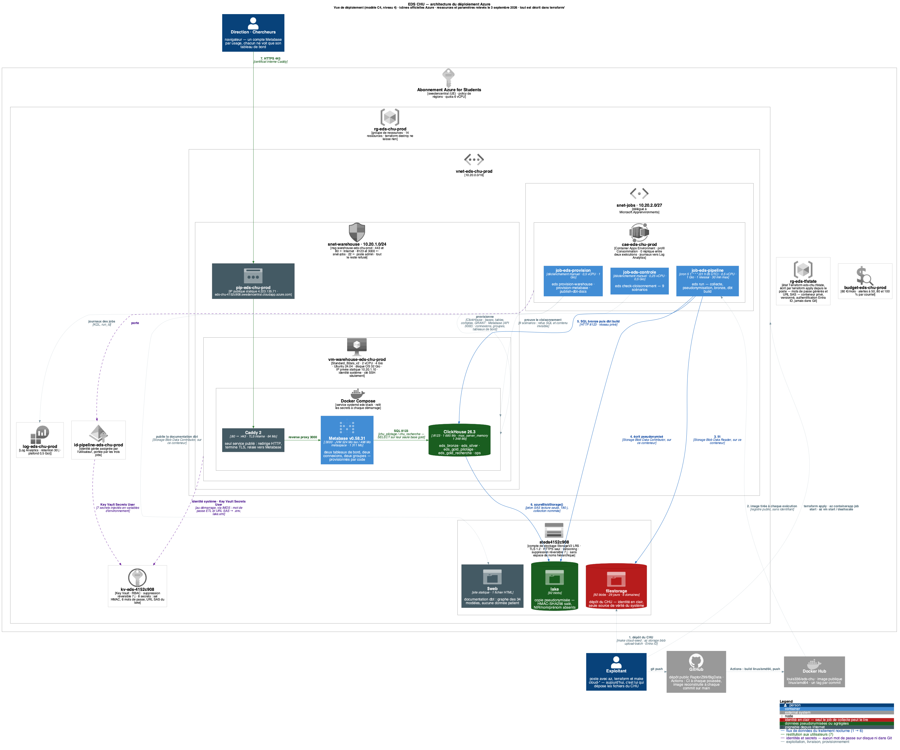

# 🏥 EDS CHU — Entrepôt de Données de Santé

Le CHU dépose chaque jour ses exports (CSV, JSON, Parquet). Ce projet les collecte,
les fiabilise et les restitue en deux tableaux de bord cloisonnés — avec
pseudonymisation dès l'entrée de la zone de travail.

`ClickHouse` · `dbt` · `Python` · `Metabase` · `Docker` · `Terraform` · `Azure`

📄 **[Le dossier de conception est dans `docs/RAPPORT.md`](docs/RAPPORT.md)** — besoin,
architecture, indicateurs, RGPD, limites.

Les six indicateurs du sujet sont **vérifiés valeur par valeur** contre la feuille de
réponses du jeu de données corrigé : 319 valeurs comparées, aucun écart.


---

## Démarrer

**Prérequis** : Docker et [uv](https://docs.astral.sh/uv/).

```bash
git clone <url-du-depot> && cd <dossier>
make demo
```

Rien d'autre à fournir : le dépôt du CHU (`source-filestorage/`, vingt-neuf jours de
fichiers, dont l'évolution du 29 août) est versionné. C'est le jeu de données **synthétique** de l'épreuve ; dans un
déploiement réel, il ne serait jamais dans Git — il contient l'identité (fictive ici) des
patients, et c'est précisément ce que la chaîne détruit à l'entrée.

Environ deux minutes au premier lancement. La commande crée `.env`, y tire au hasard le
sel de pseudonymisation et les six mots de passe, démarre ClickHouse et Metabase, ingère
les vingt-neuf jours de dépôt, construit les indicateurs et crée les tableaux de bord.
Elle affiche à la fin les accès de **votre** installation :

| Interface | URL | Compte |
|---|---|---|
| Tableau de bord pilotage | http://localhost:3000 | `pilotage@chu.local` |
| Tableau de bord recherche | http://localhost:3000 | `recherche@chu.local` |
| Administration Metabase | http://localhost:3000 | `admin@chu.local` |
| Console SQL ClickHouse | http://localhost:8123/play | `chu_etl` |

```bash
make acces      # affiche les URL et les mots de passe de votre installation
```

Les mots de passe sont tirés au hasard à la création de `.env` et n'existent que là :
ils ne sont ni dans le dépôt, ni les mêmes que chez quelqu'un d'autre. `make acces` est une
cible à part, et non la fin de `make demo`, parce que la sortie du provisionnement part dans
`logs/cron.log` quand le pipeline est planifié — un mot de passe n'a rien à faire dans un
journal.

---

## Architecture

```
source-filestorage/   ──▶   data/lake/   ──▶   bronze   ──▶   silver   ──▶   gold ×2   ──▶   Metabase
 dépôt du CHU               copie              tables         constellation   indicateurs      deux tableaux
 (lecture seule)            PSEUDONYMISÉE      typées         Kimball         par usage        cloisonnés
 CSV · JSON · Parquet       HMAC-SHA256 salé
                                               └───────────────────────────────────┘
                                                SQL dans ClickHouse, piloté par dbt

        ops · journal d'ingestion, historique des runs, rapport qualité chiffré
```

| Couche | Rôle | Principe |
|---|---|---|
| **Lake** | Copie de travail | Pseudonymisée dès l'écriture : l'identité ne sort jamais du dépôt du CHU |
| **Bronze** | Tables typées | Aucune règle métier ; partitionnée par jour, donc rejouable sans doublon |
| **Silver** | Données fiables | Constellation Kimball : 4 faits sur dimensions conformées ; anomalies écartées **et tracées** |
| **Gold** | Indicateurs | Une base par usage — c'est le socle du cloisonnement |
| **ops** | Exploitation | Journal d'ingestion, historique des runs, rapport qualité chiffré |

**Les transformations s'exécutent en SQL dans ClickHouse**, orchestrées par dbt (34 modèles).
Python copie des fichiers et lance `dbt build` : aucune donnée métier ne remonte côté client
pour y être transformée. Seuls les deux CSV à pseudonymiser traversent Python, en flux ligne
à ligne. Le monitoring — le plus volumineux — est lu directement par le moteur.

Le [**modèle de données**](docs/img/eds-data-model.png) est commenté en
[§3.2 du rapport](docs/RAPPORT.md#32-le-modèle-de-données). Source :
[`docs/data-model.puml`](docs/data-model.puml).

**Évolution du 29 août.** Le CHU a ajouté un flux d'actes médicaux et la description de ses
services. Le pipeline incrémental a chargé les trois nouveaux fichiers sans retraiter les
89 autres ; `dim_service` est complétée, `dim_ccam` et `fact_acte` ajoutées, cinq
indicateurs de plus au tableau de bord de pilotage — et les six KPI historiques valent
toujours exactement pareil. Le détail, dont la réponse aux deux pièges du sujet (un service
non décrit, « actes par service » sans jointure entre faits), est en
[§9 du rapport](docs/RAPPORT.md#9-évolution-du-29-août--actes-médicaux-et-description-des-services).

---

## Commandes

```
make demo         Démonstration complète depuis zéro
make acces        URL et identifiants de votre installation
make pipeline     Ingestion incrémentale (jours non encore traités)
make status       État de l'ingestion et volumétrie par couche
make quality      Rapport qualité du dernier traitement (22 lignes, 20 règles)
make provision    (Re)crée connexions, permissions et tableaux de bord Metabase
make test         155 tests unitaires        ·  make test-e2e   86 tests d'intégration
make dbt-test     117 tests dbt              ·  make dbt-docs   graphe des 34 modèles
make lint         Style (ruff)               ·  make logs       Logs des conteneurs
make down         Arrête (données gardées)   ·  make reset      ⚠ Détruit tout
```

```bash
uv run eds run --date 2026-08-27   # rejoue un jour précis (reprise sur incident)
uv run eds run --rebuild           # reconstruit silver et gold après un changement de modèle
uv run eds check-cloisonnement     # prouve le cloisonnement aux deux niveaux
uv run eds --help
```

---

## Exploitation

**Automatisation.** Le pipeline est incrémental : il ne traite que les jours absents de
`ops.ingest_log` et ne duplique jamais une ligne. En local, `scheduling/` donne l'exemple
cron ; sur Azure, un job planifié le déclenche chaque nuit.

**Supervision.** Trois points de contrôle, du plus rapide au plus complet :

| Commande | Ce qu'elle montre |
|---|---|
| `make status` | Jours ingérés, volumétrie par couche, dernier run et son statut |
| `make quality` | Les 22 lignes du dernier traitement : lues / conservées / écartées / signalées |
| `make test-e2e` | Les 86 invariants de l'entrepôt, dont les six KPI ancrés sur la feuille de réponses et les cinq de l'évolution |

Le bas du tableau de bord de pilotage porte le rapport qualité et le journal d'ingestion :
un utilisateur qui doute d'un chiffre voit sans quitter l'interface combien de lignes ont
été écartées, et par quelle règle.

**Reprise sur incident.**

| Symptôme | Cause probable | Remède |
|---|---|---|
| `port is already allocated` au démarrage | Les ports 3000, 8123 ou 9000 sont pris par une autre application | Libérer le port, ou arrêter ce qui l'occupe (`docker ps`). Ce sont les seuls ports utilisés |
| Un jour manque dans `make status` | Dépôt incomplet, ou échec partiel | `uv run eds run --date AAAA-MM-JJ` — le jour est rechargé après `DROP PARTITION`, sans doublon |
| `FILE_DOESNT_EXIST` au chargement | `data/lake` recréé conteneur allumé | `docker compose restart clickhouse` |
| Un indicateur est faux après modification d'un modèle | Silver ou gold en retard sur bronze | `uv run eds run --rebuild` |
| Les tableaux de bord ont disparu | Volume Metabase perdu | `make provision` — ils sont définis en code, aucun clic n'est nécessaire |
| Doute sur l'intégrité complète | — | `make reset && make demo` reconstruit tout depuis la source en ~2 min |

Une exécution qui échoue laisse une trace : `ops.pipeline_runs` porte son statut et son
message d'erreur, `ops.ingest_log` le checksum de chaque fichier déjà chargé. Relancer est
toujours sûr.

**Intégration continue.** À chaque poussée, la CI rejoue exactement le parcours d'un
correcteur sur une machine vierge — clone, `make demo`, les 241 tests, la preuve du
cloisonnement — en plus du style, de la compilation dbt et de la validation Terraform.

---

## Déploiement Azure

La même chaîne tourne sur Azure, décrite intégralement en Terraform. **Les chiffres y sont
identiques au déploiement local** — c'était le critère d'acceptation du portage.

```bash
make cloud-bootstrap    # fournisseurs Azure + backend d'état (une fois)
make image-push         # publie l'image du pipeline, en linux/amd64
make cloud-apply        # ~10 min : réseau, stockage, coffre, VM, jobs, budget
make cloud-seed         # dépose source-filestorage/ dans le conteneur du CHU
make cloud-provision    # entrepôt, comptes cloisonnés, tableaux de bord
make cloud-run          # premier traitement ; ensuite, chaque nuit tout seul
make cloud-stop         # met en pause : 33 €/mois → 8 €/mois
```

**Ce que le cloud ajoute au RGPD** : la machine qui héberge l'entrepôt n'a **aucun droit
IAM** sur le conteneur contenant les noms et les NIR. Ce n'est plus une règle de code, c'est
une propriété de l'infrastructure.

📄 **[Le rapport cloud est dans `docs/RAPPORT-CLOUD.md`](docs/RAPPORT-CLOUD.md)** — le
diagramme d'architecture, les choix et leurs alternatives, le fonctionnement au quotidien,
la sécurité, le coût, les limites. Le détail opérationnel de l'infrastructure est dans
[`terraform/README.md`](terraform/README.md).

[](docs/img/eds-cloud-architecture.svg)

---

## Structure du dépôt

```
source-filestorage/   Dépôt du CHU — 29 jours, 92 fichiers, jeu synthétique de l'épreuve (évolution du 29 août comprise)
src/eds/              Orchestrateur Python — pseudonymisation, collecte, chargement, pilotage dbt
dbt/                  Transformation silver et gold — 34 modèles, 117 tests
sql/                  Initialisation de l'entrepôt, schémas bronze, chargements par jour
terraform/            Infrastructure Azure
tests/                241 tests (155 unitaires, 86 d'intégration)
docs/                 RAPPORT.md (dossier de conception), RAPPORT-CLOUD.md (déploiement Azure), modèles PlantUML, captures, énoncé
benchmarks/           Banc d'essai : 20 M de relevés par le chemin réel du pipeline
```

---

## RGPD

| Exigence | Mise en œuvre |
|---|---|
| **Pseudonymisation** | `HMAC-SHA256(sel, IPP)` à la copie vers le lake. Stable — les jointures tiennent — et non réversible sans le sel, qui n'est ni versionné ni journalisé |
| **Minimisation** | NIR, nom et prénom jamais copiés ; date de naissance réduite à l'année ; la table des constantes ne porte même pas de pseudonyme |
| **Cloisonnement** | Deux comptes SQL en lecture seule sur leur seule base gold, deux connexions et deux collections Metabase. Une requête hors périmètre est refusée **par le moteur** |
| **Petits effectifs** | Toute cellule de moins de 5 patients garde sa ligne et **perd son effectif** — le chercheur sait qu'une valeur est protégée, plutôt que de voir une table trouée sans le savoir. Effet mesuré et publié à chaque run : 2 pathologies sur 13, 13 cellules démographiques sur 102 |
| **Traçabilité** | Chaque ligne bronze et silver porte son fichier d'origine, son jour de dépôt et son horodatage. Chaque run est journalisé, chaque règle qualité chiffrée |

`uv run eds check-cloisonnement` rejoue les 9 scénarios de cloisonnement sur votre
installation. La démonstration n'est pas une capture d'écran, c'est un exécutable.
