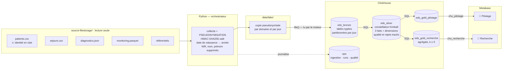

# 🏥 EDS CHU — Entrepôt de Données de Santé

Chaîne complète, de dépôts quotidiens de fichiers hétérogènes jusqu'à deux dashboards
cloisonnés, avec pseudonymisation dès l'entrée de la zone de travail.

`ClickHouse` · `Python` · `Metabase` · `Docker` · architecture médaillon · RGPD par conception

---

## Ce que fait ce projet

Le CHU dépose chaque jour ses exports (CSV, JSON, Parquet) dans un espace en lecture seule.
Ce projet les collecte, les fiabilise et les restitue sous forme d'indicateurs, pour deux
publics qui ne doivent pas voir les mêmes données :

| Public | Besoin | Ce qu'il obtient |
|---|---|---|
| **Direction & cadres de santé** | Piloter l'activité | DMS par service, activité des urgences, réadmissions à 30 jours, relevés de constantes en alerte, flux et charge par service |
| **Chercheurs cliniciens** | Constituer des cohortes | Prévalence par pathologie, taille des cohortes, distribution par âge et sexe — agrégats seuls, jamais moins de 5 patients par cellule |

Contrainte transverse : les données de santé relèvent de l'article 9 du RGPD.
**Aucune donnée identifiante n'entre dans l'entrepôt** — l'identité est remplacée par un
pseudonyme au moment même de la copie depuis le dépôt du CHU.

---

## Démarrage rapide

**Prérequis** : Docker et [uv](https://docs.astral.sh/uv/). Rien d'autre à installer.

Le dépôt du CHU (`source-filestorage/`) n'est **pas versionné** : il contient l'identité
réelle des patients. Placez-le à la racine du projet avant de lancer la démonstration, ou
indiquez son chemin dans `EDS_SOURCE_DIR`.

```bash
git clone <url-du-depot> && cd eds-chu
make demo
```

`make demo` crée au passage le fichier `.env` et **y tire au hasard tous les secrets** : le
sel de pseudonymisation et les six mots de passe. Les pseudonymes de votre installation ne
sont donc dérivables par personne d'autre, et aucune valeur d'exemple ne subsiste. Si vous
aviez copié `.env.example` à la main, le pipeline vous nomme à chaque exécution les
variables restées à leur valeur d'exemple.

`make demo` démarre ClickHouse et Metabase, provisionne l'entrepôt, ingère les trois jours
de dépôt, construit les indicateurs et crée les deux dashboards. Comptez deux à trois
minutes au premier lancement (téléchargement des images).

À la fin, la commande affiche les accès et les identifiants — ceux de **votre**
installation, lus dans `.env` :

| Interface | URL | Compte |
|---|---|---|
| Dashboard pilotage | http://localhost:3000 | `pilotage@chu.local` |
| Dashboard recherche | http://localhost:3000 | `recherche@chu.local` |
| Administration Metabase | http://localhost:3000 | `admin@chu.local` |
| Console SQL ClickHouse | http://localhost:8123/play | `chu_etl` |

Les mots de passe correspondants sont ceux de votre fichier `.env` ; ils ne sont écrits
nulle part ailleurs, pour qu'ils ne puissent pas devenir faux.

> **Démonstration du cloisonnement** : `uv run eds check-cloisonnement` teste les deux
> barrières et affiche le résultat — ClickHouse refuse la requête hors périmètre, et
> Metabase refuse l'ouverture du tableau de bord de l'autre usage. Vous pouvez le
> constater vous-même : connectez-vous en `pilotage`, puis tentez d'ouvrir le dashboard
> de recherche.

---

## Architecture



Le modèle de données détaillé est dans **[`docs/img/eds-data-model.png`](docs/img/eds-data-model.png)**
(source PlantUML : [`docs/data-model.puml`](docs/data-model.puml)).

### Rôle de chaque couche

| Couche | Rôle | Principe retenu |
|---|---|---|
| **Lake** | Copie de travail | Pseudonymisée dès l'écriture : l'identité en clair ne sort jamais du dépôt du CHU |
| **Bronze** | Tables typées | Aucune règle métier ; partitionnée par jour d'ingestion, donc rejouable sans doublon |
| **Silver** | Données fiables | Constellation Kimball : 3 faits au grain déclaré sur dimensions conformées ; anomalies écartées **et tracées** |
| **Gold** | Indicateurs | Une base par usage — c'est le socle du cloisonnement |
| **ops** | Exploitation | Journal d'ingestion, historique des runs, rapport qualité chiffré |

**Les transformations s'exécutent en SQL dans ClickHouse.** Python copie des fichiers et
envoie des requêtes ; aucune donnée métier ne remonte côté client pour y être transformée.
Seuls les deux CSV à pseudonymiser traversent Python, en flux ligne à ligne, à mémoire
constante. Le monitoring — de loin le flux le plus volumineux — est lu directement par le
moteur : c'est ce qui permet à la chaîne de passer à l'échelle.

---

## Commandes

```
make demo         Démonstration complète depuis zéro
make up           Démarre les conteneurs et provisionne l'entrepôt
make pipeline     Ingestion incrémentale (jours non encore traités)
make provision    (Re)crée connexions, groupes, permissions et dashboards Metabase
make status       État de l'ingestion et volumétrie par couche
make quality      Rapport qualité du dernier traitement
make test         Tests unitaires
make test-e2e     Tests d'intégration (invariants de l'entrepôt)
make lint         Vérification du style
make logs         Suit les logs des conteneurs
make down         Arrête les conteneurs (données conservées)
make reset        ⚠ Détruit conteneurs et données locales
```

La commande `eds` offre un contrôle plus fin :

```bash
uv run eds run --date 2026-08-27     # rejoue un jour précis (reprise sur incident)
uv run eds run --full-refresh        # recharge tout depuis la source
uv run eds run --rebuild             # reconstruit silver et gold (après modification du SQL)
uv run eds check-cloisonnement       # prouve le cloisonnement aux deux niveaux
uv run benchmarks/charge_monitoring.py   # mesure la tenue en charge du monitoring
uv run eds --help
```

---

## Structure du dépôt

```
├── src/eds/              Orchestrateur Python
│   ├── pseudo.py           pseudonymisation HMAC-SHA256
│   ├── collect.py          dépôt du CHU → lake
│   ├── load_bronze.py      lake → bronze (via file(), côté moteur)
│   ├── transform.py        silver et gold
│   ├── pipeline.py         orchestration, erreurs, traçabilité
│   ├── state.py            journal d'ingestion, idempotence
│   ├── metabase.py         provisionnement de la restitution (API)
│   ├── metabase_content.py définition et disposition des dashboards
│   └── cli.py              interface en ligne de commande
├── sql/
│   ├── 00_init/            bases, tables d'exploitation, comptes cloisonnés
│   ├── 10_bronze/          schémas bronze
│   ├── 15_bronze_load/     chargements paramétrés par jour
│   ├── 20_silver/          constellation, règles qualité, rapport
│   └── 30_gold/            indicateurs par usage
├── tests/                125 tests (64 unitaires, 61 d'intégration)
│   ├── test_pseudo.py      pseudonymisation : stabilité, non-réversibilité
│   ├── test_collect.py     aucune donnée identifiante ne sort de la source
│   ├── test_config.py      détection des secrets d'exemple
│   ├── test_state.py       décision d'ingestion : les 4 branches de l'incrémentalité
│   ├── test_warehouse.py   découpage des scripts SQL
│   ├── test_pipeline.py    dépôt incomplet, échec partiel, couche en retard
│   ├── test_dashboards.py  mise en page : chevauchements, titres, tables visées
│   └── test_e2e.py         invariants de l'entrepôt (nécessite Docker)
├── docs/
│   ├── RAPPORT.md          dossier d'analyse et de conception
│   ├── EXPLOITATION.md     lancement, maintenance, reprise sur incident
│   └── data-model.puml     modèle de données
├── .github/workflows/    Intégration continue (style, tests, invariants)
├── benchmarks/           Banc d'essai de tenue en charge (20 M de relevés)
├── scheduling/           Exemple de planification cron
└── PLAN.md               Plan d'implémentation détaillé
```

---

## Conformité RGPD

| Exigence | Mise en œuvre |
|---|---|
| **Pseudonymisation** | `HMAC-SHA256(sel, IPP)` appliqué à la copie vers le lake. Stable — les jointures tiennent — et non réversible sans le sel, qui n'est ni versionné ni journalisé. |
| **Minimisation** | NIR, nom et prénom ne sont jamais copiés ; la date de naissance est réduite à l'année ; la table des constantes ne porte même pas de pseudonyme, aucun indicateur n'en ayant besoin. |
| **Cloisonnement** | Deux comptes SQL ClickHouse en lecture seule sur leur seule base gold, deux connexions et deux collections Metabase. Une requête écrite à la main ne franchit pas la frontière : c'est le moteur qui refuse. Chaque utilisateur ne voit qu'un tableau de bord et qu'une base — l'autre usage n'existe pas de son point de vue. |
| **Petits effectifs** | `HAVING uniqExact(patient_pseudo) >= 5` sur chaque cellule diffusée en recherche ; âges en tranches de dix ans. L'effet est mesuré et affiché : 4 cellules retirées sur 1 600 au grain le plus fin. |
| **Traçabilité** | Chaque ligne de bronze et de silver porte son fichier d'origine, son jour de dépôt et son horodatage de traitement. Les tables gold sont des agrégats : elles se rattachent à leur run via `ops.quality_report`. Chaque exécution est journalisée, chaque règle qualité chiffrée. |

---

## Documentation

- **[docs/RAPPORT.md](docs/RAPPORT.md)** — analyse du besoin, justification des choix,
  définition de chaque indicateur, gouvernance, limites et recommandations.
- **[docs/EXPLOITATION.md](docs/EXPLOITATION.md)** — mise en service, exploitation
  quotidienne, supervision, reprise sur incident, maintenance.
- **[PLAN.md](PLAN.md)** — plan d'implémentation et profilage détaillé des sources.
