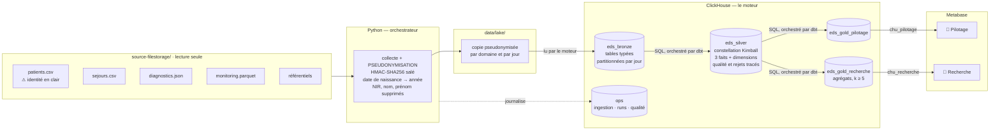

# 🏥 EDS CHU — Entrepôt de Données de Santé

Chaîne complète, de dépôts quotidiens de fichiers hétérogènes jusqu'à deux dashboards
cloisonnés, avec pseudonymisation dès l'entrée de la zone de travail.

`ClickHouse` · `dbt` · `Python` · `Metabase` · `Docker` · `Terraform` · `Azure` · architecture médaillon · RGPD par conception

---

## Ce que fait ce projet

Le CHU dépose chaque jour ses exports (CSV, JSON, Parquet) dans un espace en lecture seule.
Ce projet les collecte, les fiabilise et les restitue sous forme d'indicateurs, pour deux
publics qui ne doivent pas voir les mêmes données :

| Public | Besoin | Ce qu'il obtient |
|---|---|---|
| **Direction & cadres de santé** | Piloter l'activité | DMS par service, activité des urgences, réadmissions à 30 jours, relevés de constantes en alerte, flux et charge par service |
| **Chercheurs cliniciens** | Constituer des cohortes | Prévalence par pathologie, taille des cohortes, distribution par âge et sexe — agrégats seuls, jamais moins de 5 patients par cellule |

Contrainte transverse : les données de santé relèvent de l'article 9 du RGPD.
**Aucune donnée identifiante n'entre dans l'entrepôt** — l'identité est remplacée par un
pseudonyme au moment même de la copie depuis le dépôt du CHU.


*Les deux tableaux de bord sont recréés par le code à chaque provisionnement — aucun clic
n'est nécessaire après un clone. Chaque chiffre affiché est retrouvable en une requête SQL
sur l'entrepôt.*

---

## Démarrage rapide

**Prérequis** : Docker et [uv](https://docs.astral.sh/uv/). Rien d'autre à installer.

Le dépôt du CHU (`source-filestorage/`) n'est **pas versionné** : il contient l'identité
réelle des patients. Placez-le à la racine du projet avant de lancer la démonstration, ou
indiquez son chemin dans `EDS_SOURCE_DIR`.

```bash
git clone <url-du-depot> && cd eds-chu
make demo
```

`make demo` crée au passage le fichier `.env` et **y tire au hasard tous les secrets** : le
sel de pseudonymisation et les six mots de passe. Les pseudonymes de votre installation ne
sont donc dérivables par personne d'autre, et aucune valeur d'exemple ne subsiste. Si vous
aviez copié `.env.example` à la main, le pipeline vous nomme à chaque exécution les
variables restées à leur valeur d'exemple.

`make demo` démarre ClickHouse et Metabase, provisionne l'entrepôt, ingère les trois jours
de dépôt, construit les indicateurs et crée les deux dashboards. Comptez deux à trois
minutes au premier lancement (téléchargement des images).

À la fin, la commande affiche les accès et les identifiants — ceux de **votre**
installation, lus dans `.env` :

| Interface | URL | Compte |
|---|---|---|
| Dashboard pilotage | http://localhost:3000 | `pilotage@chu.local` |
| Dashboard recherche | http://localhost:3000 | `recherche@chu.local` |
| Administration Metabase | http://localhost:3000 | `admin@chu.local` |
| Console SQL ClickHouse | http://localhost:8123/play | `chu_etl` |

Les mots de passe correspondants sont ceux de votre fichier `.env` ; ils ne sont écrits
nulle part ailleurs, pour qu'ils ne puissent pas devenir faux.

> **Démonstration du cloisonnement** : `uv run eds check-cloisonnement` teste les deux
> barrières et affiche le résultat — ClickHouse refuse la requête hors périmètre, et
> Metabase ne montre pas le contenu de l'autre usage. Vous pouvez le constater vous-même :
> connectez-vous en `pilotage`, vous ne verrez **qu'une** collection, **qu'un** tableau de
> bord et **qu'une** base de données. Les captures sont en
> [§6.2 du rapport](docs/RAPPORT.md#62-le-cloisonnement-à-quatre-niveaux).

---

## Architecture



Le **[modèle de données complet](docs/img/eds-data-model.png)** — les 33 tables, leurs
colonnes et leurs relations — est commenté pas à pas dans
[§3.2 du rapport](docs/RAPPORT.md#32-le-modèle-de-données) : comment lire le schéma, où sont
les trois étoiles, et ce qu'il dit de la conformité RGPD. Source PlantUML :
[`docs/data-model.puml`](docs/data-model.puml).

### Rôle de chaque couche

| Couche | Rôle | Principe retenu |
|---|---|---|
| **Lake** | Copie de travail | Pseudonymisée dès l'écriture : l'identité en clair ne sort jamais du dépôt du CHU |
| **Bronze** | Tables typées | Aucune règle métier ; partitionnée par jour d'ingestion, donc rejouable sans doublon |
| **Silver** | Données fiables | Constellation Kimball : 3 faits au grain déclaré sur dimensions conformées ; anomalies écartées **et tracées**. Écrite en modèles dbt |
| **Gold** | Indicateurs | Une base par usage — c'est le socle du cloisonnement. Écrite en modèles dbt |
| **ops** | Exploitation | Journal d'ingestion, historique des runs, rapport qualité chiffré |

**Les transformations s'exécutent en SQL dans ClickHouse**, orchestrées par **dbt**. Les
deux ne sont pas concurrents : ClickHouse est le moteur — il stocke et il calcule ; dbt
envoie le SQL, dans l'ordre que le graphe des dépendances impose, et teste le résultat. Il
ne stocke rien et ne calcule rien.

Python, lui, copie des fichiers et lance `dbt build` : aucune donnée métier ne remonte côté
client pour y être transformée. Seuls les deux CSV à pseudonymiser traversent Python, en
flux ligne à ligne, à mémoire constante. Le monitoring — de loin le flux le plus volumineux —
est lu directement par le moteur : c'est ce qui permet à la chaîne de passer à l'échelle.

---

## Commandes

```
make demo         Démonstration complète depuis zéro
make up           Démarre les conteneurs et provisionne l'entrepôt
make pipeline     Ingestion incrémentale (jours non encore traités)
make provision    (Re)crée connexions, groupes, permissions et dashboards Metabase
make status       État de l'ingestion et volumétrie par couche
make quality      Rapport qualité du dernier traitement
make test         Tests unitaires
make test-e2e     Tests d'intégration (invariants de l'entrepôt)
make lint         Vérification du style
make dbt-test     Rejoue les tests dbt sur l'entrepôt en place
make dbt-docs     Documentation dbt : graphe des 27 modèles
make logs         Suit les logs des conteneurs
make down         Arrête les conteneurs (données conservées)
make reset        ⚠ Détruit conteneurs et données locales
```

La commande `eds` offre un contrôle plus fin :

```bash
uv run eds run --date 2026-08-27     # rejoue un jour précis (reprise sur incident)
uv run eds run --full-refresh        # recharge tout depuis la source
uv run eds run --rebuild             # reconstruit silver et gold (après modification d'un modèle dbt)
uv run eds check-cloisonnement       # prouve le cloisonnement aux deux niveaux
uv run benchmarks/charge_monitoring.py   # mesure la tenue en charge du monitoring
uv run eds --help
```

---

## Déploiement Azure

La même chaîne tourne sur Azure, décrite intégralement en Terraform. Les chiffres y
sont **identiques** au déploiement local — c'est le critère d'acceptation du portage.

```
Stockage (blobs)            Container Apps            VM Standard_B2als_v2
filestorage/ (identité) ──▶ job-eds-pipeline ───────▶ ClickHouse ──▶ Metabase
lake/ (pseudonymisé)    ◀──  (cron, scale-to-zero)      ▲              ▲
        │                                               │            Caddy · HTTPS
        └── azureBlobStorage(SAS lecture seule) ─────────┘
```

**Ce que le cloud ajoute au cloisonnement RGPD** : la machine qui héberge l'entrepôt
n'a **aucun droit IAM** sur le conteneur contenant les noms et les NIR. Ce n'est plus
une règle de code — c'est une propriété de l'infrastructure. Le seul composant qui
touche l'identité en clair est le job de collecte, qui la lit en flux, la pseudonymise
en mémoire et n'écrit jamais que le résultat.

```bash
make cloud-bootstrap    # fournisseurs Azure + backend d'état Terraform (une fois)
make image-push         # publie l'image du pipeline, en linux/amd64
make cloud-apply        # ~10 min : réseau, stockage, coffre, VM, jobs, budget
make cloud-seed         # dépose source-filestorage/ dans le conteneur du CHU
make cloud-provision    # entrepôt, comptes cloisonnés, dashboards, doc dbt
make cloud-run          # premier traitement ; ensuite, chaque nuit tout seul
```

Environ **30 €/mois** allumé en permanence, **5 €** en pause (`make cloud-stop`) — mesuré
sur le déploiement réel, en `swedencentral`. Le
mode d'emploi complet — prérequis, vérifications, reprise sur incident, destruction —
est dans **[`docs/CLOUD.md`](docs/CLOUD.md)** ; les choix d'architecture et les faits
vérifiés qui les motivent dans [`docs/PLAN-CLOUD.md`](docs/PLAN-CLOUD.md).

---

## Structure du dépôt

```
├── src/eds/              Orchestrateur Python
│   ├── pseudo.py           pseudonymisation HMAC-SHA256
│   ├── storage.py          un protocole, deux cibles : dossier ou stockage objet
│   ├── collect.py          dépôt du CHU → lake, en flux
│   ├── load_bronze.py      lake → bronze (lu par le moteur lui-même)
│   ├── transform.py        pilote dbt
│   ├── pipeline.py         orchestration, erreurs, traçabilité
│   ├── state.py            journal d'ingestion, idempotence
│   ├── metabase.py         provisionnement de la restitution (API)
│   ├── metabase_content.py définition et disposition des dashboards
│   └── cli.py              interface en ligne de commande
├── dbt/                  Transformation silver et gold — 27 modèles, 78 tests
│   ├── models/silver/      constellation Kimball, règles qualité, rejets
│   ├── models/gold_*/      indicateurs par usage
│   ├── models/ops/         rapport qualité (18 règles)
│   └── tests/              les propriétés qui font le projet (k-anonymat, cascades…)
├── terraform/            Infrastructure Azure — réseau, stockage, coffre, VM, jobs
├── sql/
│   ├── 00_init/            bases, tables d'exploitation, comptes cloisonnés
│   ├── 10_bronze/          schémas bronze
│   └── 15_bronze_load/     chargements paramétrés par jour
├── tests/                179 tests (116 unitaires, 63 d'intégration)
│   ├── test_pseudo.py      pseudonymisation : stabilité, non-réversibilité
│   ├── test_collect.py     aucune donnée identifiante ne sort de la source
│   ├── test_config.py      détection des secrets d'exemple
│   ├── test_state.py       décision d'ingestion : les 4 branches de l'incrémentalité
│   ├── test_warehouse.py   découpage des scripts SQL
│   ├── test_pipeline.py    dépôt incomplet, échec partiel, couche en retard
│   ├── test_storage.py     les deux cibles rendent-elles le bon SQL ? l'écriture est-elle atomique ?
│   ├── test_dbt_project.py cohérence du projet dbt, sans dbt ni Docker
│   ├── test_dashboards.py  mise en page : chevauchements, titres, tables visées
│   ├── test_data_model.py  le diagramme décrit-il encore l'entrepôt réel ?
│   └── test_e2e.py         invariants de l'entrepôt (nécessite Docker)
├── docs/                 Toute la documentation
│   ├── RAPPORT.md          dossier d'analyse et de conception (Partie 1)
│   ├── EXPLOITATION.md     lancement, maintenance, reprise sur incident (Partie 2)
│   ├── CLOUD.md            mode d'emploi du déploiement Azure
│   ├── PLAN.md             plan d'implémentation et profilage des sources
│   ├── PLAN-CLOUD.md       plan du portage cloud et faits techniques vérifiés
│   ├── CONVENTIONS.md      règles du projet et pièges rencontrés
│   ├── FICHE-SUJET.md      énoncé de l'épreuve
│   ├── data-model.puml     modèle de données (source PlantUML)
│   └── img/                diagramme rendu et captures des tableaux de bord
├── .github/workflows/    Intégration continue (style, tests, dbt, Terraform, image)
├── benchmarks/           Banc d'essai de tenue en charge (20 M de relevés)
├── scheduling/           Exemple de planification cron (chemin local)
├── scripts/              Amorçage du déploiement Azure (fournisseurs, backend d'état)
├── Dockerfile            Image du pipeline, exécutée par les jobs Azure
├── .python-version       3.13 — dbt ne démarre pas sur 3.14
└── CLAUDE.md             Configuration Claude Code (importe docs/CONVENTIONS.md)
```

La racine ne porte que le `README`, la configuration (`Makefile`, `docker-compose.yml`,
`pyproject.toml`, `CLAUDE.md`) et les répertoires de code. **Toute la documentation vit dans
`docs/`.**

---

## Qualité et vérification

Rien de ce qui suit n'est déclaratif : chaque affirmation du dossier est adossée à une
commande que vous pouvez rejouer.

| Vérification | Commande | Ce qu'elle établit |
|---|---|---|
| Style | `make lint` | ruff, sur `src/` et `tests/` |
| Tests unitaires | `make test` | 116 tests, sans Docker : pseudonymisation, collecte, incrémentalité, découpage SQL, cibles de stockage, cohérence du projet dbt, mise en page des dashboards |
| Invariants de l'entrepôt | `make test-e2e` | 63 tests : volumétries exactes, règles qualité, k-anonymat, cloisonnement, lignage |
| Cloisonnement | `uv run eds check-cloisonnement` | 9 scénarios réels, aux deux niveaux (moteur et interface) |
| Tests dbt | `make dbt-test` | 78 contrôles exécutés **pendant** le run : clés, intégrité référentielle, k-anonymat, cascades |
| Rapport qualité | `make quality` | les 18 règles du dernier traitement, chiffrées |
| Tenue en charge | `uv run benchmarks/charge_monitoring.py` | 20 M de relevés chargés par le chemin réel du pipeline |
| Infrastructure | `terraform -chdir=terraform plan` | Aucune dérive entre le code et le déploiement Azure réel |

**Ce que la CI couvre, et ce qu'elle ne couvre pas.** Le workflow exécute le style et les
**116 tests unitaires** à chaque poussée. Les **63 tests d'intégration** ne s'y exécutent que
si un jeu de données est mis à disposition du runner (`vars.EDS_SOURCE_AVAILABLE`) : le
dépôt du CHU contient l'identité réelle des patients et n'est pas versionné. C'est un
arbitrage assumé — nous préférons une CI partielle à un dépôt qui contiendrait des données
de santé. Localement, `make test-e2e` les exécute tous.

---

## Conformité RGPD

| Exigence | Mise en œuvre |
|---|---|
| **Pseudonymisation** | `HMAC-SHA256(sel, IPP)` appliqué à la copie vers le lake. Stable — les jointures tiennent — et non réversible sans le sel, qui n'est ni versionné ni journalisé. |
| **Minimisation** | NIR, nom et prénom ne sont jamais copiés ; la date de naissance est réduite à l'année ; la table des constantes ne porte même pas de pseudonyme, aucun indicateur n'en ayant besoin. |
| **Cloisonnement** | Deux comptes SQL ClickHouse en lecture seule sur leur seule base gold, deux connexions et deux collections Metabase. Une requête écrite à la main ne franchit pas la frontière : c'est le moteur qui refuse. Chaque utilisateur ne voit qu'un tableau de bord et qu'une base — l'autre usage n'existe pas de son point de vue. |
| **Petits effectifs** | `HAVING uniqExact(patient_pseudo) >= 5` sur chaque cellule diffusée en recherche ; âges en tranches de dix ans. Le seuil seul ne suffit pas : publier une marge **et** sa décomposition laisse retrouver la cellule cachée par soustraction, d'où une **suppression complémentaire** (une marge n'est diffusée que si toute sa décomposition l'est). L'effet est mesuré et affiché : 4 cellules retirées sur 1 600 au grain fin, 3 marges sur 200. Un test rejoue l'attaque et exige qu'elle ne rende rien. |
| **Disponibilité** | Les deux comptes autorisent le SQL libre : un profil de réglages (`readonly = 2`, temps et mémoire bornés) et un quota horaire empêchent une requête maladroite de priver l'autre usage de son tableau de bord. |
| **Traçabilité** | Chaque ligne de bronze et de silver porte son fichier d'origine, son jour de dépôt et son horodatage de traitement. Les tables gold sont des agrégats : elles se rattachent à leur run via `ops.quality_report`. Chaque exécution est journalisée, chaque règle qualité chiffrée. |

---

## Documentation

- **[docs/RAPPORT.md](docs/RAPPORT.md)** — analyse du besoin, justification des choix,
  définition de chaque indicateur, gouvernance, limites et recommandations.
- **[docs/EXPLOITATION.md](docs/EXPLOITATION.md)** — mise en service, exploitation
  quotidienne, supervision, reprise sur incident, maintenance.
- **[docs/CLOUD.md](docs/CLOUD.md)** — déploiement Azure : mise en service, coûts réels,
  exploitation, reprise sur incident, destruction.
- **[docs/PLAN.md](docs/PLAN.md)** — plan d'implémentation et profilage détaillé des sources.
- **[docs/PLAN-CLOUD.md](docs/PLAN-CLOUD.md)** — plan du portage cloud, et les faits
  techniques vérifiés qui ont dicté chaque choix d'infrastructure.
- **[docs/CONVENTIONS.md](docs/CONVENTIONS.md)** — règles impératives du projet, pièges des
  données et pièges techniques rencontrés à l'implémentation.
- **[docs/FICHE-SUJET.md](docs/FICHE-SUJET.md)** — l'énoncé de l'épreuve.
