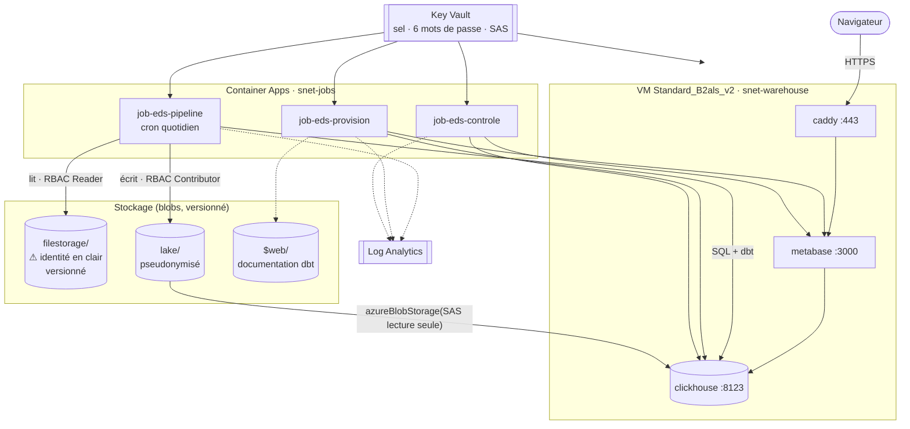

# Déploiement Azure — EDS CHU

Mise en service, exploitation et destruction de l'EDS sur Azure. Toute
l'infrastructure est décrite dans [`terraform/`](../terraform/) ; rien ne se crée à la
main.

Le plan de conception qui a mené à cette architecture — les choix, les alternatives
écartées et les faits vérifiés qui les justifient — est dans
[`PLAN-CLOUD.md`](PLAN-CLOUD.md). Ce document-ci est le mode d'emploi.

---

## Sommaire

1. [Ce qui est déployé](#1-ce-qui-est-déployé)
2. [Coût réel](#2-coût-réel)
3. [Prérequis](#3-prérequis)
4. [Première mise en service](#4-première-mise-en-service)
5. [Vérifier que tout est en place](#5-vérifier-que-tout-est-en-place)
6. [Exploitation quotidienne](#6-exploitation-quotidienne)
7. [Reprise sur incident](#7-reprise-sur-incident)
8. [Maintenance](#8-maintenance)
9. [Détruire](#9-détruire)

---

## 1. Ce qui est déployé



| Ressource | Nom | Rôle |
|---|---|---|
| Groupe | `rg-eds-chu-prod` | Tout y vit ; le détruire ne laisse rien |
| Stockage | `steds<suffixe>` | Dépôt du CHU (versionné), lake, site de documentation |
| Coffre | `kv-eds-<suffixe>` | Sel, six mots de passe, URL SAS du lake |
| VM | `vm-warehouse-eds-chu-prod` | ClickHouse, Metabase, Caddy (`Standard_B2als_v2`) |
| Environnement | `cae-eds-chu-prod` | Les trois jobs, dans le réseau |
| Journaux | `log-eds-chu-prod` | Sortie des jobs, interrogeable en KQL |

### Le cloisonnement, à quatre niveaux

Le passage au cloud ajoute un niveau **au-dessus** des trois existants, et c'est le
plus fort : il ne dépend plus du code.

| Identité | `filestorage` (identité en clair) | `lake` | Bases gold |
|---|---|---|---|
| Jobs du pipeline | lecture | lecture / écriture | — |
| **VM (ClickHouse, Metabase)** | **aucun droit** | lecture seule, par SAS daté | — |
| `chu_pilotage` | aucun droit | aucun droit | `eds_gold_pilotage` |
| `chu_recherche` | aucun droit | aucun droit | `eds_gold_recherche` |

> **La machine qui héberge l'entrepôt ne peut pas lire le conteneur qui contient les
> noms et les NIR.** Pas « ne le fait pas » : *ne le peut pas*. Aucun rôle ne lui est
> attribué sur le compte de stockage, et le jeton confié à ClickHouse est limité au
> conteneur `lake`, en lecture, avec une date d'expiration.

---

## 2. Coût réel

Tarifs Linux relevés à l'API tarifaire Azure pour `swedencentral`, base 730 h/mois.
**Chiffres du déploiement réel**, pas d'une estimation.

| Poste | Détail | Tarif relevé | €/mois |
|---|---|---|---:|
| VM `Standard_B2als_v2` | 2 vCPU / 4 Gio, Linux, `swedencentral` | 0,033397 €/h | **24,38** |
| Disque OS Standard SSD **E4** | 32 Gio, LRS | 2,060790 €/mois | **2,06** |
| IP publique Standard statique | IPv4 | 0,004293 €/h | **3,13** |
| Stockage | dépôt + lake ≈ 11 Mo, Hot LRS | 0,018700 €/Go/mois | **0,01** |
| Key Vault, Log Analytics, jobs | sous les offres gratuites | — | **0,00** |
| Registre d'images | Docker Hub public | — | **0,00** |
| | | **Total** | **≈ 29,6 €** |

**84 $ ≈ 77 € → environ 2,6 mois en ligne.** Trois leviers :

| Geste | Effet |
|---|---|
| `make cloud-stop` entre deux démonstrations | **5,2 €/mois** (disque + IP conservés) |
| Mode nuit : `auto_shutdown_time` + `auto_startup_cron` | **19,4 €/mois** → 4,0 mois (voir §8.6) |
| `make cloud-destroy` | 0 € |

Un budget Azure à 60 € avec alertes à 50, 80 et 100 % est créé dès que
`budget_contact_emails` est renseigné.

> **Pourquoi la Suède, et pas la France ?** Deux filtres se cumulent, tous deux propres
> à l'offre étudiante. D'abord une **policy d'abonnement** (« Allowed resource
> deployment regions ») n'autorise que `uaenorth`, `spaincentral`, `italynorth`,
> `swedencentral` et `germanywestcentral` — ailleurs, `RequestDisallowedByAzure`.
> Ensuite, parmi celles-là, seules `swedencentral` et `spaincentral` proposent la
> série B. `swedencentral` est la moins chère des deux, et dans l'Union européenne :
> les données restent dans le champ du RGPD. L'hébergement en France redevient
> possible sur un abonnement payant, en changeant la seule variable `location`.

---

## 3. Prérequis

| Outil | Version | Vérification |
|---|---|---|
| Azure CLI | ≥ 2.60 | `az version` |
| Terraform | ≥ 1.9 | `terraform version` |
| uv | ≥ 0.5 | `uv --version` |
| Une clé SSH | ed25519 | `ls ~/.ssh/id_ed25519.pub` |

```bash
az login
az account show     # doit afficher l'abonnement visé
```

Le dépôt du CHU (`source-filestorage/`) doit être présent localement : c'est lui
qu'on téléverse à l'étape 4.5.

---

## 4. Première mise en service

### 4.1 Amorçage — une seule fois

```bash
make cloud-bootstrap
```

Il enregistre les fournisseurs de ressources — `Microsoft.App` ne l'est pas par
défaut sur un abonnement neuf, et AzureRM 5.0 n'en enregistre plus aucun tout seul —
puis crée le compte de stockage qui hébergera l'état Terraform, et écrit
`terraform/backend.hcl` et `terraform/terraform.tfvars`.

Comptez cinq minutes au premier passage : l'enregistrement d'un fournisseur est lent.

> **Pourquoi ce script et pas Terraform ?** L'état contient les mots de passe
> générés : il doit vivre dans un stockage privé. Terraform ne peut pas créer le
> stockage de son propre état — le socle ne peut pas être géré par ce qu'il héberge.

### 4.2 Renseigner les alertes de budget

```bash
$EDITOR terraform/terraform.tfvars
```

`subscription_id` est déjà rempli. Renseignez au moins `budget_contact_emails` :
sans destinataire, aucun budget n'est créé, et le crédit peut s'épuiser sans
prévenir.

### 4.3 Publier l'image du pipeline

Les jobs Azure exécutent une image ; elle doit exister avant qu'ils tournent.

```bash
docker login -u <votre-compte>      # une fois, en interactif
make image-push
```

Puis renseigner `eds_image` dans `terraform/terraform.tfvars` si votre compte n'est pas
celui du défaut :

```hcl
eds_image = "<votre-compte>/eds-chu:latest"
```

> ⚠ **L'image doit être en `linux/amd64`.** Container Apps n'exécute pas d'arm64, et un
> Mac Apple Silicon en produit par défaut : le job échouerait au démarrage sans message
> clair. `make image-push` force la plateforme — ne pas la remplacer par un `docker build`
> ordinaire. Le registre est **public** : les jobs la tirent sans aucun identifiant, ce
> qui évite un Azure Container Registry (4,35 €/mois) et tout secret de registre dans les
> manifestes.

### 4.4 Déployer

```bash
terraform -chdir=terraform init -backend-config=backend.hcl
make cloud-plan     # relire ce qui va être créé
make cloud-apply
```

Une dizaine de minutes. À la fin, les sorties affichent l'URL des tableaux de bord,
l'adresse publique et les commandes d'exploitation prêtes à coller.

### 4.5 Déposer les fichiers du CHU

```bash
make cloud-seed
```

Téléverse `source-filestorage/` dans le conteneur `filestorage`. C'est le geste que
le CHU ferait lui-même, avec un jeton d'écriture qu'on lui délivrerait.

### 4.6 Provisionner

```bash
make cloud-provision
```

Déclenche `job-eds-provision` : bases, comptes cloisonnés, connexions Metabase,
groupes, utilisateurs, permissions, tableaux de bord, documentation dbt. Idempotent —
le rejouer réaligne l'existant sur la configuration.

### 4.7 Premier traitement

```bash
make cloud-run
make cloud-status     # attendre "Succeeded"
```

Le pipeline se déclenchera ensuite tout seul chaque nuit.

### 4.8 Récupérer les identifiants

Ils ne sont écrits nulle part ailleurs que dans le coffre :

```bash
COFFRE=$(terraform -chdir=terraform output -raw coffre)
for C in mb-pilotage mb-recherche mb-admin; do
  echo "$C : $(az keyvault secret show --vault-name $COFFRE -n $C-password --query value -o tsv)"
done
```

---

## 5. Vérifier que tout est en place

| # | Contrôle | Attendu |
|---|---|---|
| 1 | `make cloud-status` | VM `running`, jobs `Succeeded` |
| 2 | Ouvrir l'URL des tableaux de bord | Metabase répond en HTTPS |
| 3 | Se connecter en `pilotage@chu.local` | **Une** collection, **un** tableau de bord, **une** base |
| 4 | `make cloud-check` | Cloisonnement conforme aux deux niveaux |
| 5 | `curl http://<ip>:8123/ping` | **Délai d'attente** — l'entrepôt n'écoute pas sur Internet |
| 6 | `make cloud-run` une seconde fois | « aucun nouveau fichier », comptages identiques |
| 7 | URL de la documentation dbt | Le graphe des 27 modèles s'affiche |
| 8 | `terraform -chdir=terraform plan` | **Aucune dérive** — le code décrit exactement ce qui tourne |
| 9 | Test de fumée de la lecture du lake | `SELECT count() FROM azureBlobStorage(lake, blob_path='**/*.csv', format='CSVWithNames', structure='a String')` répond sans erreur : le jeton SAS et la collection nommée fonctionnent |

Les volumétries doivent être **exactement** celles du déploiement local :
`fact_sejour` 14 864, `fact_diagnostic` 37 040, `fact_monitoring` 64 799, DMS 6,08 j,
réadmission 687 / 1 421 = 48,3 %, 18 règles qualité. Un chiffre qui diffère signale
un problème de données, pas de plateforme.

> **Le contrôle 9 est le plus important de la liste.** Il valide en une requête toute la
> chaîne d'accès au lake : le jeton SAS déposé dans la configuration du serveur, la
> collection nommée qui l'expose, et les droits du compte technique. S'il passe, le
> pipeline passera ; s'il échoue, inutile de lancer un job.

> **Le certificat.** Par défaut, Caddy sert un certificat auto-signé : le trafic est
> réellement chiffré, mais le navigateur affiche un avertissement à la première
> visite. C'est un choix contraint — Let's Encrypt n'est pas utilisable sur
> `*.cloudapp.azure.com`, dont le quota d'émission est partagé entre tous les clients
> Azure et saturé en permanence. Pour un certificat de confiance : créer un
> sous-domaine gratuit sur [duckdns.org](https://www.duckdns.org) pointant vers l'IP
> publique, puis renseigner `acme_hostname` et `acme_email` et relancer
> `make cloud-apply` — Caddy obtient le certificat tout seul au redémarrage.

---

## 6. Exploitation quotidienne

**Le geste normal : aucun.** Le pipeline tourne chaque nuit. `make cloud-status` le
confirme.

| Commande | Usage |
|---|---|
| `make cloud-status` | État de la VM et des trois derniers passages de chaque job |
| `make cloud-logs` | Journaux de la dernière exécution du pipeline |
| `make cloud-run` | Déclenche le pipeline immédiatement |
| `make cloud-check` | Rejoue la preuve du cloisonnement |
| `make cloud-seed` | Redépose les fichiers du CHU |
| `make cloud-stop` / `cloud-start` | Met en pause / relance (levier de coût principal) |

### Un nouveau dépôt du CHU

Téléverser dans `filestorage`, avec la même arborescence
`<domaine>/<AAAA-MM-JJ>/<fichier>`. Le pipeline du lendemain détecte le nouveau
fichier par son empreinte et l'ingère. Aucune autre action.

### Journaux détaillés

Les journaux vivent dans Log Analytics, avec le `run_id` sur chaque ligne — le même
que dans `ops.pipeline_runs` et `ops.quality_report`. Requête à coller dans le
portail (elle figure aussi dans les sorties Terraform) :

```kusto
ContainerAppConsoleLogs_CL
| where ContainerGroupName_s startswith "job-eds-pipeline"
| where TimeGenerated > ago(24h)
| project TimeGenerated, Log_s
| order by TimeGenerated asc
```

---

## 7. Reprise sur incident

Le principe local reste vrai : **relancer suffit presque toujours**. Un geste
s'ajoute — déclencher le job à la main.

| Symptôme | Cause probable | Remède |
|---|---|---|
| Job en `Failed` | Fichier malformé, ou entrepôt indisponible | `make cloud-logs`, corriger à la source, `make cloud-run` |
| `Connection refused` sur 8123 | VM arrêtée, ou pile non remontée | `make cloud-start` ; sinon `ssh` puis `systemctl status eds-stack` |
| Un conteneur redémarre en boucle | Mémoire | `vm_size = "Standard_B2s_v2"` puis `make cloud-apply` |
| `403` sur `azureBlobStorage` | Jeton SAS expiré | `make cloud-apply` (renouvelle) puis `make cloud-start` après un `cloud-stop` |
| Un test dbt échoue | Une règle métier est violée à la source | Le run est en échec **et c'est voulu** : les tableaux de bord conservent les chiffres du dernier traitement complet. `make cloud-logs` nomme le test |
| Tableaux de bord vides | Metabase reprovisionné à vide, ou VM recréée | `make cloud-provision` |
| Chiffres figés | Modèle dbt modifié sans reconstruction | `az containerapp job start -n job-eds-pipeline -g <rg> --args 'run,--rebuild'` |
| Un jour à rejouer | Reprise ciblée | `az containerapp job start -n job-eds-pipeline -g <rg> --args 'run,--date,2026-08-27'` |
| Crédit épuisé | Limite de dépense atteinte | Les ressources sont désactivées, pas facturées. Réactiver le crédit puis `make cloud-start` |
| ClickHouse *healthy* mais injoignable de l'extérieur | Sa configuration a perdu `listen_host` | La sonde interroge localhost, d'où le faux vert. Vérifier que `/opt/eds/clickhouse/config.d/network.xml` existe, puis `systemctl restart eds-stack` |
| ClickHouse redémarre en boucle, aucun message | Configuration refusée (code 36 ou 139) | Le message n'est **que** dans `clickhouse-server.err.log`, dans un conteneur mort. `sudo docker run --rm -v /opt/eds/clickhouse/config.d:/etc/clickhouse-server/config.d -v /tmp/chlog:/var/log/clickhouse-server clickhouse/clickhouse-server:26.3` puis lire `/tmp/chlog/` |
| Job en échec sur `ImagePullBackOff` | Image absente, privée, ou en arm64 | `make image-push`, et vérifier que le dépôt du registre est public |

### Accéder à la console SQL

ClickHouse n'est pas exposé. Par tunnel :

```bash
ssh -N -L 8123:localhost:8123 chu@<ip-publique>
# puis http://localhost:8123/play
```

### Se connecter à la VM

```bash
ssh chu@<ip-publique>
cd /opt/eds

# `--env-file` est obligatoire : le fichier compose exige CLICKHOUSE_ETL_PASSWORD,
# que `fetch-secrets.sh` a écrit dans /opt/eds/.env au démarrage.
sudo docker compose --env-file .env ps
sudo docker compose --env-file .env logs --tail 100 clickhouse

sudo systemctl restart eds-stack      # relit les secrets du coffre et redéploie la pile
```

---

## 8. Maintenance

### 8.1 Ce qui est sauvegardé, et ce qui ne l'est pas

| Élément | Sauvegardé | Pourquoi |
|---|---|---|
| `filestorage` (dépôt du CHU) | **Oui** — versioning + suppression réversible 7 j | La seule source de vérité |
| **Le sel de pseudonymisation** | **Oui** — Key Vault, suppression réversible | **Le seul élément non reconstructible.** Le perdre invalide tous les pseudonymes et rompt toutes les jointures |
| État Terraform | Oui — conteneur versionné | Contient les secrets générés |
| `lake` | Non | Se reconstruit depuis `filestorage` et le sel |
| Entrepôt ClickHouse | Non | `eds run --full-refresh` |
| Metabase | Non | `eds provision-metabase` |

> **La VM est du bétail.** La détruire et la recréer coûte `make cloud-apply` +
> `cloud-provision` + `cloud-run`, soit une dizaine de minutes, et ne perd rien.
> C'est ce qui justifie l'absence de disque de données séparé et de sauvegarde
> managée : deux postes de coût pour protéger ce qui se reconstruit tout seul.

### 8.2 Rotation du jeton SAS

Le jeton confié à ClickHouse expire au bout de 180 jours et se renouvelle tout seul
au `terraform apply` suivant (la rotation est déclenchée 15 jours avant le terme).
Pour que la VM le prenne en compte :

```bash
make cloud-apply
az vm restart -g <rg> -n <vm>     # eds-stack relit le coffre au démarrage
```

### 8.3 Changer un mot de passe

Les mots de passe sont générés par Terraform. Pour en forcer un nouveau :

```bash
terraform -chdir=terraform taint 'random_password.secrets["mb-pilotage"]'
make cloud-apply
make cloud-provision              # réaligne le compte Metabase sur le coffre
```

Celui de ClickHouse (`clickhouse-etl`) est lu par Docker à la création du
conteneur : le changer exige en plus un `az vm restart`.

### 8.4 Mettre à jour le pipeline

```bash
make image-push          # reconstruit en amd64 et publie :latest et :<commit>
make cloud-run           # la nouvelle image est tirée à l'exécution suivante
```

Les jobs tirent `:latest` à chaque exécution : publier suffit, il n'y a pas de
redéploiement Terraform à faire. Pour **épingler** une version — ce qu'on veut avant une
démonstration — renseigner le commit dans `terraform/terraform.tfvars` puis
`make cloud-apply` :

```hcl
eds_image = "<votre-compte>/eds-chu:8fe156b"
```

Le dépôt GitHub porte aussi un workflow qui publie l'image à chaque poussée sur `main`.
Il ne s'active que si les secrets `DOCKERHUB_USERNAME` et `DOCKERHUB_TOKEN` sont
renseignés dans le dépôt ; sans eux, il est simplement ignoré et `make image-push` reste
le chemin nominal.

### 8.5 Éteindre la nuit, rallumer le matin

**Préparé, désactivé par défaut.** Deux variables l'activent :

```hcl
# terraform/terraform.tfvars
auto_shutdown_time = "2200"        # arrêt à 22 h, heure de Paris
auto_startup_cron  = "0 6 * * *"   # démarrage à 06 h UTC = 08 h à Paris (été)
pipeline_cron      = "30 7 * * *"  # 09 h 30 à Paris — DANS la fenêtre allumée
```

Puis `make cloud-apply`. Quatre ressources apparaissent : la planification d'arrêt, un
job `job-eds-reveil`, un rôle sur mesure et son attribution.

**Économie : 29,6 → 19,4 €/mois**, soit 2,6 mois d'autonomie portés à 4,0. À comparer
aux 5,20 €/mois de `make cloud-stop` — qui reste plus efficace si la plateforme n'a pas
besoin d'être disponible tous les jours.

Trois choses valent d'être comprises avant de basculer.

**Azure ne sait pas rallumer une VM.** La planification d'arrêt
(`azurerm_dev_test_global_vm_shutdown_schedule`) n'a pas d'équivalent « démarrage » hors
des laboratoires DevTest. C'est un quatrième job Container Apps qui joue ce rôle : il
appelle `az vm start` avec son identité gérée. Coût : une exécution de trente secondes
par jour, soit 0,02 % de l'offre gratuite mensuelle. Sans `auto_startup_cron`, la
machine s'éteint le soir et **reste éteinte** — Terraform vous en avertit au `plan`.

**Le pipeline doit tenir dans la fenêtre allumée.** Laissé à 01 h 05 UTC, il se
déclencherait sans entrepôt à joindre et échouerait chaque nuit. Un second contrôle
Terraform le signale.

**Les deux formats d'heure diffèrent, et c'est voulu.** `auto_shutdown_time` est une
heure de Paris — Azure gère le changement d'heure. `auto_startup_cron` est un cron
**UTC**, comme tout déclencheur de job Container Apps. Les aligner artificiellement
masquerait le fait que l'un suit l'heure d'été et l'autre non : en hiver, `0 6 * * *`
réveille la machine à 07 h et non 08 h.

**Le job de réveil ne peut que démarrer la VM.** Il porte un rôle sur mesure limité à
`read`, `instanceView/read` et `start/action`, sur cette machine uniquement. Le rôle
intégré « Virtual Machine Contributor » aurait convenu, mais il autorise aussi à
supprimer la VM : donner ce pouvoir à une tâche nocturne contredirait tout le reste du
projet.

### 8.6 Ajouter un indicateur

La procédure est celle du déploiement local (cf.
[`EXPLOITATION.md` §6.3](EXPLOITATION.md#63-ajouter-un-nouvel-indicateur)) : un
modèle dbt, sa description, ses tests, la carte Metabase. Une fois validée en local,
elle arrive en production par un `git push` (l'image se reconstruit) puis
`make cloud-run`.

---

## 9. Détruire

```bash
make cloud-destroy
```

Détruit le groupe de ressources et tout ce qu'il contient. Ne sont **pas** détruits :

- le groupe `rg-eds-tfstate` et l'état Terraform — à supprimer à la main quand on est
  certain de ne plus rien vouloir reconstruire ;
- le coffre, qui reste en suppression réversible pendant 7 jours. Pour libérer le nom
  immédiatement : `az keyvault purge --name <coffre>`.

Le dépôt du CHU local (`source-filestorage/`) n'est évidemment jamais touché.
