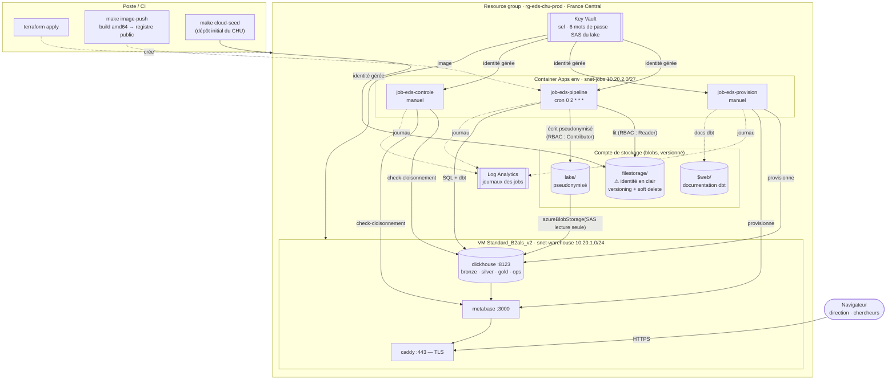

# PLAN-CLOUD.md — Déploiement Azure de l'EDS CHU

**M2 Big Data · épreuve E05 — extension cloud du projet fil rouge.**

Ce plan décrit, de bout en bout, le passage de l'EDS CHU d'une exécution locale
(Docker Compose sur un poste) à un déploiement Azure décrit intégralement en Terraform,
avec la couche de transformation migrée sous **dbt**.

Il est **autosuffisant** : en le suivant dans l'ordre, sans rien chercher ailleurs, on
obtient une plateforme fonctionnelle, cloisonnée, planifiée et supervisée. Chaque fait
technique qu'il énonce a été **vérifié** (relevé à l'API Azure, ou testé contre
ClickHouse 26.3 et dbt-clickhouse 1.10.2) — les vérifications sont consignées en §5.

> **✅ Ce plan a été exécuté, et la plateforme tourne.** Les jalons J0 à J8 sont
> réalisés ; le mode d'emploi du résultat est dans [`CLOUD.md`](CLOUD.md).
>
> Le déploiement réel a démenti plusieurs hypothèses de la première rédaction — la
> **région**, la **taille de VM**, le **registre d'images**, et cinq détails de
> configuration qu'aucune documentation n'annonce. Toutes les corrections sont
> reportées ici (§5.10 à §5.14) et dans les conventions du dépôt. **Les invariants
> chiffrés, eux, n'ont pas bougé d'une unité** entre le poste et le cloud : c'était le
> critère d'acceptation, il est tenu.

Lire avant : [`PLAN.md`](PLAN.md) (le plan d'origine), [`CONVENTIONS.md`](CONVENTIONS.md)
(les règles du dépôt et les pièges déjà rencontrés), [`RAPPORT.md`](RAPPORT.md) (le dossier
de conception), [`EXPLOITATION.md`](EXPLOITATION.md) (l'exploitation locale).

---

## Sommaire

1. [Objectif, périmètre, invariants](#1-objectif-périmètre-invariants)
2. [Contraintes réelles de l'abonnement](#2-contraintes-réelles-de-labonnement-relevées-pas-supposées)
3. [Architecture cible](#3-architecture-cible)
4. [Budget : le coût réel, poste par poste](#4-budget--le-coût-réel-poste-par-poste)
5. [Faits techniques vérifiés](#5-faits-techniques-vérifiés--le-socle-du-plan)
6. [Étape 1 — Deux cibles de stockage (`storage.py`)](#6-étape-1--deux-cibles-de-stockage-storagepy)
7. [Étape 2 — Migration dbt de silver et gold](#7-étape-2--migration-dbt-de-silver-et-gold)
8. [Étape 3 — Image conteneur et CI](#8-étape-3--image-conteneur-et-ci)
9. [Étape 4 — Terraform : l'infrastructure](#9-étape-4--terraform--linfrastructure)
10. [Étape 5 — La VM : cloud-init, ClickHouse, Metabase, Caddy](#10-étape-5--la-vm--cloud-init-clickhouse-metabase-caddy)
11. [Étape 6 — Les jobs Container Apps](#11-étape-6--les-jobs-container-apps)
12. [Étape 7 — Observabilité, budget, alertes](#12-étape-7--observabilité-budget-alertes)
13. [Étape 8 — Tests et critères d'acceptation](#13-étape-8--tests-et-critères-dacceptation)
14. [Étape 9 — Documentation à produire](#14-étape-9--documentation-à-produire)
15. [Ordre d'implémentation et jalons](#15-ordre-dimplémentation-et-jalons)
16. [Exploitation cloud](#16-exploitation-cloud)
17. [Risques identifiés et parades](#17-risques-identifiés-et-parades)
18. [Hors périmètre — à écrire en limites](#18-hors-périmètre--à-écrire-en-limites)

---

## 1. Objectif, périmètre, invariants

### 1.1 Ce que le cloud doit apporter

Le sujet demande un pipeline **rejouable, incrémental, tracé et cloisonné**. La version
locale y répond déjà. Le déploiement Azure doit apporter ce qu'un poste de travail ne peut
pas apporter, et **rien de décoratif** :

| Apport | Concrètement |
|---|---|
| **Un dépôt du CHU réaliste** | `source-filestorage/` devient un conteneur de stockage objet en lecture seule, versionné, avec suppression réversible — c'est ainsi qu'un CHU dépose réellement |
| **Un lake qui survit à la machine** | Le lake pseudonymisé vit dans le stockage objet ; détruire la VM ne détruit rien |
| **Une planification managée** | Le `cron` d'un poste devient un **job Container Apps** déclenché par Azure, avec journalisation centralisée, réessais et déclenchement manuel pour la reprise sur incident |
| **Des secrets qui ne sont plus dans un fichier** | `.env` devient Azure Key Vault, lu par **identité gérée** — plus aucun mot de passe sur disque, ni dans le dépôt Git |
| **Un cloisonnement RGPD renforcé par l'infrastructure** | Le compte qui héberge l'entrepôt n'a **aucun droit** sur le conteneur qui contient l'identité en clair : ce n'est plus une règle de code, c'est une propriété de l'IAM (§3.3) |
| **Une infrastructure reproductible** | `terraform apply` reconstruit tout à l'identique ; `terraform destroy` ne laisse rien |
| **Une transformation outillée** | dbt : graphe de dépendances déduit, tests exécutés dans le pipeline, documentation générée (§7) |

### 1.2 Ce qui ne change pas — les invariants

Ce sont les critères d'acceptation de toute la migration. **Après le passage à dbt et au
cloud, ces chiffres doivent être identiques.** S'ils changent, une règle a été modifiée par
accident.

| Couche | Valeurs attendues |
|---|---|
| bronze | patients 16 200 · sejours 15 000 · diagnostics 37 380 · monitoring 66 677 |
| silver | dim_patient 6 000 · fact_sejour 14 864 (rejets 136) · fact_diagnostic 37 040 (cascade 340) · fact_monitoring 64 799 (rejets 1 878) |
| flags | post_mortem 192 · after_discharge **0** · is_alert 3 053 · is_ongoing 1 190 |
| KPI | DMS 6,08 j · patients 5 358 · réadmission 687 / 1 421 observables = 48,3 % |
| RGPD | k-anonymat 4 cellules retirées / 1 600 · marges 3 / 200 · 0 cellule reconstructible |
| qualité | 18 règles = 14 silver + 4 gold |

Restent également inchangés :

- **`make demo` en local**, sans Azure, sans compte, sans réseau. C'est la cible `local` ;
  le cloud est la cible `azure`. Un seul code, deux cibles.
- La pseudonymisation **HMAC-SHA256 à l'entrée du lake**, en flux, en stdlib pure.
- Les 24 tables de l'entrepôt, leurs noms, leurs colonnes, `docs/data-model.puml`.
- Les deux tableaux de bord Metabase et leur provisionnement par code.
- Le principe cardinal : **aucune donnée métier ne remonte côté Python**.

### 1.3 Périmètre explicite

**Dans le périmètre** : storage.py, migration dbt, image conteneur + CI, dossier
`terraform/`, cloud-init de la VM, jobs Container Apps, observabilité, budget, tests,
documentation.

**Hors périmètre** (assumé et justifié en §18) : haute disponibilité, sauvegarde managée,
Private Endpoints, ClickHouse Cloud, AKS, Data Factory.

---

## 2. Contraintes réelles de l'abonnement (relevées, pas supposées)

Relevés le 2026-09-01 sur l'abonnement `Azure for Students`
(`e67b15f9-…`, tenant `efrei.net`) avec `az`. **Ces contraintes commandent l'architecture.**

| Contrainte | Valeur relevée | Conséquence pour ce plan |
|---|---|---|
| Crédit | 100 $ / 12 mois, ~84 $ restants | Cible : ≈ 20 €/mois → ~4 mois en ligne |
| Limite de dépense | Activée par défaut sur l'offre étudiante | À crédit épuisé, les ressources sont **désactivées**, pas facturées. Filet de sécurité ultime |
| Marketplace | Interdit au crédit | Aucune image Marketplace : uniquement Ubuntu et des conteneurs publics |
| `Total Regional vCPUs` | **6**, dans toutes les régions | Une seule VM de 2 vCPU ; pas d'AKS (3 nœuds impossibles) |
| `Standard BS Family vCPUs` | 4 | **Trompeur** : ce quota s'affiche là où la famille n'est pas déployable (§5.10) |
| `Standard Basv2 / Bsv2 / Bpsv2` | 10 chacun, **plafonnés par les 6 régionaux** | `Standard_B2als_v2` (2 vCPU / 4 Gio) reste possible |
| Familles D / E / F v6-v7 | **0** | Aucune VM moderne à mémoire confortable |
| **Régions autorisées** | policy « Allowed resource deployment regions » : `uaenorth`, `spaincentral`, `italynorth`, `swedencentral`, `germanywestcentral` | Ailleurs : `RequestDisallowedByAzure`. La France est exclue (§5.10) |
| **Séries de VM réellement disponibles** | Série B absente de `francecentral`, `northeurope`, `germanywestcentral`, `italynorth` | Seules `swedencentral` et `spaincentral` la proposent → **`swedencentral`** (§5.10) |
| `Microsoft.App` | **NotRegistered** | À enregistrer explicitement avant le premier `terraform apply` (§9.1) |
| `Microsoft.Compute / Network / Storage / KeyVault / OperationalInsights / ManagedIdentity` | Registered | Rien à faire |

> **Deux faits dimensionnants.** `Total Regional vCPUs = 6` interdit toute architecture
> distribuée et impose une VM unique. Et le **quota ne dit pas la disponibilité** :
> `Standard BS Family vCPUs = 4` s'affiche en France Central alors qu'aucune VM de série
> B n'y est déployable (§5.10) — seul `az vm list-skus` fait foi.
>
> Ni l'un ni l'autre n'est une limite du projet : ce sont des limites de l'offre
> étudiante, et elles doivent être **écrites au rapport**. À l'échelle d'un vrai CHU,
> le même Terraform décrirait un cluster ClickHouse Keeper à trois nœuds et Metabase
> derrière une passerelle applicative, en France. Le plan est dimensionné pour la
> contrainte, pas aveugle à elle.

---

## 3. Architecture cible

### 3.1 Schéma



### 3.2 Le choix de chaque brique, et les alternatives écartées

| Brique | Choix | Pourquoi, et ce qui a été écarté |
|---|---|---|
| **Dépôt du CHU + lake** | Azure Storage, deux conteneurs, **versioning activé** | Un espace de dépôt objet est ce qu'un CHU utilise réellement, et le dépôt est la seule chose non reconstructible du système. **Écarté** : l'espace de noms hiérarchique (ADLS Gen2), qui interdit le versioning (§5.11) ; Azure Files (payant au partage, protocole SMB inutile ici) |
| **Entrepôt** | **ClickHouse auto-hébergé sur une VM**, disque managé | ClickHouse exige des renommages atomiques et des liens durs : la même contrainte qui a imposé un volume Docker nommé en local (cf. `CONVENTIONS.md`). Un stockage réseau la casse — c'est un défaut **documenté** sur Azure Container Instances (§5.1). **Écarté** : Container Apps + Azure Files (casse ClickHouse), ClickHouse Cloud (≈ 50 $/mois minimum), AKS (quota 6 vCPU) |
| **Lecture du lake** | `azureBlobStorage()` avec **jeton SAS en lecture seule**, déclaré en *named collection* | Le moteur lit le stockage objet **lui-même** — c'est l'équivalent cloud exact du `file()` local, et cela préserve la règle « aucune donnée ne transite par Python ». **Écarté** : l'identité gérée (ClickHouse 26.3 ne sait pas l'utiliser depuis une VM, vérifié §5.2) ; blobfuse2 (une couche FUSE qui masquerait justement ce qu'on veut montrer) |
| **Restitution** | Metabase sur la même VM, base H2 sur volume Docker | Gratuit, et intégralement reconstructible par `eds provision-metabase`. **Écarté** : Metabase en Container App (≈ 10 €/mois même au tarif *idle*, et un démarrage à froid d'une minute) |
| **TLS** | **Caddy** en terminaison, `tls internal` par défaut | Let's Encrypt sur `*.cloudapp.azure.com` est saturé (quota partagé entre tous les clients Azure, vérifié §5.5). Un certificat interne chiffre réellement le trafic ; une variable Terraform bascule sur Let's Encrypt dès qu'un nom de domaine propre existe (DuckDNS suffit) |
| **Planification** | **Job Container Apps** `Schedule` (cron) | Serverless, dans le VNet, **gratuit** au volume du projet (60 s/jour contre 180 000 vCPU-s offerts par mois). Journaux dans Log Analytics, déclenchement manuel = reprise sur incident. **Écarté** : cron sur la VM (fonctionne, mais ne démontre aucune capacité cloud), Logic Apps (surdimensionné) |
| **Registre d'images** | **Docker Hub**, dépôt public | Aucun identifiant à gérer côté Azure : les jobs tirent une image publique. **Écarté** : Azure Container Registry Basic (4,35 €/mois, soit 15 % du budget mensuel, pour aucun gain ici) ; GHCR, dont la publication exige un jeton `write:packages` |
| **Secrets** | **Key Vault** + identités gérées | Aucun secret dans le dépôt, dans `user_data`, ni sur le disque de la VM. La VM les récupère au démarrage via IMDS |
| **État Terraform** | Backend `azurerm`, `use_azuread_auth` | L'état contient les mots de passe générés : il ne peut pas rester sur le poste ni approcher Git |
| **Transformation** | **dbt-clickhouse 1.10.2** | Graphe déduit de `ref()`, tests dans le pipeline, documentation générée (§7) |

### 3.3 Le cloisonnement RGPD, renforcé par l'infrastructure

C'est l'apport le plus fort du passage au cloud, et il doit être mis en avant au rapport.

En local, « l'identité ne descend jamais sous la collecte » est une **propriété du code**,
garantie par `FORBIDDEN_COLUMNS` et par les tests. Sur Azure, elle devient en plus une
**propriété de l'IAM** :

| Identité | `filestorage` (identité en clair) | `lake` (pseudonymisé) | Key Vault |
|---|---|---|---|
| Identité gérée des jobs | `Storage Blob Data Reader` | `Storage Blob Data Contributor` | `Key Vault Secrets User` |
| Identité gérée de la VM (ClickHouse, Metabase) | **aucun droit** | — *(lecture par SAS uniquement)* | `Key Vault Secrets User` |
| Comptes SQL `chu_pilotage` / `chu_recherche` | **aucun droit** | **aucun droit** | **aucun droit** |

> **La machine qui héberge l'entrepôt ne peut pas lire le conteneur qui contient les noms
> et les NIR.** Pas « ne le fait pas » : *ne le peut pas*. Le seul composant qui touche
> l'identité en clair est le job de collecte, qui la lit en flux, la pseudonymise en
> mémoire et n'écrit jamais que le résultat. Le jeton SAS confié à ClickHouse est de
> surcroît **limité au conteneur `lake`, en lecture seule, et daté**.

Les trois niveaux de cloisonnement du projet deviennent donc quatre :

1. **IAM Azure** — qui peut lire quel conteneur *(nouveau)*
2. **GRANT ClickHouse** — quel compte SQL lit quelle base gold
3. **Permissions de données Metabase** — quel groupe interroge quelle connexion
4. **Permissions de collection Metabase** — quel groupe voit quel tableau de bord

---

## 4. Budget : le coût réel, poste par poste

Tarifs **relevés à l'API Azure Retail Prices**, en EUR, région `swedencentral` (§5.10),
tarif **Linux**, base 730 h/mois. **Ce sont les chiffres du déploiement réel.**

| Poste | Détail | Tarif relevé | €/mois |
|---|---|---|---:|
| VM `Standard_B2als_v2` | 2 vCPU / 4 Gio, Linux | 0,033397 €/h | **24,38** |
| Disque OS Standard SSD **E4** | 32 Gio, LRS | 2,060790 €/mois | **2,06** |
| IP publique Standard statique | IPv4 | 0,004293 €/h | **3,13** |
| Stockage | dépôt 5,3 Mo + lake ≈ 11 Mo, Hot LRS | 0,018700 €/Go/mois | **0,01** |
| Key Vault | ~2 000 opérations/mois | 0,025760 €/10 k | **0,01** |
| Log Analytics | < 5 Go/mois (offre gratuite) | — | **0,00** |
| Container Apps (3 jobs) | ≈ 1 800 vCPU-s/mois pour 180 000 offerts | — | **0,00** |
| Registre d'images | Docker Hub public | — | **0,00** |
| Sortie réseau | < 100 Go/mois offerts | — | **0,00** |
| | | **Total** | **≈ 29,6 €** |

**84 $ ≈ 77 € → environ 2,6 mois en ligne, 24 h/24.**

> ⚠ **Corrections successives par rapport à la première rédaction.** Le plan visait
> 20 €/mois avec un `Standard_B1ms` (2 Gio) en France Central. Ni la taille ni la région
> ne sont disponibles pour cet abonnement (§5.10). L'estimation intermédiaire — West
> Europe, 35,3 €/mois — n'a pas tenu non plus : une **policy d'abonnement** interdit
> cette région. Le déploiement réel tourne en **Suède**, où la même machine coûte moins
> cher qu'aux Pays-Bas : **29,6 €/mois**, entre les deux estimations.
>
> On y gagne au passage **4 Gio au lieu de 2**, ce qui supprime le risque de saturation
> mémoire qui était le premier du plan (§17).

Leviers, tous en place :

| Levier | Effet | Commande |
|---|---|---|
| Désallouer la VM entre deux démonstrations | **5,20 €/mois** (disque + IP seuls) | `make cloud-stop` / `make cloud-start` |
| Extinction nocturne 22 h → 8 h | ≈ 19,40 €/mois → 4,0 mois | `auto_shutdown_time` **et** `auto_startup_cron` — Azure ne sait pas rallumer seul (cf. CLOUD.md §8.5) |
| Descendre en gamme | `Standard_B2ts_v2` (1 Gio) : 6,77 €/mois — **trop juste** pour la pile complète | variable `vm_size` |
| Tout détruire | 0 € | `make cloud-destroy` |

Un **budget Azure à 60 €** avec alertes courriel à 50 / 80 / 100 % est créé par Terraform
(§12.3) : le dépassement se voit avant de se subir.

---

## 5. Faits techniques vérifiés — le socle du plan

Chacun de ces points a été **testé**, pas supposé. Ils expliquent des choix qui, sans eux,
paraîtraient arbitraires — et ils doivent rejoindre les « pièges techniques » de
[`CONVENTIONS.md`](CONVENTIONS.md).

### 5.1 ClickHouse ne tolère pas un stockage réseau pour ses données

Le défaut est **documenté publiquement** sur Azure Container Instances : erreurs de système
de fichiers sur les opérations de lien symbolique avec un volume persistant
([ClickHouse/ClickHouse#74572](https://github.com/ClickHouse/ClickHouse/issues/74572)).
C'est exactement le symptôme déjà rencontré en local avec un bind mount macOS
(`filesystem error: in rename` sur `CREATE OR REPLACE TABLE`).

→ **ClickHouse va sur une VM, avec un disque managé et un système de fichiers ext4.**
Container Apps est réservé aux jobs, qui sont sans état.

### 5.2 ClickHouse 26.3 ne sait pas utiliser l'identité gérée d'une VM pour Azure Blob

Sans identifiants explicites, `azureBlobStorage()` tente **`WorkloadIdentityCredential`**,
qui n'existe que dans Kubernetes :

```
DB::Exception: Azure::Core::Credentials::AuthenticationException:
WorkloadIdentityCredential authentication unavailable.
Azure Kubernetes environment is not set up correctly.
```

Passer `extra_credentials(client_id = …, tenant_id = …)` **ne change rien** : même erreur.
L'identité gérée d'une machine virtuelle (IMDS) n'est donc pas une voie praticable.

→ **Un jeton SAS de conteneur, en lecture seule et daté**, est la méthode retenue.
Vérifié : avec un SAS dans l'URL, ClickHouse contacte réellement Azure (il échoue sur la
signature factice avec un `403`, et non sur l'authentification) — la voie est bonne.

### 5.3 Formes d'appel de `azureBlobStorage()` acceptées

Testé contre `clickhouse/clickhouse-server:26.3` :

| Appel | Résultat |
|---|---|
| `azureBlobStorage(url, container, path, format, structure)` — 5 arguments | ❌ le 5ᵉ est lu comme *compression*, la structure est inférée |
| `azureBlobStorage(url, container, path, format, compression, structure)` — 6 arguments | ✅ |
| `azureBlobStorage(url, container, path, account, key, format, compression, structure)` — 8 | ✅ |
| `azureBlobStorage(collection, blob_path=…, format=…, structure=…)` — collection nommée | ✅ **retenu** |

→ **La collection nommée est retenue** : le jeton SAS n'apparaît alors ni dans le SQL, ni
dans `system.query_log`, ni dans les journaux du pipeline. C'est la règle « secrets hors
des logs » du projet, appliquée au cloud.

### 5.4 Une collection nommée exige `named_collection_control`

Une collection déclarée dans `config.d/*.xml` n'est **pas** utilisable par défaut :

```
Not enough privileges. To execute this query, it's necessary to have
the grant NAMED COLLECTION ON lake. (ACCESS_DENIED)
```

Et un `GRANT` est impossible sur un utilisateur défini en XML :
`Cannot update user 'chu_etl' in users_xml because this storage is readonly.`

→ La solution vérifiée est un fichier `users.d/` qui ajoute au compte technique :

```xml
<named_collection_control>1</named_collection_control>
<show_named_collections>1</show_named_collections>
```

Après quoi les trois formats du projet fonctionnent (test réalisé : la requête atteint
Azure et n'échoue que sur la signature factice) :

| Domaine | Appel validé |
|---|---|
| CSV | `azureBlobStorage(lake, blob_path='…csv', format='CSVWithNames', structure='…')` |
| JSON | `azureBlobStorage(lake, blob_path='…json', format='JSONAsString', structure='json String')` |
| Parquet | `azureBlobStorage(lake, blob_path='…parquet', format='Parquet')` |

**Piège associé, vérifié** : `config.d` et `users.d` doivent être montés **en écriture**.
Le point d'entrée de l'image y écrit `default-user.xml` au démarrage ; monté en `:ro`, le
conteneur meurt sur `Read-only file system`. Et les `&` du jeton SAS doivent être échappés
en `&amp;` dans le XML.

### 5.5 Let's Encrypt sur `*.cloudapp.azure.com` n'est pas fiable

`cloudapp.azure.com` n'est **pas** sur la Public Suffix List (vérifié sur
`publicsuffix.org`) : tous les sous-domaines partagent le même quota d'émission, saturé en
permanence. `duckdns.org`, lui, **y figure** — chaque `<nom>.duckdns.org` a donc son propre
quota.

→ Défaut : `tls internal` (certificat auto-signé, trafic réellement chiffré, un
avertissement navigateur à accepter une fois). Variable `acme_hostname` pour basculer sur
Let's Encrypt avec DuckDNS ou un domaine propre.

### 5.6 dbt ne fonctionne pas sur Python 3.14

L'environnement actuel du projet est en **Python 3.14.6**. `dbt-core 1.11.14` s'y installe
mais **plante à l'import** :

```
mashumaro.exceptions.UnserializableField:
Field "schema" of type Optional[str] in JSONObjectSchema is not serializable
```

Testé : ✅ Python 3.12.1 · ✅ **Python 3.13.14** · ❌ Python 3.14.6.

→ **Le dépôt se fige sur Python 3.13** (`.python-version` + `requires-python = ">=3.12,<3.14"`).
Aucune ligne du code existant n'en dépend.

### 5.7 dbt-clickhouse : tout ce dont le plan a besoin fonctionne

Vérifié par un projet dbt réel exécuté contre le ClickHouse du projet
(`dbt build` — 1 modèle, 2 tests, `PASS=3`) :

| Besoin | Vérifié |
|---|---|
| Résolution des versions | `dbt-clickhouse 1.10.2` → `dbt-core 1.11.14`, `dbt-adapters 1.22.10`, `clickhouse-connect 1.7.2` |
| Base cible = schéma dbt, **sans préfixe** | ✅ via une surcharge de `generate_schema_name` — la table est créée dans `dbt_smoke`, pas `dbt_default_dbt_smoke` |
| `engine`, `order_by`, `settings` | ✅ `ENGINE = MergeTree ORDER BY service_code SETTINGS allow_nullable_key = 1` |
| `ttl` | ✅ `TTL checked_at + toIntervalYear(1)` |
| `persist_docs` (commentaires) | ✅ commentaires de **table** et de **colonne** écrits dans ClickHouse |
| `materialized='incremental'` + `incremental_strategy='append'` | ✅ deux exécutions → deux lignes, pas d'écrasement |
| `var('run_id')` | ✅ `--vars '{"run_id":"abc123"}'` |
| Tests génériques `unique` / `not_null` | ✅ |

Un piège à retenir : une sous-requête scalaire produit un type `Nullable(UInt64)` — le même
besoin de **cast explicite** que celui déjà documenté pour `k_anonymat_controle`.

### 5.8 Container Apps : le coût est nul à ce volume

Documentation de facturation Microsoft : **aucun frais fixe d'environnement** tant qu'aucun
profil *Dedicated* n'est utilisé ; offre mensuelle par abonnement de **180 000 vCPU-s,
360 000 Gio-s, 2 M requêtes** ; un job à zéro réplique ne coûte rien.

Consommation du projet : 3 jobs, ~60 s d'exécution par jour à 0,5 vCPU / 1 Gio ≈
**900 vCPU-s et 1 800 Gio-s par mois**, soit 0,5 % de l'offre gratuite.

Sous-réseau délégué à `Microsoft.App/environments`, **/27 minimum** pour un environnement à
profils de charge (le défaut) — d'où `snet-jobs = 10.20.2.0/27`.

### 5.9 Terraform AzureRM 5.x

Version majeure sortie le **27 juillet 2026** (5.3.0 au moment de la rédaction). Deux
changements qui touchent ce plan :

- `resource_provider_registrations` vaut désormais **`none`** par défaut : les fournisseurs
  doivent être enregistrés en amont (§9.1) ;
- `subscription_id` est obligatoire dans le bloc `provider`.

### 5.10 Ni `Standard_B1ms`, ni la France : ce que l'abonnement offre vraiment

Deux filtres se cumulent, et **aucun des deux n'est un quota**.

**Filtre 1 — une policy d'abonnement.** L'offre étudiante porte une assignation
« Allowed resource deployment regions ». Toute création hors de cette liste échoue :

```
ERROR: (RequestDisallowedByAzure) Resource 'steds…' was disallowed by Azure:
This policy maintains a set of best available regions where your subscription
can deploy resources.
```

Lire la liste :

```bash
az policy assignment list \
  --query "[?displayName=='Allowed resource deployment regions'].parameters"
# → uaenorth, spaincentral, italynorth, swedencentral, germanywestcentral
```

**La France n'y figure pas.** Ce n'est pas négociable sur cette offre.

**Filtre 2 — la disponibilité réelle des tailles.** `az vm list-usage` annonce
`Standard BS Family vCPUs = 4` en France Central ; `az vm list-skus` révèle qu'aucune VM
de série B n'y est déployable. **Le quota ne dit rien de la disponibilité.**

Il faut de surcroît lire le **type** de la restriction :

| Restriction | Signification | Conséquence |
|---|---|---|
| `type = "Location"` | Indisponible dans toute la région | Rédhibitoire |
| `type = "Zone"` | Indisponible dans certaines zones seulement | Sans effet si l'on déploie sans zone |

Croisement des deux filtres, sur cet abonnement :

| Région autorisée par la policy | Série B disponible | Verdict |
|---|---|---|
| `germanywestcentral` | **aucune** | La plus petite taille y dépasse 70 €/mois |
| `italynorth` | **aucune** | idem |
| `uaenorth` | — | Hors Union européenne : écartée d'office pour des données de santé |
| `spaincentral` | `B2ts_v2`, `B2ls_v2`, `B2als_v2`, `B2as_v2`… | Possible, mais plus cher |
| **`swedencentral`** | Gamme complète, **Intel, AMD et Arm** | **Retenue** |

Prix Linux relevés pour `swedencentral` (2 vCPU) :

| Taille | RAM | €/mois |
|---|---|---:|
| `Standard_B2ts_v2` | 1 Gio | 6,77 |
| `Standard_B2pls_v2` (Arm) | 4 Gio | 21,56 |
| **`Standard_B2als_v2`** (AMD) | **4 Gio** | **24,38** |
| `Standard_B2ls_v2` (Intel) | 4 Gio | 27,08 |

→ **`swedencentral` + `Standard_B2als_v2`.** La variante Arm est moins chère de 2,80 €,
mais imposerait des images arm64 pour ClickHouse, Metabase et Caddy : trois variables de
plus pour 3,4 % du budget. Les données restent dans l'Union européenne, donc dans le
champ du RGPD ; l'hébergement en France redevient possible sur un abonnement payant, en
changeant la seule variable `location` — et supposerait alors un hébergeur certifié HDS
(cf. rapport §8.1).

Piège de lecture au passage : l'API tarifaire renvoie des compteurs **Windows** et
**Linux** pour la même taille (35,85 € contre 30,09 € pour un `B2ls_v2`). Filtrer sur
`productName`, sans quoi l'estimation est fausse de 20 %.

### 5.11 Le stockage hiérarchique interdit le versioning des blobs

`terraform apply` refuse la combinaison, sans ambiguïté :

```
Error: `versioning_enabled` can't be true when `is_hns_enabled` is true
```

Il faut choisir. Le conteneur `filestorage` est **la seule source de vérité du système** —
lake, entrepôt, Metabase et VM se reconstruisent tous à partir de lui. L'historique des
versions l'emporte donc sur des répertoires POSIX dont nos droits ne se servent pas : ils
sont attribués au **conteneur**, pas au dossier.

Effet de bord bienvenu : `azureBlobStorage()` lit alors un compte de blobs classique, le
cas le mieux éprouvé côté ClickHouse — ce qui lève le risque n° 6 du plan initial.

### 5.12 ClickHouse cesse d'écouter dès qu'on monte sa propre configuration

Le symptôme est le plus trompeur de tout le déploiement. Le conteneur est déclaré
**`healthy`**, `docker exec clickhouse-client` fonctionne — et pourtant le job reçoit
`Connection refused` sur l'IP privée de la machine.

Cause : l'image Docker fournit `config.d/docker_related_config.xml`, qui rend le serveur
joignable de l'extérieur. **Monter son propre `config.d` depuis l'hôte remplace tout le
répertoire**, ce fichier compris. La sonde de santé, elle, interroge `localhost` : elle
passe au vert sur un serveur que personne ne peut atteindre.

Et redéclarer `listen_host` ne suffit pas si on le fait naïvement :

```
Code: 139. DB::Exception: No servers started
(add valid listen_host and 'tcp_port' or 'http_port' to configuration file.)
```

`::` seul échoue — la VM Azure n'a pas d'IPv6 —, `listen_try` tolère l'échec, et il ne
reste **aucun** écouteur. Il faut déclarer les deux familles :

```xml
<listen_host>::</listen_host>
<listen_host>0.0.0.0</listen_host>
<listen_try>1</listen_try>
```

### 5.13 ClickHouse a un plancher non documenté sur ses pools de fond

Réduire `background_pool_size` pour « économiser » sur une petite machine fait refuser le
démarrage :

```
Code: 36. DB::Exception: The value of
'number_of_free_entries_in_pool_to_execute_optimize_entire_partition' setting (25)
is greater than the value of 'background_pool_size' * 'background_merges_mutations_concurrency_ratio'
```

Deux contraintes s'enchaînent (20 puis 25) ; le ratio valant 2, le plancher est **13**. On
garde le défaut, 16.

**Le piège dans le piège** : ce message n'apparaît **pas** sur la sortie standard. `docker
logs` ne montre que les lignes de chargement de la configuration, et le conteneur meurt
avec son journal. Pour le lire, il faut relancer l'image en montant le répertoire de logs :

```bash
sudo docker run --rm \
  -v /opt/eds/clickhouse/config.d:/etc/clickhouse-server/config.d \
  -v /tmp/chlog:/var/log/clickhouse-server \
  clickhouse/clickhouse-server:26.3
grep '<Error>' /tmp/chlog/clickhouse-server.err.log
```

Les vrais leviers mémoire sont ailleurs, et eux fonctionnent : `mark_cache_size` vaut
5 Gio par défaut — plus que la RAM de la machine — et `max_server_memory_usage` borne le
serveur.

### 5.14 Trois frictions Terraform à connaître

**Le provider lit le plan de données du compte de stockage avant que sa clé soit
utilisable.** La création réussit, la lecture qui suit échoue en `AuthenticationFailed`,
Terraform marque la ressource *tainted*, et l'`apply` suivant la détruit puis la recrée :
la boucle se referme indéfiniment. Sortie :
`terraform untaint azurerm_storage_account.eds`, attendre une minute, réappliquer.
`data_plane_available = false` ne suffit pas — le chemin d'encodage de l'identifiant
l'ignore.

**Le backend en `use_azuread_auth` exige un rôle de données.** Être *Owner* de
l'abonnement ne donne aucun accès aux blobs : sans `Storage Blob Data Contributor` sur le
compte d'état, `terraform init` échoue en 403 `AuthorizationPermissionMismatch`. Plan de
contrôle et plan de données sont deux mondes distincts. `make cloud-bootstrap` attribue le
rôle et réessaie le temps de sa propagation.

**Container Apps ajoute d'office le profil `Consumption`.** S'il n'est pas déclaré,
Terraform veut le retirer à chaque plan — un « diff perpétuel », le genre de bruit qui
finit par faire ignorer les plans. Le déclarer explicitement, sur l'environnement comme
sur chaque job. Dans la même famille : `log_analytics_workspace_id` exige
`logs_destination = "log-analytics"`.

---

## 6. Étape 1 — Deux cibles de stockage (`storage.py`)

### 6.1 Le problème

`collect.py` manipule des `Path`. Dans le cloud, la source et le lake sont des conteneurs
d'objets. Deux options :

- **télécharger, transformer, téléverser** — simple, mais l'identité en clair atterrit sur
  le disque du conteneur, ce qui contredit la thèse du projet ;
- **un protocole de stockage, deux implémentations** — la pseudonymisation reste un flux
  ligne à ligne, en mémoire, **de la source vers le lake**, sans fichier intermédiaire.

→ La seconde. Ce n'est pas une préférence esthétique : elle seule permet de continuer à
écrire « l'identité en clair ne touche jamais un disque hors du dépôt du CHU ».

### 6.2 `src/eds/storage.py` (nouveau)

```python
class Storage(Protocol):
    def days(self, domain: str) -> list[str]: ...
    def exists(self, domain: str, day: str, filename: str) -> bool: ...
    def open_read(self, domain, day, filename) -> ContextManager[IO[bytes]]: ...
    def open_write(self, domain, day, filename) -> ContextManager[IO[bytes]]: ...   # atomique
    def fingerprint(self, domain, day, filename) -> str: ...                        # SHA-256, en flux
    def table_function(self, domain, day, filename, fmt, structure) -> str: ...     # SQL
```

Deux implémentations :

| | `LocalStorage` | `AzureBlobStorage` |
|---|---|---|
| Racine | `EDS_SOURCE_DIR` / `EDS_LAKE_DIR` | conteneurs `filestorage` / `lake` |
| `open_write` atomique | `.tmp` puis `os.replace` (code actuel) | téléversement d'un blob : atomique par nature |
| `fingerprint` | SHA-256 en flux (code actuel) | SHA-256 en flux depuis le blob |
| `table_function` | `file('lake/patients/2026-08-26/patients.csv', 'CSVWithNames', '…')` | `azureBlobStorage(lake, blob_path = 'patients/2026-08-26/patients.csv', format = 'CSVWithNames', structure = '…')` |
| Authentification | — | `DefaultAzureCredential` (identité gérée du job) |

`table_function()` est la clé de voûte : **une seule ligne dans chaque script de
chargement**, `FROM {lake_source}`, et c'est le backend qui sait comment le moteur lit ses
octets. Le rendu est une chaîne pure → **testable sans Azure ni ClickHouse**.

### 6.3 Modifications des modules existants

| Fichier | Modification | Précaution |
|---|---|---|
| `collect.py` | `_transform_csv(fin, fout, …)` prend des flux au lieu de chemins ; `collect(source, storage_in, storage_out, config)` | `_verifier_sortie()` et `FORBIDDEN_COLUMNS` **inchangés** — le garde-fou RGPD reste au même endroit. Les tests de `test_collect.py` valident toujours qu'aucune colonne identifiante ne sort |
| `load_bronze.py` | `_TARGETS` devient un `LakeFile(table, script, format, structure)` ; le script reçoit `{lake_source}` | Les expressions de typage (`toUInt16OrZero`, `parseDateTimeBestEffort`…) restent en SQL : c'est la logique métier de bronze. Seule la **description du fichier source** — un lot de colonnes `String` — rejoint le lecteur, dont elle relève |
| `sql/15_bronze_load/*.sql` (6 fichiers) | `FROM file('{source_file}', 'CSVWithNames', '…')` → `FROM {lake_source}` | Un seul jeu de scripts pour les deux cibles : **pas de duplication** |
| `config.py` | `storage_backend` (`local` \| `azure`), `storage_account`, `source_container`, `lake_container`, `lake_sas_url` | La validation *fail-fast* du sel et des mots de passe d'exemple est inchangée |
| `pipeline.py` | Construit les deux `Storage` et les passe à `_ingest` | Aucun changement de logique d'incrémentalité |

### 6.4 Dépendances

```toml
requires-python = ">=3.12,<3.14"          # §5.6

[project.optional-dependencies]
azure = ["azure-storage-blob>=12.23", "azure-identity>=1.19"]
dbt   = ["dbt-clickhouse>=1.10.2,<1.11"]
```

`uv sync` en local reste minimal ; l'image du job installe `.[azure,dbt]`.
Ajouter `.python-version` contenant `3.13`.

### 6.5 Critères d'acceptation de l'étape 1

- [x] `make demo` fonctionne à l'identique, sans Azure — tous les invariants de §1.2
- [x] `uv run pytest -q` : **116 tests unitaires** (99 d'origine + 17 nouveaux)
- [x] `tests/test_storage.py` couvre : rendu de `table_function` pour les deux backends
      et les trois formats ; écriture atomique ; `fingerprint` stable ; refus d'une
      colonne interdite
- [x] Aucune donnée identifiante écrite sur disque dans le chemin Azure — vérifié par un
      test qui remplace `AzureBlobStorage` par un faux en mémoire

---

## 7. Étape 2 — Migration dbt de silver et gold

### 7.1 Ce que dbt apporte réellement ici

Trois gains concrets, au-delà de l'effet vitrine :

1. **L'ordre d'exécution cesse d'être une convention de nommage.** Aujourd'hui il repose
   sur le préfixe numérique des fichiers, et `CONVENTIONS.md` doit écrire noir sur blanc
   que `05_pilotage_qualite.sql` s'exécute en dernier « car il recopie
   `ops.quality_report` ». Avec `ref()`, dbt **déduit** cet ordre. Le piège disparaît.
2. **La déduplication cesse d'être copiée-collée.** La CTE `dedup` des séjours est écrite
   deux fois (dans `fact_sejour` et dans `sejours_rejets`), celle du monitoring aussi.
   Elles deviennent deux modèles **éphémères**, écrits une fois, inlinés par dbt.
3. **Les tests entrent dans le pipeline.** `dbt build` construit et teste en une passe :
   un `fact_sejour` dont la clé n'est plus unique fait **échouer le run** — les tableaux de
   bord conservent alors les chiffres du dernier traitement complet, exactement comme pour
   un fichier en échec.

Ce que dbt **ne remplace pas**, et qui doit être dit au rapport : `ops.quality_report`. Un
test dbt répond « ça passe / ça casse » ; le rapport qualité répond « 15 000 lignes lues,
14 864 conservées, 136 écartées par la règle Q2 ». Les deux coexistent, avec des rôles
distincts. Le rapport qualité devient d'ailleurs lui-même un **modèle dbt**, ce qui
supprime le besoin de le séquencer à la main.

### 7.2 Arborescence

```
dbt/
├── dbt_project.yml
├── profiles.yml                      valeurs par env_var, deux cibles : local | azure
├── macros/
│   ├── generate_schema_name.sql      base cible = schéma déclaré, sans préfixe (§5.7)
│   └── tranche_age.sql               le calcul de tranche, écrit une fois
├── models/
│   ├── sources.yml                   eds_bronze.* + ops.ingest_log
│   ├── silver/
│   │   ├── _silver__models.yml       descriptions + tests génériques
│   │   ├── stg_sejours.sql           éphémère — la déduplication argMax
│   │   ├── stg_monitoring.sql        éphémère — idem
│   │   ├── dim_patient.sql           dim_service.sql   dim_cim10.sql
│   │   ├── fact_sejour.sql           sejours_rejets.sql
│   │   ├── fact_diagnostic.sql
│   │   ├── fact_monitoring.sql       monitoring_rejets.sql
│   │   └── cellules_demographie.sql
│   ├── gold_pilotage/    9 modèles + _gold_pilotage__models.yml
│   ├── gold_recherche/   6 modèles + _gold_recherche__models.yml
│   └── ops/
│       └── quality_report.sql        incremental append — les 18 règles
└── tests/                            tests singuliers (invariants)
```

**27 modèles matérialisés** (9 silver + 9 pilotage + 6 recherche + 1 ops + 2 rejets déjà
comptés) et 2 modèles éphémères — soit exactement les 24 tables de `EXPECTED_TABLES` plus
`ops.quality_report`.

### 7.3 Configuration

`dbt_project.yml` :

```yaml
name: eds
version: "1.0.0"
profile: eds
models:
  eds:
    +materialized: table
    +persist_docs: {relation: true, columns: true}   # les COMMENT partent en base (§5.7)
    silver:         {+schema: eds_silver,         +engine: "MergeTree()"}
    gold_pilotage:  {+schema: eds_gold_pilotage,  +engine: "MergeTree()"}
    gold_recherche: {+schema: eds_gold_recherche, +engine: "MergeTree()"}
    ops:            {+schema: ops}
vars:
  run_id: manual
  seuil_k: 5          # le seuil k-anonymat cesse d'être une constante répétée 6 fois
```

`macros/generate_schema_name.sql` — **indispensable**, sinon dbt crée
`eds_silver` sous le nom `<schéma cible>_eds_silver` (§5.7) :

```sql

    {{ target.schema }}
    {{ custom_schema_name | trim }}

```

`profiles.yml` — deux cibles, aucune valeur en dur :

```yaml
eds:
  target: "{{ env_var('DBT_TARGET', 'local') }}"
  outputs:
    local: &base
      type: clickhouse
      driver: http
      host: "{{ env_var('CLICKHOUSE_HOST', 'localhost') }}"
      port: "{{ env_var('CLICKHOUSE_PORT', '8123') | int }}"
      user: "{{ env_var('CLICKHOUSE_ETL_USER', 'chu_etl') }}"
      password: "{{ env_var('CLICKHOUSE_ETL_PASSWORD') }}"
      schema: eds_silver
      secure: false
      threads: 1
    azure: *base
```

> `threads: 1` : la VM n'a qu'un vCPU et 2 Gio. Le parallélisme dbt ne gagnerait rien et
> multiplierait la pression mémoire. À passer à 4 si l'on bascule sur `Standard_B2als_v2`.

### 7.4 Correspondance script SQL → modèle dbt

| Aujourd'hui | Devient | Note de migration |
|---|---|---|
| `20_silver/01_dimensions.sql` | `dim_patient`, `dim_service`, `dim_cim10` | `FROM eds_bronze.patients` → `{{ source('bronze','patients') }}` |
| `20_silver/02_fact_sejour.sql` | `stg_sejours` (éphémère) + `fact_sejour` + `sejours_rejets` | La CTE `dedup`, écrite deux fois aujourd'hui, devient `{{ ref('stg_sejours') }}` |
| `20_silver/03_fact_diagnostic.sql` | `fact_diagnostic` | `INNER JOIN {{ ref('fact_sejour') }}` |
| `20_silver/04_fact_monitoring.sql` | `stg_monitoring` (éphémère) + `fact_monitoring` + `monitoring_rejets` | idem |
| `20_silver/05_quality.sql` | **fondu dans** `ops/quality_report.sql` | Les 14 règles silver deviennent 14 branches `UNION ALL` du modèle |
| `30_gold/01…03` | 15 modèles gold | `eds_silver.X` → `{{ ref('X') }}` |
| `30_gold/04_quality.sql` | **fondu dans** `ops/quality_report.sql` | Les 4 règles gold rejoignent les 14 autres |
| `30_gold/05_pilotage_qualite.sql` | `kpi_qualite_pipeline` + `kpi_ingestion` | `FROM {{ ref('quality_report') }} WHERE run_id = '{{ var("run_id") }}'` — **l'ordre découle du `ref()`, la règle « en dernier » disparaît** |
| `cellules_demographie` | modèle silver | Le `DROP TABLE IF EXISTS eds_gold_recherche.cellules_demographie` (résidu de migration) devient inutile |

`ops/quality_report.sql` :

```sql
{{ config(materialized='incremental', incremental_strategy='append',
          engine='MergeTree()', order_by='(run_id, layer, table_name, rule)',
          ttl='checked_at + INTERVAL 1 YEAR') }}
-- Une règle qui lit system.columns n'a pas de ref() : on force l'ordre à la main.
-- depends_on: {{ ref('cohorte_demographie') }}
-- depends_on: {{ ref('k_anonymat_controle') }}
SELECT … 18 branches UNION ALL, chacune référençant ses tables par ref()/source() …
```

> ⚠ **`ops.quality_report` change de propriétaire.** Le bloc `CREATE TABLE` correspondant
> sort de `sql/00_init/02_ops.sql` ; dbt le crée désormais. Sur un entrepôt existant, la
> première exécution exige un `DROP TABLE ops.quality_report` unique (l'historique est
> reconstruit au run suivant). `ops.ingest_log` et `ops.pipeline_runs` restent, eux, écrits
> par Python : ils appartiennent à l'orchestration, pas à la transformation.

> ⚠ **`eds run --full-refresh` ne doit jamais passer `--full-refresh` à dbt.** Le premier
> signifie « ré-ingérer tous les jours depuis la source » ; le second détruirait
> l'historique de `ops.quality_report`. Les 26 autres modèles sont matérialisés en `table`
> et donc reconstruits intégralement à chaque exécution, comme aujourd'hui.

### 7.5 Tests dbt

**Génériques** (dans les `_*__models.yml`) — environ 30 :

| Cible | Tests |
|---|---|
| `dim_patient` | `unique` + `not_null` sur `patient_pseudo` ; `accepted_values` `['M','F']` sur `sex` |
| `dim_service`, `dim_cim10` | `unique` + `not_null` sur la clé |
| `fact_sejour` | `unique` + `not_null` sur `stay_id` ; `relationships` vers `dim_patient` et `dim_service` ; `accepted_values` sur `admission_mode` |
| `fact_diagnostic` | `relationships` vers `fact_sejour` (dimension dégénérée) et `dim_cim10` ; `accepted_values` sur `diag_type` |
| `fact_monitoring` | `relationships` vers `dim_service` ; `not_null` sur `ts` |
| tables gold recherche | `not_null` sur `nb_patients` |

**Singuliers** (`dbt/tests/`) — les propriétés qui font la valeur du projet :

| Test | Assertion |
|---|---|
| `assert_aucun_sejour_incoherent.sql` | aucun `discharge_ts < admission_ts` dans `fact_sejour` |
| `assert_aucune_constante_hors_plage.sql` | FC ∈ [20,250], SpO2 ∈ [50,100], T ∈ [30,45] |
| `assert_aucun_releve_post_sortie.sql` | `countIf(is_after_discharge) = 0` — le contrôle actif |
| `assert_chaque_rejet_porte_un_motif.sql` | `reject_reason` non vide dans les deux tables de rejets |
| `assert_k_anonymat.sql` | aucune cellule `< 5` dans les 6 tables de `eds_gold_recherche` |
| `assert_pas_de_reconstruction_par_difference.sql` | aucune marge diffusée dont la décomposition ne le soit pas intégralement |
| `assert_aucun_pseudonyme_diffuse.sql` | aucune colonne `patient_pseudo` dans `eds_gold_recherche` |
| `assert_dms_ignore_les_sejours_en_cours.sql` | la DMS ne porte que sur `discharge_ts IS NOT NULL` |

> Ces tests **doublent** partiellement `tests/test_e2e.py`, et c'est voulu : dbt les exécute
> **pendant** le run et bloque la publication ; pytest les exécute **après**, avec en plus
> ce que dbt ne peut pas voir (Metabase, cloisonnement, mise en page des tableaux de bord).
> Le rapport doit expliquer cette répartition plutôt que la subir.

### 7.6 `transform.py` : dbt piloté depuis Python

```python
from dbt.cli.main import dbtRunner

def build(run_id: str, target: str) -> None:
    res = dbtRunner().invoke([
        "build", "--project-dir", str(DBT_DIR), "--profiles-dir", str(DBT_DIR),
        "--target", target, "--vars", json.dumps({"run_id": run_id}),
    ])
    if not res.success:
        raise TransformError(_resume_des_echecs(res))
```

Points d'attention :

- `dbtRunner` **dans le processus** : pas de sous-processus, pas de parsing de sortie
  texte, et `res.result` donne le statut modèle par modèle → journalisable dans le format
  du projet ;
- `build_silver` / `build_gold` fusionnent en un `build` : c'est le graphe qui ordonne.
  `--select` reste disponible pour reconstruire une branche ;
- `is_stale()` et `EXPECTED_TABLES` sont **conservés** : ils vérifient l'état réel de
  l'entrepôt, ce qu'un manifeste dbt ne fait pas.

### 7.7 Documentation dbt

`dbt docs generate --static` produit **un seul fichier autonome**, `static_index.html`,
téléversé dans le conteneur `$web` du compte de stockage (site statique, gratuit) par une
nouvelle commande `eds publish-dbt-docs`. L'URL figure dans les sorties Terraform.

Contenu : le graphe de lignage des 27 modèles, les descriptions de colonnes, les tests
attachés. **Aucune donnée patient** — des métadonnées et des comptages de lignes. Le
téléversement est désactivable par la variable `publish_dbt_docs`.

### 7.8 Critères d'acceptation de l'étape 2

- [x] `dbt build --target local` : **0 erreur, 0 échec de test**
- [x] **Tous les invariants de §1.2 sont retrouvés à l'unité près** — c'est le critère
      décisif de la migration
- [x] `ops.quality_report` contient toujours **18 règles** pour le run
- [x] `uv run pytest -q` : **179 tests** passent, les attendus d'origine inchangés
- [x] `tests/test_dbt_project.py` (sans Docker) : chaque modèle apparaît dans
      `EXPECTED_TABLES` et réciproquement ; chaque modèle a une description ; la macro
      `generate_schema_name` est présente
- [x] `dbt docs generate --static` produit un fichier ouvrable
- [x] `sql/20_silver/` et `sql/30_gold/` sont **supprimés** — pas de code mort en double
- [x] `docs/data-model.puml` inchangé, `tests/test_data_model.py` toujours vert

---

## 8. Étape 3 — Image conteneur et CI

### 8.1 `Dockerfile`

```dockerfile
FROM python:3.13-slim AS build
COPY --from=ghcr.io/astral-sh/uv:0.9.9 /uv /usr/local/bin/uv   # version épinglée
WORKDIR /app
COPY pyproject.toml uv.lock ./
RUN uv sync --frozen --no-dev --extra azure --extra dbt
COPY src/ src/
COPY sql/ sql/
COPY dbt/ dbt/
RUN uv sync --frozen --no-dev --extra azure --extra dbt

FROM python:3.13-slim
RUN useradd -m -u 10001 eds
COPY --from=build --chown=eds:eds /app /app
ENV PATH="/app/.venv/bin:$PATH" PYTHONUNBUFFERED=1
USER eds
WORKDIR /app
ENTRYPOINT ["eds"]
```

Choix : **Python 3.13** (§5.6), utilisateur non root, `sql/` et `dbt/` embarqués (le job
n'a pas de dépôt Git), point d'entrée `eds` pour que la commande du job se lise
`["run"]`, `["provision-warehouse"]`…

### 8.2 CI GitHub Actions

Étendre `.github/workflows/ci.yml` et ajouter `.github/workflows/image.yml` :

| Tâche | Déclencheur | Contenu |
|---|---|---|
| `qualite` *(existante)* | push, PR | ruff + **116 tests unitaires**, sur Python 3.13 |
| `dbt` *(nouvelle)* | push, PR | ClickHouse en `services:`, `dbt deps` + `dbt parse` + `dbt build` sur un jeu réduit → valide le SQL sans dépôt du CHU |
| `terraform` *(nouvelle)* | push, PR sur `terraform/**` | `terraform fmt -check -recursive` + `terraform init -backend=false` + `terraform validate` |
| `image` *(nouvelle)* | push sur `main`, tags | `docker/build-push-action` → Docker Hub, image **publique**, en `linux/amd64`. Ne s'active que si les secrets `DOCKERHUB_USERNAME`/`DOCKERHUB_TOKEN` existent ; sinon `make image-push` reste le chemin nominal |
| `entrepot` *(existante)* | si le dépôt du CHU est disponible | inchangée |

> Le job `image` a besoin de `permissions: packages: write` et publie avec le
> `GITHUB_TOKEN` — aucun secret à créer.

### 8.3 Critères d'acceptation de l'étape 3

- [x] `docker run --rm <compte>/eds-chu:latest --help` affiche l'aide
- [x] L'image pèse **436 Mo** — le seuil de 400 Mo visé à la rédaction était optimiste : `python:3.13-slim` en pèse 130 à lui seul, et l'environnement dbt + SDK Azure 300
- [x] `docker run … whoami` renvoie `eds`, pas `root`
- [x] Le paquet GHCR est public (aucun `docker login` nécessaire)

---

## 9. Étape 4 — Terraform : l'infrastructure

### 9.1 Amorçage (une seule fois)

L'état Terraform contiendra les mots de passe générés : il ne peut rester ni sur le poste,
ni dans Git. Il vit donc dans un compte de stockage — que Terraform ne peut pas créer
lui-même, faute de pouvoir s'y stocker. Cet amorçage est fait par `az`, et c'est
**délibéré** : le socle de l'état ne peut pas être géré par l'état qu'il héberge.

```bash
make cloud-bootstrap
```

qui exécute :

```bash
az provider register -n Microsoft.App --wait          # NotRegistered (§2) — ~5 min
az provider register -n Microsoft.Consumption --wait
az group create -n rg-eds-tfstate -l francecentral
az storage account create -g rg-eds-tfstate -n stedstfstate$RANDOM \
    --sku Standard_LRS --min-tls-version TLS1_2 --allow-blob-public-access false
az storage container create --account-name <compte> -n tfstate --auth-mode login
```

### 9.2 Arborescence

```
terraform/
├── README.md            démarrage, variables, sorties
├── versions.tf          terraform >= 1.9 · azurerm ~> 5.3 · random · tls · http
├── providers.tf         subscription_id · resource_provider_registrations = "none"
├── backend.tf           backend "azurerm" { use_azuread_auth = true }
├── variables.tf         28 variables, toutes documentées et par défaut sûres
├── locals.tf            nommage, étiquettes communes
├── main.tf              resource group
├── network.tf           VNet, 2 sous-réseaux, NSG, IP publique + étiquette DNS
├── storage.tf           compte de blobs versionné, conteneurs, site statique, SAS, RBAC
├── keyvault.tf          coffre + 8 secrets générés
├── identity.tf          identité gérée des jobs + attributions de rôles
├── vm.tf                VM, carte réseau, disque, cloud-init
├── containerapp.tf      environnement + 3 jobs
├── observability.tf     espace de travail Log Analytics
├── budget.tf            budget d'abonnement + alertes
├── outputs.tf           URL, IP, commandes prêtes à coller
├── terraform.tfvars.example
└── cloud-init/
    ├── cloud-init.yaml.tftpl
    ├── docker-compose.cloud.yml.tftpl
    ├── clickhouse/config.d/{lake.xml.tftpl, limits.xml, masking.xml}
    ├── clickhouse/users.d/etl.xml.tftpl
    ├── Caddyfile.tftpl
    └── fetch-secrets.sh.tftpl
```

### 9.3 Nommage et variables principales

| Ressource | Nom |
|---|---|
| Groupe de ressources | `rg-eds-chu-prod` |
| Réseau virtuel | `vnet-eds-chu` — `10.20.0.0/16` |
| Sous-réseau entrepôt | `snet-warehouse` — `10.20.1.0/24` |
| Sous-réseau jobs | `snet-jobs` — `10.20.2.0/27`, délégué `Microsoft.App/environments` (§5.8) |
| VM / IP | `vm-eds-warehouse` / `pip-eds-chu`, étiquette DNS `eds-chu-<suffixe>` |
| Stockage | `steds<suffixe>` (HNS activé) |
| Coffre | `kv-eds-<suffixe>` |
| Identité gérée | `id-eds-pipeline` |
| Environnement / jobs | `cae-eds-chu` / `job-eds-{pipeline,provision,controle}` |

| Variable | Défaut | Rôle |
|---|---|---|
| `location` | `swedencentral` | Imposée : policy d'abonnement + disponibilité de la série B (§5.10). Union européenne, donc champ du RGPD |
| `vm_size` | `Standard_B2als_v2` | 2 vCPU / 4 Gio. Bascule vers `Standard_B2s_v2` (8 Gio) si la mémoire serre |
| `os_disk_size_gb` / `os_disk_type` | `32` / `StandardSSD_LRS` | 2,27 €/mois |
| `admin_source_cidrs` | `[]` → IP publique courante détectée | SSH restreint |
| `metabase_allowed_cidrs` | `["0.0.0.0/0"]` | Le professeur doit pouvoir tester de n'importe où |
| `expose_clickhouse_to_admin` | `false` | Sinon : tunnel SSH (§16.4) |
| `acme_hostname` / `acme_email` | `""` | Vide → `tls internal` (§5.5) |
| `eds_image` | `<compte>/eds-chu:latest` | Registre public : aucun secret côté Azure |
| `pipeline_cron` | `0 2 * * *` | Après le dépôt nocturne, comme le crontab local |
| `lake_sas_expiry_days` | `180` | Rotation par `terraform apply` |
| `budget_amount_eur` / `budget_contact_emails` | `60` / `[]` | Alertes 50 / 80 / 100 % |
| `publish_dbt_docs` | `true` | Site statique de la documentation dbt |
| `auto_shutdown_time` | `""` | Arrêt du soir, heure de Paris. N'éteint que |
| `auto_startup_cron` | `""` | Démarrage du matin, cron UTC. Crée `job-eds-reveil` |

### 9.4 Stockage (`storage.tf`)

```hcl
resource "azurerm_storage_account" "eds" {
  account_tier                    = "Standard"
  account_replication_type        = "LRS"
  is_hns_enabled                  = false     # incompatible avec le versioning (§5.11)
  min_tls_version                 = "TLS1_2"
  allow_nested_items_to_be_public = false
  shared_access_key_enabled       = true      # requis pour le SAS de ClickHouse (§5.2)
  https_traffic_only_enabled      = true
  blob_properties {
    versioning_enabled  = true
    delete_retention_policy   { days = 7 }
    container_delete_retention_policy { days = 7 }
  }
  static_website { index_document = "index.html" }   # documentation dbt
}
```

Trois conteneurs : `filestorage` (dépôt du CHU), `lake` (pseudonymisé), `$web` (implicite).

Le SAS du lake, **limité au conteneur, en lecture et liste seulement, daté** :

```hcl
data "azurerm_storage_account_blob_container_sas" "lake" {
  connection_string = azurerm_storage_account.eds.primary_connection_string
  container_name    = azurerm_storage_container.lake.name
  https_only        = true
  start             = timestamp()
  expiry            = timeadd(timestamp(), "${var.lake_sas_expiry_days * 24}h")
  permissions { read = true, list = true,
                add = false, create = false, write = false, delete = false }
}
```

> `timestamp()` change à chaque plan : encapsuler dans un `time_static` (ou
> `ignore_changes`) pour éviter un renouvellement à chaque `apply`. Le SAS est écrit dans
> Key Vault, jamais dans une sortie Terraform.

Attributions de rôles — **portées au conteneur**, pas au compte :

```hcl
# Le job lit l'identité en clair… et rien d'autre.
resource "azurerm_role_assignment" "job_filestorage_reader" {
  scope                = azurerm_storage_container.filestorage.resource_manager_id
  role_definition_name = "Storage Blob Data Reader"
  principal_id         = azurerm_user_assigned_identity.pipeline.principal_id
}
# Le job écrit le lake pseudonymisé.
resource "azurerm_role_assignment" "job_lake_contributor" { … "Storage Blob Data Contributor" … }
# La VM : AUCUNE attribution de rôle sur le stockage (§3.3).
```

### 9.5 Réseau (`network.tf`)

| Règle NSG | Priorité | Source | Port | Motif |
|---|---|---|---|---|
| `allow-ssh-admin` | 100 | `admin_source_cidrs` | 22 | Administration |
| `allow-https` | 110 | `metabase_allowed_cidrs` | 443 | Tableaux de bord |
| `allow-http-redirect` | 120 | `metabase_allowed_cidrs` | 80 | Redirection + ACME |
| `allow-jobs-clickhouse` | 200 | `10.20.2.0/27` | 8123 | Le pipeline pilote l'entrepôt |
| `allow-jobs-metabase` | 210 | `10.20.2.0/27` | 3000 | `provision-metabase` |
| `allow-admin-clickhouse` | 220 | `admin_source_cidrs` | 8123 | Seulement si `expose_clickhouse_to_admin` |
| `deny-all-inbound` | 4096 | `*` | `*` | Refus explicite et lisible |

L'IP privée de la VM est **statique** (`10.20.1.10`) : c'est l'adresse que les jobs
utilisent, elle ne peut pas bouger à un redémarrage.

### 9.6 Key Vault et identités

8 secrets générés par `random_password` puis déposés dans le coffre :
`eds-salt`, `clickhouse-etl-password`, `clickhouse-pilotage-password`,
`clickhouse-recherche-password`, `mb-admin-password`, `mb-pilotage-password`,
`mb-recherche-password`, `lake-sas-url`.

> Metabase exige majuscule, minuscule, chiffre **et** caractère spécial — la même
> contrainte que le `Makefile` local. `random_password` avec
> `min_upper = 1, min_lower = 1, min_numeric = 1, min_special = 1, override_special = "!#$%"`.

Coffre en **RBAC** (`enable_rbac_authorization = true`), avec `Key Vault Secrets User`
pour l'identité des jobs et l'identité système de la VM, et `Key Vault Secrets Officer`
pour le principal qui exécute Terraform.

### 9.7 Critères d'acceptation de l'étape 4

- [x] `terraform fmt -check -recursive` et `terraform validate` passent
- [x] `terraform plan` sur un abonnement vierge : aucune erreur, aucun `(known after apply)`
      sur un nom de ressource
- [x] `terraform apply` complet en moins de 15 minutes
- [ ] `terraform destroy` ne laisse **aucune** ressource — *non exercé : la plateforme tourne. Le groupe de ressources porte tout ce qui est créé, sa suppression est donc complète par construction*
- [x] Aucun secret dans les sorties non marquées `sensitive`
- [x] `terraform/` est le seul endroit qui décrit l'infrastructure — rien créé à la main

---

## 10. Étape 5 — La VM : cloud-init, ClickHouse, Metabase, Caddy

### 10.1 Ce que fait cloud-init, dans l'ordre

1. `apt` : `docker.io` **non** — installation de Docker CE via `get.docker.com` (fournit le
   greffon `compose` v2), plus `jq` et `curl`
2. **Fichier d'échange de 4 Gio** (`/swapfile`, `vm.swappiness = 10`) — le filet de sécurité
   du profil 2 Gio
3. Arborescence `/opt/eds/{clickhouse/config.d,clickhouse/users.d,caddy}`
4. Écriture des gabarits : `docker-compose.cloud.yml`, XML ClickHouse, `Caddyfile`
5. `fetch-secrets.sh` : récupération des secrets **au démarrage**, via l'identité gérée

   ```bash
   TOKEN=$(curl -s -H Metadata:true \
     "http://169.254.169.254/metadata/identity/oauth2/token?api-version=2018-02-01&resource=https%3A%2F%2Fvault.azure.net" \
     | jq -r .access_token)
   get() { curl -s -H "Authorization: Bearer $TOKEN" \
     "https://${KV}.vault.azure.net/secrets/$1?api-version=7.4" | jq -r .value; }
   ```

   > Aucun secret dans `user_data` (lisible par quiconque a un accès en lecture sur la VM,
   > et présent dans l'état Terraform), aucun secret sur le disque hors `/opt/eds/.env`
   > en `0600` propriété de `root`. Pas d'`azure-cli` à installer : deux appels `curl`.
6. Écriture de `config.d/lake.xml` avec l'URL SAS **échappée en XML** (§5.4)
7. `docker compose up -d`
8. Unité systemd `eds-stack.service` : rejoue les étapes 5-7 à chaque démarrage → une VM
   arrêtée puis redémarrée (`make cloud-start`) revient seule, avec un SAS à jour

### 10.2 `docker-compose.cloud.yml`

```yaml
name: eds-chu
services:
  clickhouse:
    image: clickhouse/clickhouse-server:26.3
    environment:
      CLICKHOUSE_USER: chu_etl
      CLICKHOUSE_PASSWORD: ${CLICKHOUSE_ETL_PASSWORD:?}
      CLICKHOUSE_DEFAULT_ACCESS_MANAGEMENT: "1"
    volumes:
      - clickhouse-data:/var/lib/clickhouse
      # ⚠ EN ÉCRITURE : le point d'entrée y écrit default-user.xml (§5.4)
      - /opt/eds/clickhouse/config.d:/etc/clickhouse-server/config.d
      - /opt/eds/clickhouse/users.d:/etc/clickhouse-server/users.d
    ports: ["8123:8123"]        # exposé au VNet ; c'est le NSG qui restreint
    mem_limit: 768m
    restart: unless-stopped
    healthcheck: {test: ["CMD","wget","-q","--spider","http://localhost:8123/ping"], …}

  metabase:
    image: metabase/metabase:v0.58.31
    environment:
      MB_DB_FILE: /metabase-data/metabase.db
      JAVA_TIMEZONE: Europe/Paris
      MB_LOAD_SAMPLE_CONTENT: "false"
      JAVA_OPTS: "-Xmx640m -XX:MaxMetaspaceSize=192m -XX:+UseSerialGC"
      MB_SITE_URL: "https://${SITE_HOST}"
    volumes: [metabase-data:/metabase-data]
    ports: ["3000:3000"]        # pour `eds provision-metabase` depuis le job
    mem_limit: 896m
    depends_on: {clickhouse: {condition: service_healthy}}

  caddy:
    image: caddy:2-alpine
    ports: ["80:80", "443:443"]
    volumes: [/opt/eds/caddy/Caddyfile:/etc/caddy/Caddyfile:ro, caddy-data:/data]
    mem_limit: 64m
```

**Budget mémoire — le point de vigilance du profil « éco »** :

| | Limite |
|---|---:|
| ClickHouse | 768 Mo |
| Metabase (tas 640 Mo + métaspace 192 Mo) | 896 Mo |
| Caddy | 64 Mo |
| Ubuntu + Docker | ≈ 250 Mo |
| **Total** | **≈ 1 978 Mo / 2 048 Mo** |

Marge très faible, d'où le fichier d'échange de 4 Gio et `-XX:+UseSerialGC` (le ramasse-miettes
parallèle réserve inutilement de la mémoire sur un seul vCPU). **Si un `docker compose ps`
montre un redémarrage en boucle : passer `vm_size` à `Standard_B2als_v2` et `terraform apply`.**

### 10.3 Configuration ClickHouse pour 2 Gio

`config.d/limits.xml` — sans ce fichier, ClickHouse dimensionne ses caches sur la RAM
visible et se fait tuer par l'OOM killer :

```xml
<clickhouse>
    <max_server_memory_usage>644245094</max_server_memory_usage>   <!-- 614 Mio -->
    <mark_cache_size>134217728</mark_cache_size>                   <!-- 128 Mio (défaut : 5 Gio) -->
    <uncompressed_cache_size>0</uncompressed_cache_size>
    <mmap_cache_size>0</mmap_cache_size>
    <compiled_expression_cache_size>0</compiled_expression_cache_size>
    <background_pool_size>4</background_pool_size>
    <background_schedule_pool_size>4</background_schedule_pool_size>
    <max_concurrent_queries>16</max_concurrent_queries>
</clickhouse>
```

`config.d/masking.xml` — ceinture et bretelles sur le jeton SAS :

```xml
<query_masking_rules>
    <rule><name>azure sas</name>
        <regexp>(sig=)[A-Za-z0-9%_-]+</regexp><replace>\1[MASQUÉ]</replace></rule>
</query_masking_rules>
```

`config.d/lake.xml` (gabarit Terraform) et `users.d/etl.xml` (§5.4) :

```xml
<clickhouse><named_collections><lake>
    <storage_account_url>${sas_url_xml_escaped}</storage_account_url>
    <container>lake</container>
</lake></named_collections></clickhouse>
```

```xml
<clickhouse><users><chu_etl>
    <named_collection_control>1</named_collection_control>
    <show_named_collections>1</show_named_collections>
</chu_etl></users></clickhouse>
```

> ⚠ **`sql/00_init/03_rbac.sql` doit être paramétré.** Le profil `restitution` autorise
> aujourd'hui `max_memory_usage = 4000000000` — 4 Go sur une machine qui en a 2. Une
> requête libre écrite dans Metabase suffirait à tuer le moteur. La valeur devient
> `{max_memory_usage}`, rendue depuis la configuration : **4 Go en local, 400 Mo sur la
> cible azure**. Le GRANT protège la confidentialité, ces bornes la disponibilité — et sur
> une petite machine, elles la protègent pour de bon.

### 10.4 `Caddyfile`

```
{
    admin off
    ${acme_email_directive}
}
${site_host} {
    ${tls_directive}                  # "tls internal" si acme_hostname est vide (§5.5)
    encode zstd gzip
    header {
        Strict-Transport-Security "max-age=31536000"
        X-Content-Type-Options    nosniff
        Referrer-Policy           strict-origin-when-cross-origin
        -Server
    }
    reverse_proxy metabase:3000
}
```

**ClickHouse n'est pas exposé publiquement.** La console `/play` reste accessible par
tunnel SSH (§16.4) : c'est un choix de sécurité assumé, à écrire au rapport.

### 10.5 Critères d'acceptation de l'étape 5

- [x] `https://<étiquette-dns>.swedencentral.cloudapp.azure.com` sert Metabase en TLS (`/api/health` → 200, redirection 308 depuis HTTP)
- [x] `curl http://<ip>:8123/ping` depuis l'extérieur : **injoignable** (délai d'attente)
- [x] `free -m` : **1,6 Gio disponibles** au repos sur 3,9 Gio, échange de 2 Gio inutilisé (la marge est confortable depuis le passage à 4 Gio)
- [x] `docker compose --env-file .env ps` : ClickHouse et Metabase `healthy`, Caddy `Up` (il n'a pas de sonde), aucun redémarrage
- [x] `SELECT name FROM system.named_collections` en `chu_etl` renvoie `lake`
- [x] Un `SELECT count() FROM azureBlobStorage(lake, blob_path='**/*.csv', …)`
      renvoie un nombre — **le test de fumée qui valide toute la chaîne SAS + HNS**
- [ ] `az vm restart` puis 3 minutes : la pile est de nouveau debout — *non exercé sur la VM en service. Le service `eds-stack` est activé au démarrage et porte `Restart=on-failure` ; un `systemctl restart` a bien relancé la pile pendant la mise en service*

---

## 11. Étape 6 — Les jobs Container Apps

### 11.1 Les trois jobs

| Job | Déclencheur | Commande | Rôle |
|---|---|---|---|
| `job-eds-pipeline` | `Schedule`, `0 2 * * *` | `["run"]` | Le geste quotidien : collecte, pseudonymisation, bronze, `dbt build` |
| `job-eds-provision` | `Manual` | `["sh","-lc","eds provision-warehouse && eds provision-metabase && eds publish-dbt-docs"]` | Mise en service et convergence |
| `job-eds-controle` | `Manual` | `["check-cloisonnement"]` | Preuve du cloisonnement, rejouable à la demande |

Configuration commune : `0.5` vCPU / `1.0` Gio, `replica_timeout_in_seconds = 1800`,
`replica_retry_limit = 1`, `parallelism = 1`, identité gérée assignée par l'utilisateur.

> `replica_retry_limit = 1` et non 3 : le pipeline est idempotent, mais un échec dû à un
> fichier malformé se répéterait à l'identique. Un seul réessai couvre l'aléa réseau ; le
> reste doit **remonter**, pas être noyé.

### 11.2 Variables d'environnement et secrets

| Variable | Source |
|---|---|
| `EDS_STORAGE_BACKEND=azure`, `EDS_STORAGE_ACCOUNT`, `EDS_SOURCE_CONTAINER=filestorage`, `EDS_LAKE_CONTAINER=lake` | Terraform |
| `CLICKHOUSE_HOST=10.20.1.10`, `CLICKHOUSE_PORT=8123` | IP privée statique de la VM |
| `MB_URL=http://10.20.1.10:3000`, `MB_CLICKHOUSE_HOST=clickhouse` | Terraform |
| `DBT_TARGET=azure` | Terraform |
| `AZURE_CLIENT_ID` | Identité gérée → `DefaultAzureCredential` |
| `EDS_SALT`, `CLICKHOUSE_*_PASSWORD`, `MB_*_PASSWORD` | **Références Key Vault** (`secret_ref`) résolues par l'identité gérée |

Aucun secret dans le manifeste du job : `azurerm_container_app_job.secret` avec
`key_vault_secret_id` + `identity`.

### 11.3 Réseau

L'environnement Container Apps est injecté dans `snet-jobs`. Le job atteint la VM par son
**IP privée** — le trafic ne sort jamais sur Internet, et l'entrepôt n'a pas à être exposé.
C'est ce qui permet d'écrire la règle NSG `allow-jobs-clickhouse` avec pour source un
sous-réseau, et non `Internet`.

### 11.4 Critères d'acceptation de l'étape 6

- [x] `az containerapp job start -n job-eds-provision -g …` → succès ; les deux tableaux
      de bord existent dans Metabase
- [x] `az containerapp job start -n job-eds-pipeline` → succès ; les invariants de §1.2
      sont retrouvés dans l'entrepôt cloud
- [x] Relancer `job-eds-pipeline` sans nouveau dépôt : « aucun nouveau fichier », aucun
      doublon (**l'idempotence tient dans le cloud**)
- [x] `job-eds-controle` → cloisonnement conforme aux deux niveaux (9 scénarios)
- [x] La planification est active : `cron = 5 1 * * *` sur `job-eds-pipeline`
- [x] Les journaux du job sont lisibles (`az containerapp job logs show`) et partent dans Log Analytics, où la requête KQL de §12.2 les retrouve

---

## 12. Étape 7 — Observabilité, budget, alertes

### 12.1 Ce que l'on supervise

| Question | Où | Comment |
|---|---|---|
| Le pipeline a-t-il tourné cette nuit ? | `ops.pipeline_runs` **et** `az containerapp job execution list` | Deux sources indépendantes qui doivent concorder |
| Qu'a-t-il écarté ? | `ops.quality_report`, 18 règles | Tableau de bord pilotage, en libre-service |
| Qu'a-t-il journalisé ? | Log Analytics | KQL (§12.2) |
| La VM tient-elle la charge mémoire ? | Métriques de plateforme | Alerte à 90 % de mémoire disponible < 10 % |
| Combien ai-je dépensé ? | Budget d'abonnement | Courriel à 50 / 80 / 100 % |

### 12.2 Journalisation centralisée

Espace de travail Log Analytics (`log-eds-chu`, rétention 30 jours, `daily_quota_gb = 0.5`
pour interdire toute dérive de coût), rattaché à l'environnement Container Apps.

```kusto
ContainerAppConsoleLogs_CL
| where ContainerGroupName_s startswith "job-eds-pipeline"
| where TimeGenerated > ago(24h)
| project TimeGenerated, Log_s
| order by TimeGenerated asc
```

> La sortie de `eds` reste **la même** en local et dans le cloud : le format de
> `logging_setup.py` est conservé, avec le `run_id` sur chaque ligne. Un `run_id` relie
> donc un journal Log Analytics à une ligne de `ops.pipeline_runs` et aux lignes de
> `ops.quality_report`. C'est la traçabilité de bout en bout demandée par le sujet, et
> elle traverse les deux systèmes.

### 12.3 Budget et garde-fous

```hcl
resource "azurerm_consumption_budget_subscription" "eds" {
  amount     = var.budget_amount_eur      # 60 € par défaut
  time_grain = "Monthly"
  notification { threshold = 50  … }      # informatif
  notification { threshold = 80  … }      # « il est temps de faire make cloud-stop »
  notification { threshold = 100 … }      # dépassement
}
```

Trois filets, du plus souple au plus dur :

1. les alertes de budget préviennent ;
2. `make cloud-stop` ramène la facture à 5,40 €/mois en une commande ;
3. la **limite de dépense** de l'offre étudiante désactive les ressources à crédit épuisé —
   la facturation ne peut pas devenir négative.

### 12.4 Critères d'acceptation de l'étape 7

- [x] Les journaux du job apparaissent dans Log Analytics (rattachement vérifié à la création de l'environnement, `logs_destination = log-analytics`)
- [x] Le budget existe avec ses 3 seuils (`az consumption budget list` → 60 €, 3 notifications)
- [x] `daily_quota_gb = 0.5` et rétention 30 jours, vérifiés sur l'espace de travail
- [x] Un `run_id` relie les journaux à `ops.pipeline_runs` : le run `b7f49d277de6` du premier traitement cloud y figure avec ses trois jours et ses 14 fichiers

---

## 13. Étape 8 — Tests et critères d'acceptation

### 13.1 Répartition

| Suite | Compte visé | Dépendances | Rôle |
|---|---|---:|---|
| pytest unitaires | **116** | aucune | Style, pseudonymisation, décisions d'ingestion, **rendu de `table_function`**, mise en page des tableaux de bord, cohérence du projet dbt |
| tests dbt | **78** (69 génériques, 9 singuliers) | ClickHouse | Gardes exécutées **pendant** le run : elles bloquent la publication |
| pytest intégration | 63 | ClickHouse + Metabase | Invariants chiffrés, cloisonnement, RGPD, traçabilité |
| Terraform | — | terraform | `fmt -check`, `validate` |
| Recette cloud | 12 points | Azure | §13.3 |

### 13.2 Nouveaux tests unitaires

`tests/test_storage.py`

- `table_function` rend exactement `file('lake/patients/2026-08-26/patients.csv', 'CSVWithNames', '…')`
- `table_function` rend exactement `azureBlobStorage(lake, blob_path = '…', format = '…', structure = '…')`
- Parquet : aucune structure passée (§5.4)
- L'écriture est atomique : une exception en cours d'écriture laisse la cible intacte
- `fingerprint` est stable et indépendant du backend pour un contenu identique
- Un backend Azure factice reçoit **uniquement** des colonnes non identifiantes

`tests/test_dbt_project.py` (sans Docker, sans dbt installé — lecture des fichiers)

- Chaque `.sql` de `dbt/models/**` correspond à une entrée de `EXPECTED_TABLES` (ou est éphémère)
- Chaque table de `EXPECTED_TABLES` a son modèle
- Chaque modèle a une `description` dans un `_*__models.yml`
- La macro `generate_schema_name` existe et ne concatène pas (§5.7)
- Aucun modèle ne référence une base en dur (`eds_silver.`) : uniquement `ref()` / `source()`

### 13.3 Recette cloud — les 12 points à cocher après `terraform apply`

| # | Vérification | Attendu |
|---|---|---|
| 1 | `terraform apply` | Aucune erreur, sorties affichées |
| 2 | `make cloud-seed` | 19 fichiers dans `filestorage` |
| 3 | Test de fumée `azureBlobStorage` | Un comptage revient (valide SAS + HNS + collection nommée) |
| 4 | `job-eds-provision` | Bases, comptes, 2 tableaux de bord |
| 5 | `job-eds-pipeline` | Statut `success`, **tous les invariants §1.2** |
| 6 | Second `job-eds-pipeline` | « aucun nouveau fichier », comptages identiques |
| 7 | `job-eds-controle` | Cloisonnement conforme aux 2 niveaux |
| 8 | HTTPS | Metabase répond, les deux comptes ne voient qu'un tableau de bord |
| 9 | ClickHouse depuis Internet | **Refusé** |
| 10 | Documentation dbt | Le site statique affiche le graphe des 27 modèles |
| 11 | Log Analytics | Les journaux du run sont là, avec leur `run_id` |
| 12 | `make cloud-stop` puis `cloud-start` | La pile revient seule, l'entrepôt est intact |

### 13.4 Le critère qui prime

> **Après la migration dbt et le déploiement Azure, `eds status` dans le cloud doit
> afficher exactement les mêmes volumétries que `make status` en local.** Une plateforme
> qui donne d'autres chiffres n'a pas été portée : elle a été réécrite.

---

## 14. Étape 9 — Documentation à produire

| Document | Action | Contenu |
|---|---|---|
| `docs/CLOUD.md` | **créer** | Architecture cloud, prérequis, déploiement pas à pas, exploitation, reprise sur incident cloud, coûts, destruction |
| `docs/RAPPORT.md` | **étendre** | §3.6 « Déploiement cloud » (schéma, justification des briques, le cloisonnement à 4 niveaux de §3.3) · §4.4 « Pourquoi dbt, et ce que dbt ne remplace pas » · §8.2 les limites de §18 |
| `docs/CONVENTIONS.md` | **étendre** | Les 7 pièges vérifiés de §5, la règle « `--full-refresh` n'est pas `dbt --full-refresh` », la migration de `ops.quality_report`, le budget mémoire de la VM |
| `docs/EXPLOITATION.md` | **étendre** | §8 « Exploitation cloud » : les commandes `make cloud-*`, le tableau de diagnostic cloud, la rotation du SAS |
| `README.md` | **étendre** | Section « Déploiement Azure » : le schéma, le coût, les 6 commandes |
| `terraform/README.md` | **créer** | Variables, sorties, amorçage de l'état, destruction |
| `dbt/README.md` | **créer** | Comment lire les modèles, lancer `dbt build`, ajouter un indicateur |
| `docs/data-model.puml` | **vérifier** | Aucune table ne change ; `tests/test_data_model.py` doit rester vert |

> **La procédure « ajouter un indicateur » change** (EXPLOITATION §6.3) : il ne s'agit plus
> d'écrire un fichier dans `sql/30_gold/` mais un modèle dans `dbt/models/gold_*/` avec sa
> description et ses tests. Cette section doit être réécrite, sinon la documentation
> d'exploitation devient fausse dès la première évolution.

---

## 15. Ordre d'implémentation et jalons

Chaque jalon est **livrable et vérifiable seul**. Ne jamais passer au suivant avec un
jalon rouge.

| # | Jalon | Contenu | Vérification |
|---|---|---|---|
| **J0** ✅ | Socle Python | `.python-version` = 3.13, `requires-python`, `uv sync` | `make test` vert sur 3.13 |
| **J1** ✅ | Migration dbt, **en local** | `dbt/`, `transform.py`, suppression de `sql/20_silver` et `sql/30_gold` | `make demo` → **invariants §1.2** ; 179 tests pytest + 78 tests dbt verts |
| **J2** ✅ | Abstraction de stockage | `storage.py`, `collect.py`, `load_bronze.py`, `sql/15_bronze_load/` | `make demo` toujours vert ; `test_storage.py` |
| **J3** ✅ | Image + CI | `Dockerfile`, workflows | Image publique sur GHCR, exécutable |
| **J4** ✅ | Terraform, infrastructure nue | `terraform/` sans les jobs | `apply` + `destroy` propres |
| **J5** ✅ | La VM debout | cloud-init, compose, Caddy, XML | Metabase en HTTPS ; test de fumée `azureBlobStorage` |
| **J6** ✅ | Les jobs | 3 jobs, secrets, réseau | Recette §13.3 points 4 à 7 |
| **J7** ✅ | Observabilité et budget | Log Analytics, budget, alertes | Recette points 10 à 12 |
| **J8** ✅ | Documentation | §14 | Un lecteur extérieur redéploie sans poser de question |

> **J1 avant J2, et les deux avant tout Azure.** La migration dbt est le changement le plus
> risqué du plan : elle touche la totalité de la logique métier. La valider **en local**,
> contre des invariants connus au chiffre près, avant d'ajouter la moindre variable
> d'environnement cloud, c'est ce qui permettra de savoir, en cas d'écart, si le problème
> vient de dbt ou d'Azure. L'inverse coûterait des heures.

**Charge estimée** : J0-J1 ≈ 1,5 jour · J2 ≈ 0,5 jour · J3 ≈ 0,5 jour ·
J4-J6 ≈ 1,5 jour · J7-J8 ≈ 0,5 jour. **Environ 4,5 jours.**

---

## 16. Exploitation cloud

### 16.1 Les commandes

```
make cloud-bootstrap   Enregistre les fournisseurs et crée le backend d'état (une fois)
make cloud-plan        terraform plan
make cloud-apply       terraform apply
make cloud-seed        Téléverse source-filestorage/ vers le conteneur filestorage
make cloud-provision   Déclenche job-eds-provision (entrepôt + Metabase + docs dbt)
make cloud-run         Déclenche job-eds-pipeline immédiatement
make cloud-check       Déclenche job-eds-controle (cloisonnement)
make cloud-status      Exécutions des jobs, état de la VM, dernier run
make cloud-logs        Journaux du dernier run (KQL)
make cloud-stop        Désalloue la VM  → 5,40 €/mois
make cloud-start       Redémarre la VM  → la pile revient seule
make cloud-destroy     terraform destroy
```

### 16.2 Le geste quotidien

Aucun. Le job planifié tourne à 02 h 05. `make cloud-status` le confirme.

Un nouveau dépôt du CHU se traduit par un téléversement dans `filestorage` — par
`make cloud-seed`, ou par le CHU lui-même via un SAS d'écriture qu'on lui délivrerait. Le
job du lendemain le détecte par son empreinte, comme en local.

### 16.3 Reprise sur incident

Le principe local — **relancer suffit presque toujours** — reste vrai, avec un geste de
plus : le job se déclenche à la main.

| Symptôme | Cause probable | Remède |
|---|---|---|
| Job en `Failed` | Fichier malformé, ou entrepôt indisponible | `make cloud-logs`, corriger, `make cloud-run` |
| `Connection refused` sur 8123 | VM arrêtée ou pile non remontée | `make cloud-start` ; sinon `ssh` + `docker compose ps` |
| ClickHouse redémarre en boucle | Mémoire (profil 2 Gio) | `vm_size = "Standard_B2als_v2"` + `terraform apply` |
| `403` sur `azureBlobStorage` | SAS expiré (180 jours) | `terraform apply` régénère et redéploie ; `az vm restart` |
| Un jour à rejouer | Reprise | `az containerapp job start … --args "run,--date,2026-08-27"` |
| Metabase vide | Provisionnement perdu (VM recréée) | `make cloud-provision` |
| Tableaux de bord figés | dbt non rejoué après un changement de modèle | `--args "run,--rebuild"` |
| Un test dbt échoue | Une règle métier est violée à la source | Le run est en échec **et c'est voulu** : les tableaux de bord gardent les chiffres du dernier run complet. `make cloud-logs` nomme le test |
| Crédit épuisé | Limite de dépense atteinte | Ressources désactivées. Réactiver le crédit, puis `make cloud-start` |

### 16.4 Accès à la console SQL

ClickHouse n'est pas exposé. Pour ouvrir `/play` :

```bash
ssh -N -L 8123:localhost:8123 chu@<ip-publique>
# puis http://localhost:8123/play
```

### 16.5 Sauvegarde — ce qui doit l'être, et ce qui ne le doit pas

| Élément | Sauvegardé ? | Pourquoi |
|---|---|---|
| `filestorage` (dépôt du CHU) | **Oui** — versioning + suppression réversible 7 j | La seule source de vérité |
| `lake` | Non | Reconstructible à partir de `filestorage` et du sel |
| Entrepôt ClickHouse | Non | Reconstructible : `eds run --full-refresh` |
| Metabase | Non | Reconstructible : `eds provision-metabase` |
| **Le sel de pseudonymisation** | **Oui** — Key Vault, suppression réversible | **Le seul élément non reconstructible du système.** Le perdre, c'est perdre toutes les jointures |
| État Terraform | Oui — versioning du conteneur | Contient les secrets générés |

> Conséquence assumée : **la VM est du bétail.** La détruire et la recréer coûte
> `terraform apply` + `make cloud-provision` + `make cloud-run`, soit une dizaine de
> minutes, et ne perd rien. C'est ce qui justifie l'absence de disque de données séparé et
> d'Azure Backup — deux postes de coût pour protéger ce qui se reconstruit tout seul.

---

## 17. Risques identifiés et parades

| # | Risque | Probabilité | Impact | Parade |
|---|---|---|---|---|
| 1 | ~~2 Gio de RAM insuffisants~~ — **levé** : la seule taille disponible offre 4 Gio (§5.10) | — | — | Les `mem_limit` explicites, les caches ClickHouse bridés et le plafond `max_memory_usage` restent en place : ils viennent de la taille choisie, calculés dans `terraform/locals.tf`. Marge mesurée : ~800 Mo |
| 2 | La migration dbt fait bouger un invariant | Moyenne | Élevé | J1 se valide **en local**, contre les 63 tests d'intégration, avant tout Azure |
| 3 | SAS expiré au bout de 180 jours | Certaine à terme | Moyen | Documenté ; `terraform apply` + `az vm restart` régénère. Alerte à poser dans l'agenda |
| 4 | `Microsoft.App` non enregistré → `terraform apply` échoue | Certaine au premier essai | Faible | `make cloud-bootstrap` l'enregistre et attend (§9.1) |
| 5 | dbt cassé sur Python 3.14 | Certaine | Élevé | Dépôt figé sur 3.13, vérifié (§5.6) |
| 6 | ~~ADLS Gen2 mal supporté par `azureBlobStorage()`~~ — **levé** : le HNS est désactivé (§5.11), et le test de fumée passe sur le déploiement réel | — | — | **Test de fumée dès le point 3 de la recette** ; repli documenté : désactiver HNS (`is_hns_enabled = false`), sans autre conséquence |
| 7 | Avertissement de certificat auto-signé pendant la démonstration | Certaine | Faible | Annoncé ; bascule DuckDNS + Let's Encrypt en 2 minutes par `acme_hostname` |
| 8 | Crédit épuisé pendant l'évaluation | Faible | Élevé | Budget à 60 € avec alertes ; `make cloud-stop` entre deux démonstrations ; mode nuit complet (arrêt + réveil) disponible en deux variables |
| 9 | Quota de 6 vCPU atteint | Faible | Moyen | Une seule VM ; les jobs sont serverless et hors quota VM |
| 10 | Démarrage à froid du job (téléchargement de l'image ≈ 20 s) | Certaine | Nul | Sans effet sur un traitement nocturne |
| 11 | L'IP privée de la VM change | Faible | Élevé | Allocation **statique** `10.20.1.10` (§9.5) |
| 12 | Secrets exposés dans l'état Terraform | Certaine | Élevé | État dans un conteneur privé, `use_azuread_auth`, jamais dans Git, sorties `sensitive` |
| 13 | **Image publiée en arm64 depuis un Mac** — le job échoue sans message clair | Certaine si l'on oublie | Élevé | `make image-push` force `--platform linux/amd64` ; ne jamais publier par un `docker build` ordinaire |
| 14 | **Boucle destruction/recréation du compte de stockage** au premier `apply` | Élevée au premier passage | Moyen | `terraform untaint` puis réessayer (§5.14). Documenté dans `terraform/README.md` |

---

## 18. Hors périmètre — à écrire en limites

À assumer explicitement au rapport, avec la trajectoire correspondante. Une limite nommée
et argumentée vaut mieux qu'une lacune découverte par le correcteur.

| Limite | Pourquoi ici | Ce qu'on ferait à l'échelle d'un CHU |
|---|---|---|
| **Point unique de défaillance** | Quota de 6 vCPU (§2) | Cluster ClickHouse à 3 nœuds + Keeper, Metabase répliqué derrière un Application Gateway |
| **Pas de sauvegarde de l'entrepôt** | Reconstructible en quelques minutes (§16.5) | Instantanés de disque + `BACKUP TO Disk()` vers un conteneur froid |
| **Metabase sur H2** | Suffisant pour deux comptes ; reconstructible par code | PostgreSQL flexible managé |
| **Pas de Private Endpoint** | Frais fixe de gestion « Dedicated » (§5.8) | Point de terminaison privé sur le stockage et le coffre, blocage de l'accès public |
| **Certificat auto-signé par défaut** | Quota Let's Encrypt partagé sur `cloudapp.azure.com` (§5.5) | Nom de domaine du CHU + certificat d'entreprise |
| **Un jeton SAS plutôt qu'une identité gérée** | Limite de ClickHouse 26.3, vérifiée (§5.2) | À rebasculer dès que ClickHouse gérera `ManagedIdentityCredential` sur VM — le plan reste valable, seul `lake.xml` change |
| **Empreinte SHA-256 recalculée à chaque exécution** | 5,3 Mo : négligeable | Voie rapide sur l'`ETag` du blob : ne télécharger que ce qui a changé. ≈ 20 lignes, une colonne `source_etag` dans `ops.ingest_log` |
| **Pas de reprise par jour côté dbt** | Silver et gold sont reconstruits intégralement — déterministe à ce volume | Matérialisations `incremental` sur les faits, partitionnées par jour d'ingestion |
| **Une seule région** | Coût | Réplication GRS du stockage, plan de reprise inter-région |

---

## Annexe A — Récapitulatif des fichiers touchés

| Action | Fichiers |
|---|---|
| **Créés** | `src/eds/storage.py` · `dbt/**` (≈ 40 fichiers) · `terraform/**` (≈ 20 fichiers) · `Dockerfile` · `.dockerignore` · `.python-version` · `docs/CLOUD.md` · `terraform/README.md` · `dbt/README.md` · `tests/test_storage.py` · `tests/test_dbt_project.py` · `.github/workflows/image.yml` |
| **Modifiés** | `src/eds/{config,collect,load_bronze,transform,pipeline,cli}.py` · `sql/15_bronze_load/*.sql` (6) · `sql/00_init/{02_ops,03_rbac}.sql` · `pyproject.toml` · `Makefile` · `.github/workflows/ci.yml` · `README.md` · `docs/{CONVENTIONS,EXPLOITATION,RAPPORT}.md` |
| **Supprimés** | `sql/20_silver/**` (5) · `sql/30_gold/**` (5) — remplacés par les modèles dbt |
| **Inchangés** | `src/eds/{pseudo,state,logging_setup,metabase,metabase_content}.py` · `sql/{00_init/01_databases,10_bronze}` · `docs/data-model.puml` · `docker-compose.yml` (local) · les 9 fichiers de `tests/` existants |

## Annexe B — Sources vérifiées

- Tarifs : API Azure Retail Prices, EUR, `francecentral`, relevés le 2026-09-01
- Quotas et fournisseurs : `az vm list-usage`, `az provider show` sur l'abonnement
- ClickHouse sur stockage réseau : [ClickHouse/ClickHouse#74572](https://github.com/ClickHouse/ClickHouse/issues/74572)
- `azureBlobStorage()` : [documentation ClickHouse](https://clickhouse.com/docs/sql-reference/table-functions/azureBlobStorage) et tests contre `clickhouse-server:26.3`
- Facturation Container Apps : [Microsoft Learn](https://learn.microsoft.com/en-us/azure/container-apps/billing)
- Sous-réseaux Container Apps : [Microsoft Learn](https://learn.microsoft.com/en-us/azure/container-apps/custom-virtual-networks)
- AzureRM 5.0 : [guide de migration HashiCorp](https://github.com/hashicorp/terraform-provider-azurerm/blob/main/website/docs/guides/5.0-upgrade-guide.html.markdown)
- dbt-clickhouse : [dépôt ClickHouse/dbt-clickhouse](https://github.com/ClickHouse/dbt-clickhouse), PyPI, et un `dbt build` réel contre l'entrepôt du projet
- Public Suffix List : `publicsuffix.org` — `duckdns.org` présent, `cloudapp.azure.com` absent
