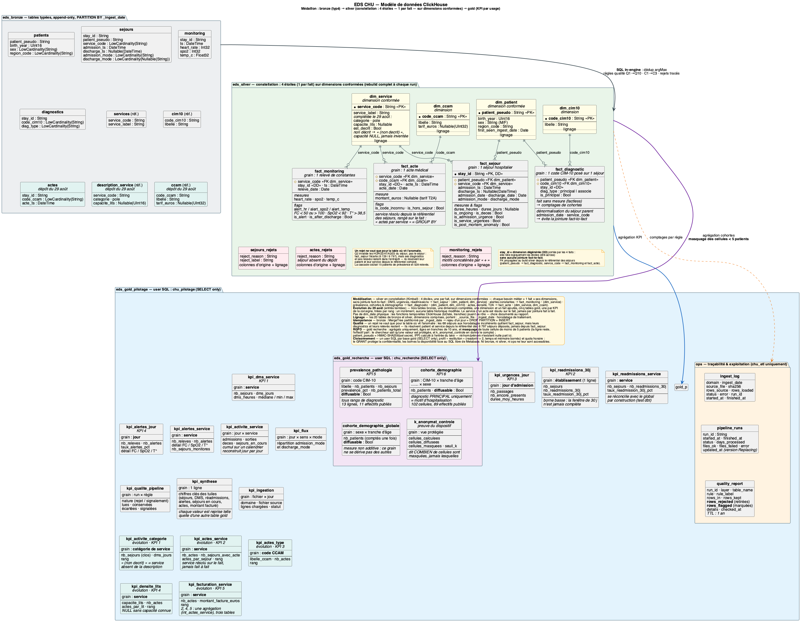
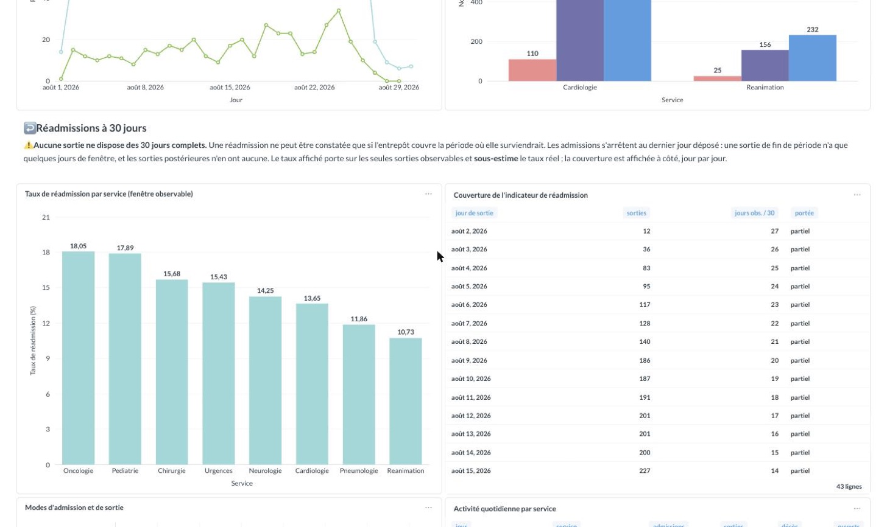
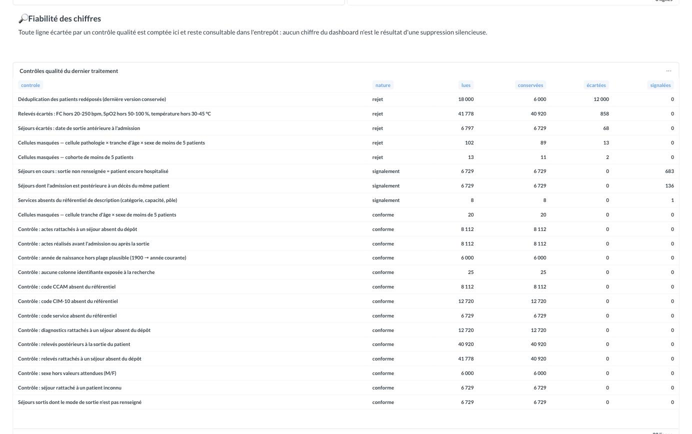
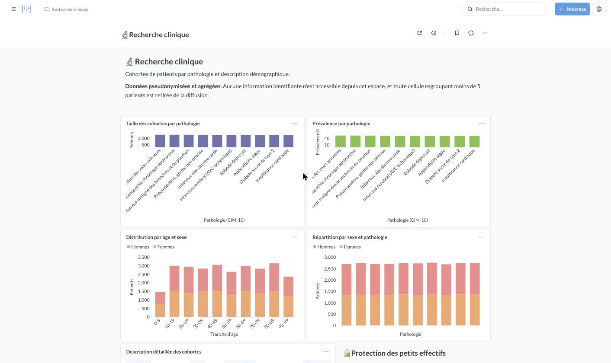
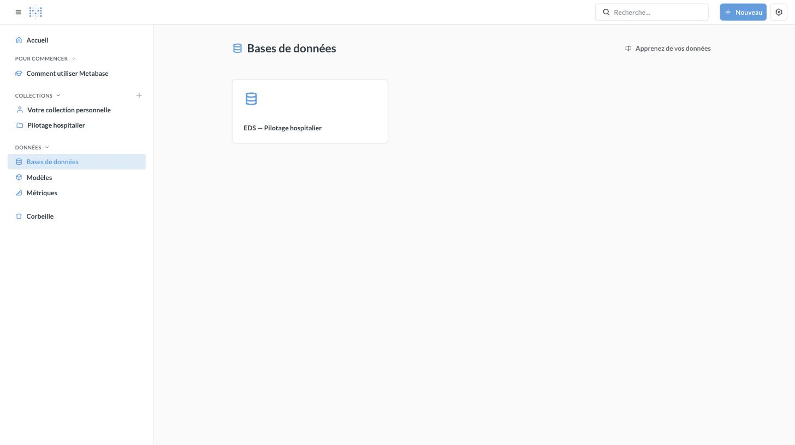
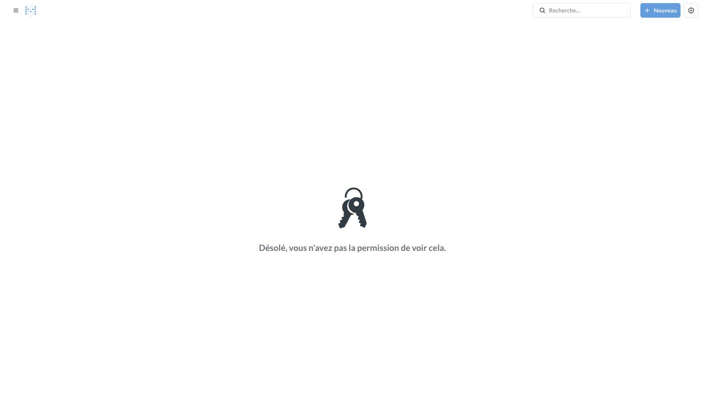
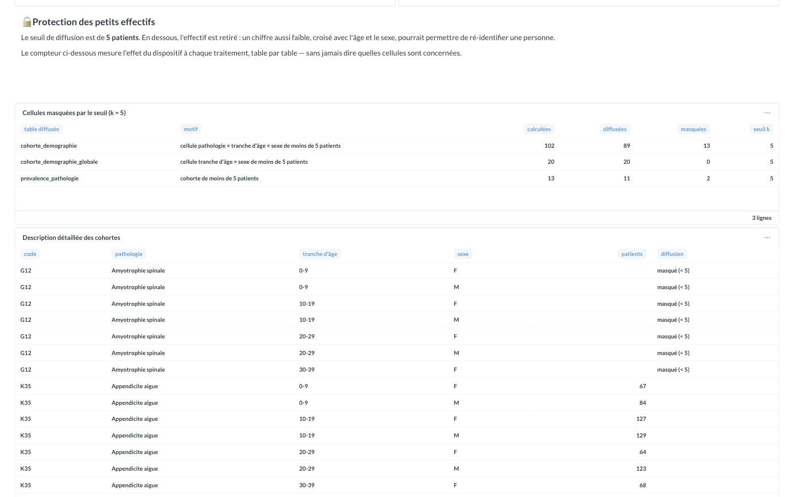
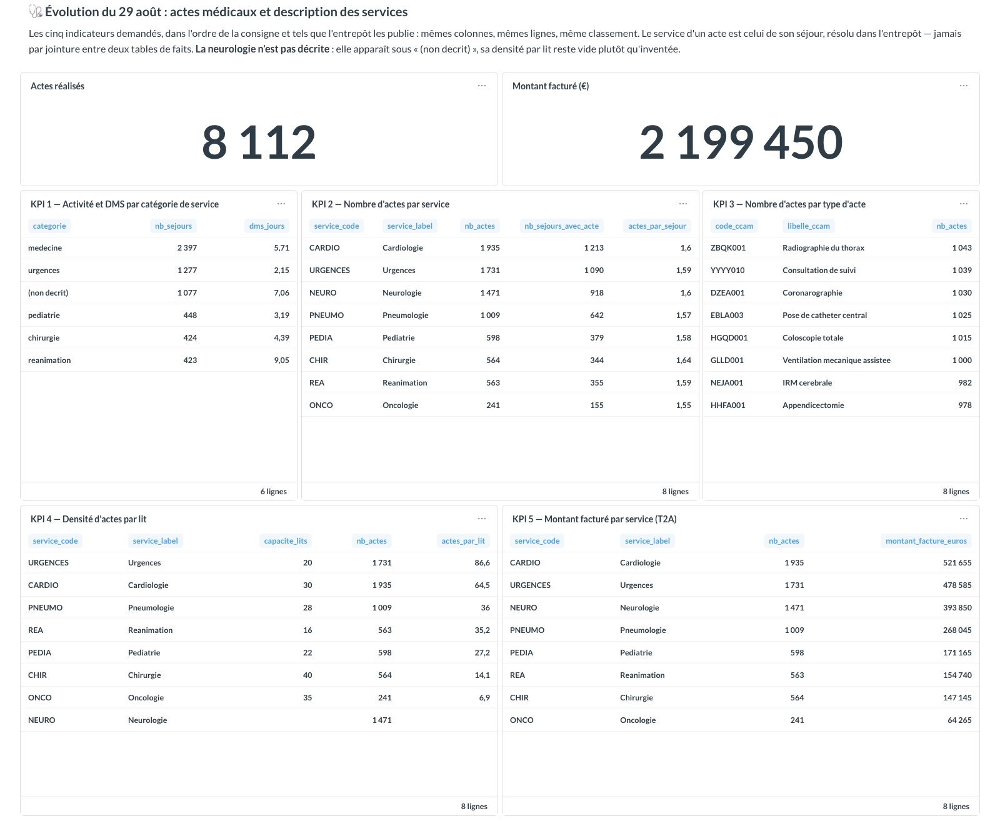

# Entrepôt de Données de Santé du CHU — dossier de conception

**M2 Big Data · épreuve E05** — de dépôts quotidiens de fichiers hétérogènes à deux
tableaux de bord cloisonnés, avec pseudonymisation dès l'entrée de la zone de travail.

> Tous les chiffres de ce dossier sont ceux de la dernière exécution, et chacun est
> reproductible en une commande (§5.4). Les six indicateurs du sujet sont en outre
> **vérifiés valeur par valeur contre la feuille de réponses** du jeu de données
> corrigé (§5.2). La mise en service et l'exploitation sont dans le
> [README](../README.md).

| § | Question |
|---|---|
| [1](#1-le-besoin) | Que veut l'hôpital ? |
| [2](#2-les-données-sources) | Qu'y a-t-il dans les fichiers — et qu'y a-t-il de cassé ? |
| [3](#3-architecture) | Quelle chaîne, et pourquoi celle-là ? |
| [4](#4-qualité-des-données) | Qu'a-t-on écarté, et sur quelle règle ? |
| [5](#5-les-indicateurs) | Que valent les chiffres publiés ? |
| [6](#6-restitution-et-cloisonnement) | Qui voit quoi ? |
| [7](#7-gouvernance-rgpd) | Comment tient la conformité ? |
| [8](#8-limites-et-recommandations) | Ce qu'il ne faut pas conclure de ces données |
| [9](#9-évolution-du-29-août--actes-médicaux-et-description-des-services) | Que change le nouveau dépôt du CHU, et que reste-t-il inchangé ? |

---

## 1. Le besoin

Deux publics, deux besoins incompatibles — et c'est précisément ce qui structure le projet.

| Public | Besoin | Ce qu'il obtient | Ce qu'il ne doit **pas** voir |
|---|---|---|---|
| **Direction & cadres** | Piloter l'activité | DMS par service, urgences, réadmissions, alertes de constantes, flux | Rien de nominatif ; pas les cohortes de recherche |
| **Chercheurs cliniciens** | Constituer des cohortes | Prévalence, taille de cohorte, distribution par âge et sexe | Le détail individuel, et **toute cellule < 5 patients** |

Contrainte transverse : les données de santé relèvent de l'**article 9 du RGPD**. La
conformité n'est pas une couche ajoutée à la fin — elle décide de l'architecture. Deux
conséquences structurantes, prises dès le premier jour :

1. **L'identité est détruite avant l'entrepôt**, pas masquée dedans. Le NIR, le nom et le
   prénom ne sont jamais copiés ; l'IPP est remplacé par un pseudonyme au moment même de la
   copie depuis le dépôt du CHU.
2. **Le cloisonnement est porté par le moteur**, pas par l'interface. Deux bases gold, deux
   comptes SQL. Une requête hors périmètre est refusée par ClickHouse, pas cachée par Metabase.

---

## 2. Les données sources

### 2.1 Ce que le CHU dépose

Vingt-neuf jours de dépôt (1er → 29 août), six domaines, trois formats — en lecture
seule. Tout n'arrive pas tous les jours : les nomenclatures seulement quand elles changent ;
les patients trois fois, en fin de période, et à chaque fois en intégralité ; les actes
médicaux en un seul dépôt, le 29 août, avec tout leur historique (§9).

| Fichier | Format | Contenu | Jours | Volume brut |
|---|---|---|---:|---:|
| `patients/<jour>/patients.csv` | CSV | ⚠ **identité en clair** : IPP, NIR, nom, prénom, date de naissance, sexe, département | 3 | 18 000 (3 × 6 000) |
| `sejours/<jour>/sejours.csv` | CSV | Séjour : `stay_id`, patient, service, admission, sortie, modes | 28 | 6 797 |
| `diagnostics/<jour>/diagnostics.json` | JSON imbriqué | 1..n codes CIM-10 par séjour | 28 | 12 720 |
| `monitoring/<jour>/monitoring.parquet` | Parquet | Constantes au chevet : FC, SpO2, température | 28 | 41 778 |
| `actes/<jour>/actes.parquet` | Parquet | Acte médical : séjour, code CCAM, horodatage — **dépôt du 29 août** | 1 | 8 112 |
| `referentiels/<jour>/*.csv` | CSV | Nomenclatures : services et CIM-10 le 1er août ; **description des services et CCAM le 29** | 2 | 8 + 13 · 7 + 8 |

Le jeu est **synthétique** — c'est celui de l'épreuve — et il est versionné avec le code
pour que le projet se lance après un simple clone. Dans un déploiement réel, ce dépôt ne
serait jamais dans Git.

### 2.2 Ce que le profilage a révélé

Explorer avant de coder a évité plusieurs erreurs de conception. Chacune de ces
observations a une conséquence directe dans la chaîne.

| Observation | Conséquence retenue |
|---|---|
| `patients/` est redéposé **en intégralité** à chaque fois — 6 000 lignes, trois fois — et **118 patients changent de département** d'un dépôt à l'autre | Déduplication par `argMax` sur le jour d'ingestion : **18 000 lignes → 6 000 patients**, chacun dans sa version la plus récente. Un test vérifie que la dimension ne porte aucune version périmée |
| ~2 % du monitoring porte FC **et** SpO2 aberrantes **sur les mêmes lignes** (0/500 bpm, 0/120 %), la température restant toujours valide | Signature d'un **capteur en panne**, pas d'un patient en détresse → rejet, et non alerte clinique |
| 683 séjours sans date de sortie — et le mode de sortie n'est vide **que** dans ce cas | Patient encore hospitalisé → conservé, signalé, exclu de la seule DMS |
| 68 séjours dont la sortie **précède** l'admission | Incohérence temporelle → le séjour quitte `fact_sejour`, mais **ni ses 127 diagnostics ni ses 520 relevés** : ce sont les horodatages qui sont faux, pas le reste (§4) |
| 136 séjours admis **après un décès antérieur** du même patient | Anomalie de source → conservée et **marquée**, pour ne pas masquer un problème amont |
| Aucun séjour ne chevauche le précédent du même patient ; 1,13 séjour par patient, 3 au plus | Le calcul de réadmission est néanmoins écrit pour résister aux chevauchements (§5.3) : la bonne définition ne dépend pas de la propreté du jeu |
| 13 codes CIM-10, dont trois maladies rares portées par 8, 4 et 3 patients | Le seuil de 5 patients **masque l'effectif de deux pathologies entières** dans la base de recherche (§7.2) |
| Activité **inégale** entre services — 1 601 séjours en cardiologie, 211 en oncologie — et 49 % des admissions en mode urgence | Les indicateurs par service discriminent réellement : la DMS va de 2 à 9 jours (§5.1) |
| Le monitoring ne couvre que **REA** et **CARDIO** | Les alertes de constantes ne concernent que ces deux services — ce n'est pas une lacune de la chaîne |

---

## 3. Architecture

### 3.1 Vue d'ensemble et justification

```
source-filestorage/   ──▶   data/lake/   ──▶   bronze   ──▶   silver   ──▶   gold ×2   ──▶   Metabase
 dépôt du CHU               copie              tables         constellation   indicateurs      deux tableaux
 (lecture seule)            PSEUDONYMISÉE      typées         Kimball         par usage        cloisonnés
 CSV · JSON · Parquet       HMAC-SHA256 salé
                                               └───────────────────────────────────┘
                                                SQL dans ClickHouse, piloté par dbt

        ops · journal d'ingestion, historique des runs, rapport qualité chiffré
```

| Choix | Alternative écartée | Raison |
|---|---|---|
| **ClickHouse** comme entrepôt | PostgreSQL | Colonne, compressé, conçu pour l'agrégation. Le monitoring seul justifie ce choix ; il lit le Parquet directement, sans passer par Python |
| **Pseudonymiser au lake**, pas en bronze | Charger puis anonymiser | Un chargement intermédiaire laisserait l'identité dans le moteur, ne serait-ce qu'un instant. Ici elle ne l'atteint jamais |
| **dbt** pour silver et gold | SQL ordonné à la main | dbt déduit l'ordre d'exécution du graphe des `ref()` — plus aucune convention de nommage à respecter — et exécute **135 tests pendant** le run, pas après |
| **Python n'orchestre que** | pandas | Sortir les données du moteur pour les transformer ne passe pas à l'échelle. Seuls les deux CSV à pseudonymiser traversent Python, en flux ligne à ligne, à mémoire constante |
| **Deux bases gold** | Une base + des vues | Le cloisonnement devient un `GRANT`, donc une propriété du moteur, et non une règle applicative |
| **Partition bronze par jour** | Table unique | Rejouer un jour = `DROP PARTITION` + rechargement. L'idempotence est structurelle, pas défendue par du code |

ClickHouse et dbt ne sont pas concurrents : **ClickHouse stocke et calcule ; dbt envoie le
SQL dans le bon ordre et teste le résultat.** dbt ne stocke rien et ne calcule rien.

### 3.2 Le modèle de données

Silver est modélisé en **constellation Kimball : quatre étoiles, une par fait**, sur
dimensions conformées — trois depuis l'origine, la quatrième depuis le dépôt du 29 août.



| Fait | Grain | Dimensions | Lignes |
|---|---|---|---:|
| `fact_sejour` | un séjour | `dim_patient`, `dim_service` | 6 729 |
| `fact_diagnostic` | un code CIM-10 par séjour | `dim_patient`, `dim_cim10` | 12 720 |
| `fact_monitoring` | un relevé (`stay_id`, `ts`) | `dim_service` | 40 920 |
| `fact_acte` | un acte médical | `dim_service`, `dim_ccam` | 8 112 |

Trois propriétés à retenir :

- **Chaque fait porte les clés de ses propres dimensions**, propagées au build silver. Il
  n'y a donc **aucune jointure fait-à-fait** dans le modèle ni dans les requêtes gold — un
  produit croisé entre deux tables de faits gonflerait silencieusement tous les comptages.
- **`stay_id` est la dimension dégénérée** commune aux quatre faits : c'est elle qui permet
  le *drill-across* (partir d'une alerte de constante et remonter au séjour).
- **Les mesures non additives sont isolées.** `nb_patients` ne se somme jamais hors de son
  grain : la pyramide des âges lit une table au grain sexe × tranche, pas la table au grain
  CIM-10 × tranche × sexe — sinon un patient à cinq diagnostics serait compté cinq fois.
- **Le patient et le service des deux faits secondaires sont résolus depuis le référentiel
  de tous les séjours déposés**, pas depuis `fact_sejour`. Un séjour écarté pour ses
  horodatages garde donc ses diagnostics et ses relevés (§4).

Source PlantUML : [`data-model.puml`](data-model.puml). Un test
(`tests/test_data_model.py`) échoue si une table est ajoutée sans figurer au diagramme : le
schéma ne peut pas se périmer en silence.

### 3.3 Déploiement cloud

La même chaîne tourne sur Azure, décrite en Terraform, et **les invariants ne bougent pas
d'une unité** — c'était le critère d'acceptation. Le stockage objet remplace le dossier
local, un job planifié remplace cron, ClickHouse lit le lake par `azureBlobStorage()`.

Le cloud ajoute un **quatrième niveau de cloisonnement** que le local ne peut pas offrir :
les droits IAM sont attribués **par conteneur de stockage**. La machine qui héberge
l'entrepôt n'a aucun droit sur le conteneur contenant les noms et les NIR. Ce n'est plus une
règle de code — c'est une propriété de l'infrastructure, et `terraform plan` doit rester
vide pour qu'elle le demeure.

Coût relevé sur la facture : ~33 €/mois allumé, ~8 € en pause.

Le déploiement a son propre dossier, avec le diagramme d'architecture, les choix et leurs
alternatives, le fonctionnement au quotidien et les limites :
[`RAPPORT-CLOUD.md`](RAPPORT-CLOUD.md). Le détail opérationnel est dans
[`terraform/README.md`](../terraform/README.md).

### 3.4 Automatisation : planification, erreurs, traçabilité

Le sujet demande une collecte et une transformation **planifiées**, avec gestion des erreurs
et journalisation. Le pipeline est un seul geste, `eds run`, incrémental et rejouable, et il
est **déclenché de la même façon sur les deux cibles** : un conteneur planifié, construit
depuis le même `Dockerfile`, sur le même cron UTC, avec le même réessai.

| | Sur le poste | Sur Azure |
|---|---|---|
| Déclencheur | Le conteneur `scheduler` de la pile Docker Compose, démarré par `make demo` — rien à installer. Cron `5 1 * * *`, 01 h 05 UTC | `job-eds-pipeline`, planifié par Azure : cron `5 1 * * *`, 01 h 05 UTC, après le dépôt nocturne |
| Ce qu'une nuit fait | Ne charge que les jours absents de `ops.ingest_log` ; sans nouveau fichier, ne reconstruit rien | Identique — même image, même code |
| Erreurs | Un réessai après 60 s ; le run est marqué `failed` avec son message ; le planificateur survit à une nuit ratée | Un réessai, journaux dans Log Analytics, `make cloud-status` montre les trois derniers passages |
| Reprise | `uv run eds run --date AAAA-MM-JJ` : `DROP PARTITION` puis rechargement, jamais de doublon. Ou `docker compose run --rm scheduler run`, dans l'image du cloud | `az containerapp job start … --args 'run,--date,…'` — le même job, à la main |
| Traçabilité | `ops.pipeline_runs` (un enregistrement par run, statut, message) · `ops.ingest_log` (fichier, empreinte, run) · rapport qualité chiffré par run | Idem, plus le `run_id` sur chaque ligne de journal |
| Preuve | `make schedule` : le prochain passage annoncé ; `make status` : derniers runs et jours ingérés. La CI vérifie sur un clone nu que le conteneur tourne et que son image exécute le pipeline | Trois exécutions planifiées consécutives, `Succeeded`, les 2, 3 et 4 septembre à 01:05:00 |

Le contrôle du cloisonnement est à la demande sur les deux cibles :
`uv run eds check-cloisonnement` en local, `make cloud-check` sur Azure. Lancement,
supervision et reprise sur incident
sont dans le [README](../README.md#exploitation) ; le déroulé d'une nuit sur Azure, flèche par
flèche, dans le [rapport cloud, §4](RAPPORT-CLOUD.md#4-comment-ça-fonctionne).

---

## 4. Qualité des données

Principe constant : **on écarte, on trace, on ne corrige jamais en silence.** Toute ligne
rejetée part dans une table `*_rejets` avec son motif, et reste consultable.

Trois natures de règles, à ne pas confondre :

- **Rejet** — la ligne quitte l'entrepôt ;
- **Signalement** — la ligne est **conservée** mais marquée (anomalie légitime, ou de la source) ;
- **Contrôle** — vérification attendue à zéro, dont le passage au vert est l'information.

| Règle | Nature | Lues | Conservées | Écartées | Signalées |
|---|---|---:|---:|---:|---:|
| **Q1** Patients redéposés à chaque dépôt | Déduplication | 18 000 | 6 000 | 12 000 | — |
| **Q2** Sortie antérieure à l'admission | Rejet | 6 797 | 6 729 | 68 | — |
| **Q4** Constantes hors plage physiologique | Rejet | 41 778 | 40 920 | 858 | — |
| **Q3** Séjour sans date de sortie | Signalement | 6 729 | 6 729 | 0 | 683 |
| **Q5** Sortie datée, mode non renseigné | Signalement | 6 729 | 6 729 | 0 | 0 |
| **Q7** Admission après un décès antérieur | Signalement | 6 729 | 6 729 | 0 | 136 |
| **Q8** Relevé postérieur à la sortie | Contrôle | 40 920 | 40 920 | 0 | **0** |
| **C1** Relevé rattaché à un séjour inconnu | Contrôle | 41 778 | 40 920 | 0 | **0** |
| **C2** Diagnostic rattaché à un séjour inconnu | Contrôle | 12 720 | 12 720 | 0 | **0** |
| **Q6** Formats et intégrité référentielle (5 règles) | Contrôle | — | — | 0 | **0** |
| **Q9** Service absent du référentiel de description | Signalement | 8 | 8 | 0 | 1 |
| **C3** Acte rattaché à un séjour inconnu | Contrôle | 8 112 | 8 112 | 0 | **0** |
| **Q6** Code CCAM absent du référentiel | Contrôle | 8 112 | 8 112 | 0 | **0** |
| **Q10** Acte avant l'admission ou après la sortie | Contrôle | 8 112 | 8 112 | 0 | **0** |

Avec les contrôles RGPD de la couche gold (§7), `ops.quality_report` compte **vingt-deux
lignes** pour vingt règles — le k-anonymat est chiffré table diffusée par table diffusée.
Elles sont recalculées à chaque run et affichées au bas du tableau de bord de pilotage. Les
quatre dernières sont celles de l'évolution du 29 août (§9).

**La décision qui structure toute la couche : un rejet ne vaut que pour la table où vit
l'anomalie.**

Q2 constate que `discharge_ts` précède `admission_ts`. Ce qui est faux, ce sont **les
horodatages** — pas l'existence du séjour, pas le patient, pas le service, pas les
diagnostics qui y ont été codés, pas les constantes relevées au chevet, qui portent leur
propre horodatage. Écarter en cascade tout ce qui s'y rattache reviendrait à faire
disparaître une infection urinaire parce qu'une date de sortie a été mal saisie.

Le coût de cette cascade a été mesuré : **quinze patients manquants** sur la prévalence des
infections urinaires (2 219 au lieu de 2 234) et **520 relevés valides perdus**. Le séjour
quitte donc `fact_sejour`, où sa durée serait inexploitable ; ses 127 diagnostics et ses 520
relevés restent dans l'entrepôt et résolvent leur patient et leur service depuis le
référentiel des 6 797 séjours déposés.

Il ne reste par conséquent **aucune règle de cascade**. C1 et C2 sont devenus des contrôles
attendus à zéro : un relevé ou un diagnostic référençant un séjour *absent du dépôt* n'aurait
ni service ni patient résoluble, et serait écarté. Aucun n'existe.

Deux autres décisions à défendre :

- **Une sortie non renseignée n'est pas une anomalie** — c'est un patient encore
  hospitalisé. Les 683 séjours concernés sont conservés, marqués, et exclus du seul calcul
  où ils fausseraient le résultat : la DMS.
- **Q8 vaut zéro, et c'est un résultat.** Le contrôle ne se prononce que sur les séjours
  temporellement cohérents : sur les autres, c'est la date de sortie elle-même qui est
  fausse, et tout relevé y paraîtrait « postérieur ». Sans ce périmètre, Q8 ne mesurerait
  que Q2. Même logique pour Q5, à zéro sur ce jeu : c'est la règle qui fait l'entrepôt, pas
  le jeu de données.

**Traçabilité.** Chaque ligne de bronze et de silver porte son fichier d'origine, son jour
de dépôt et son horodatage de traitement. Chaque exécution est enregistrée dans
`ops.pipeline_runs` ; `ops.ingest_log` relie chaque fichier au run qui l'a chargé.

---

## 5. Les indicateurs

Tous sont calculés dans l'entrepôt et exposés en tables agrégées. Les requêtes des tableaux
de bord se réduisent à des `SELECT` : aucun calcul métier n'est enfoui dans Metabase, et
**aucune carte ne ré-agrège une table gold pour en changer le grain**. Si une vue manque,
c'est un modèle qui manque.

### 5.1 Les six indicateurs, et le grain auquel ils se lisent

| # | Indicateur | Grain publié | Table gold | Résultat |
|---|---|---|---|---|
| 1 | **DMS par service** | service | `kpi_dms_service` | 2,15 j aux urgences → 9,05 j en réanimation |
| 2 | **Réadmission à 30 jours** | établissement | `kpi_readmissions_30j` | **780 / 6 729 = 11,59 %** |
| 3 | **Activité des urgences** | jour d'admission | `kpi_urgences_jour` | 9 → 82 passages/j, 1 423 au total |
| 4 | **Relevés en alerte** | jour | `kpi_alertes_jour` | **3 314 / 40 920 = 8,1 %** |
| 5 | **Prévalence par pathologie** | code CIM-10 | `prevalence_pathologie` | 2 234 (infections urinaires) → 8 (amyotrophie spinale) |
| 6 | **Description de cohorte** | pathologie × tranche d'âge × sexe | `cohorte_demographie` | 102 cellules, 89 chiffrées |

**Le grain n'est pas un détail de mise en forme, c'est la question posée.** « Quels services
immobilisent le plus longtemps un lit ? » est une question sur les services : la DMS se
publie par service, pas par service et par jour de sortie — cette dernière vue existait, et
elle se lisait comme du bruit. Même chose pour la réadmission, qui est un chiffre unique de
qualité des soins : sa ventilation par service est utile, mais elle est une vue de plus,
pas la définition de l'indicateur. À l'inverse, l'activité des urgences et la surveillance
des constantes **sont** des séries temporelles : les publier au grain du jour est ce que
demande la question.

Chaque indicateur a donc exactement une table, à exactement un grain. Les vues
complémentaires — `kpi_readmissions_service`, `kpi_alertes_service`, `kpi_activite_service`,
`kpi_flux` — portent leur grain dans leur nom, et les cinq tables de l'évolution du 29 août
suivent la même règle : une par indicateur de la consigne, dans son ordre (§9.4).

Quelques définitions qui méritent d'être explicitées :

| Indicateur | Choix de définition | Pourquoi |
|---|---|---|
| **DMS** | Séjours **terminés** uniquement | Une durée partielle tirerait la moyenne vers le bas et simulerait une amélioration |
| **Réadmission** | Existe-t-il, pour le même patient, **une** admission dans les 30 jours suivant la sortie ? Dénominateur : **tous** les séjours valides | Un séjour en cours ne peut pas être suivi d'une réadmission ; il compte pour 0 au numérateur mais reste au dénominateur — le taux décrit la population entière, pas un sous-ensemble choisi |
| **Passage aux urgences** | Séjour dont le **service** est URGENCES | L'autre acception — admission en **mode** urgence, tous services — vaut 2,3× plus (18 → 158/j) et répond à une autre question ; elle est publiée dans `kpi_flux` |
| **Alerte de constante** | FC < 50 ou > 100 bpm, SpO2 < 92 %, T° > 38,5 °C | Seuils de **vigilance**, volontairement plus serrés que les bornes de plausibilité (FC 20-250, SpO2 50-100, T° 30-45) qui écartent les capteurs en panne : une constante peut être parfaitement mesurée et cliniquement anormale |
| **Taille de cohorte** | Patients **distincts**, tous rangs de diagnostic | Un patient hospitalisé trois fois compte une fois |
| **Description de cohorte** | Diagnostic **principal** seulement | Décrire une cohorte, c'est décrire les patients pris en charge **pour** cette pathologie. Compter aussi les comorbidités gonfle le diabète de 843 à 2 177 patients — deux populations distinctes, deux questions distinctes |

### 5.2 Les chiffres sont vérifiés, pas seulement reproductibles

Un indicateur reproductible peut être faux : il suffit qu'il le soit à chaque exécution. Le
jeu de données corrigé est accompagné d'une **feuille de réponses** de l'intervenant, qui
donne les valeurs attendues pour les six KPI et pour les trois points de contrôle
bronze → silver. Elle n'est pas distribuée avec ce dépôt ; ses valeurs sont reprises,
littéralement, dans `tests/test_e2e.py`.

La suite d'intégration les ancre **valeur par valeur** :

| Vérification | Valeurs comparées |
|---|---:|
| Points de contrôle silver (`dim_patient`, `fact_sejour`, `fact_monitoring`) | 3 |
| KPI 1 — DMS par service (effectif, jours, heures) | 24 |
| KPI 2 — Réadmission à 30 jours | 3 |
| KPI 3 — Urgences par jour (28 jours × 3 mesures) | 84 |
| KPI 4 — Alertes par jour (30 jours × 3 mesures) | 90 |
| KPI 5 — Prévalence par pathologie, masquages compris | 13 |
| KPI 6 — Cohorte pathologie × tranche × sexe | 102 |

Ces vérifications ont trouvé trois défauts réels, tous corrigés :

1. la **cascade de rejets** minorait la prévalence de quinze patients et perdait 520 relevés
   (§4) ;
2. les **seuils d'alerte** retenus au départ (FC 40-130, SpO2 < 90) étaient plus larges que
   ceux du sujet et sous-comptaient les alertes de 40 % ;
3. le **grain de publication** de la DMS et de la réadmission répondait à une autre question
   que celle posée (§5.1).

### 5.3 Le taux de réadmission : l'indicateur qui demandait le plus de soin

**Définition robuste.** On teste **toutes** les admissions du patient, pas seulement la
suivante. Sur ce jeu, aucun séjour ne se chevauche et les deux écritures donnent le même
compte ; sur des données réelles, l'admission « suivante » est souvent un séjour concurrent
commencé avant la sortie, qui masque la réadmission réelle. La bonne définition ne doit pas
dépendre de la propreté du jeu.

**La limite : la fenêtre d'observation.** Une réadmission ne peut être constatée que si
l'entrepôt couvre la période où elle surviendrait. Les admissions s'arrêtent au 28 août ;
les sorties s'étalent du 2 août au 15 septembre. Une sortie du 2 août dispose de 27 jours
d'observation, une sortie du 27 août d'un seul, une sortie de septembre d'**aucun**.

| Fenêtre observable | Séjours | Réadmissions | Taux |
|---|---:|---:|---:|
| 22 à 27 jours | 568 | 154 | 27,1 % |
| 15 à 21 jours | 1 557 | 332 | 21,3 % |
| 8 à 14 jours | 1 676 | 231 | 13,8 % |
| 1 à 7 jours | 1 568 | 63 | 4,0 % |
| aucune — sortie après le 28 août | 677 | 0 | 0 % |
| séjour encore en cours | 683 | 0 | 0 % |

Le taux **croît avec la fenêtre** : c'est la signature d'une censure à droite, pas d'une
tendance. Le **11,59 % publié est donc une borne basse** — les séjours les mieux observés
tournent autour de 27 % — et l'avertissement est placé **au-dessus** des graphiques qu'il
qualifie, un avertissement sous le chiffre qu'il corrige n'étant pas lu. Soixante jours
d'historique permettraient de publier la valeur réelle (§8).



Par service, le taux va de 6,6 % en réanimation à 14,7 % en chirurgie et en pédiatrie — un
classement à lire avec la même précaution, les services n'ayant pas le même profil de sortie
dans la fenêtre observable. La somme des services reproduit exactement le taux global : un
test le vérifie à chaque build.

### 5.4 Retrouver n'importe quel chiffre

| Chiffre affiché | Valeur | Table gold | Expression déterminante |
|---|---:|---|---|
| Séjours pris en charge | 6 729 | `kpi_synthese` | `count()` sur `fact_sejour` |
| Patients suivis | 5 949 | `kpi_synthese` | `uniqExact(patient_pseudo)` sur `fact_sejour` |
| DMS globale | 5,15 j | `kpi_synthese` | `avg(duree_jours)` **où** `discharge_ts IS NOT NULL` |
| DMS par service | 2,15 → 9,05 j | `kpi_dms_service` | `avg(duree_jours)` **groupé par service** — la carte lit la table telle quelle |
| Réadmissions | 780 / 6 729 | `kpi_readmissions_30j` | `arrayExists(adm -> adm > discharge_ts AND adm <= discharge_ts + INTERVAL 30 DAY, admissions_du_patient)` |
| Relevés en alerte | 3 314 / 40 920 | `kpi_alertes_jour` | `countIf(is_alert)` |
| Séjours en cours | 683 | `kpi_synthese` | `countIf(is_ongoing)` |
| Population suivie | 6 000 | `prevalence_pathologie` | `count()` sur `dim_patient` — dénominateur de la prévalence |
| Pyramide des âges | total 6 000 | `cohorte_demographie_globale` | grain sexe × tranche : un patient compté **une** fois |
| Effectifs publiés | 11 / 13 pathologies | `prevalence_pathologie` | `nb_patients >= 5` — la ligne reste, l'effectif part |
| Cellules masquées (k<5) | 13 / 102 | `k_anonymat_controle` | cellules calculées − cellules diffusées |
| Actes réalisés | 8 112 | `kpi_synthese` | `count()` sur `fact_acte`, repris de `kpi_actes_service` |
| Montant facturé | 2 199 450 € | `kpi_synthese` | `sum(montant_euros)` — tarif CCAM porté par le fait |

**Deux dénominateurs coexistent, et ce n'est pas une incohérence.** Le pilotage compte
5 949 patients — ceux qui ont au moins un séjour dont les horodatages sont exploitables. La
recherche en compte 6 000 — la population que le CHU a déposée. L'écart est exactement les
51 patients dont *tous* les séjours ont été écartés par Q2 : leurs diagnostics restent
comptés (§4), et les exclure de la population de référence fausserait la prévalence. Chaque
table porte son dénominateur en colonne pour que la lecture ne dépende pas de cette note.

Trois commandes rejouent l'ensemble : `make quality` (les 22 lignes du rapport qualité),
`make test-e2e` (les 88 invariants, dont chacun de ces chiffres), `uv run eds
check-cloisonnement`. **La suite d'intégration ancre ces valeurs** : modifier une règle sans
le vouloir fait échouer un test nommé, cela ne fait pas dériver un chiffre en silence.

---

## 6. Restitution et cloisonnement

**🏥 Pilotage** se lit par bandes : chiffres clés → durées et urgences → surveillance →
réadmissions et flux → charge des services → **fiabilité**. Cette dernière bande distingue ce tableau de bord d'un tableau de bord
ordinaire : un utilisateur qui doute d'un chiffre voit, sans quitter l'interface et sans
accès à la base d'exploitation, combien de lignes ont été écartées et par quelle règle.



**🔬 Recherche** présente cohortes, prévalence, distribution par âge et sexe. L'en-tête porte
deux avertissements d'égale importance : le seuil de cinq patients, et le fait que ces
prévalences n'ont **aucune valeur clinique** (§8).



La mise en page est **du code**, pas un réglage d'interface : quatre défauts que seul l'écran
révèle (chevauchement, grille incomplète, titre trop long, requête visant une table absente)
sont vérifiés par des tests avant même de provisionner.

### Le cloisonnement, à quatre niveaux

| Niveau | Mécanisme | Effet |
|---|---|---|
| **Infrastructure** *(Azure)* | Droits IAM par **conteneur**, pas par compte | La machine de l'entrepôt n'a aucun droit sur le conteneur contenant les NIR |
| **Base de données** | Deux comptes SQL, chacun `SELECT` sur sa seule base gold | Un accès hors périmètre est refusé **par le moteur** |
| **Connexion Metabase** | Une connexion par usage, avec le compte SQL correspondant | Aucune requête ne peut viser l'autre base |
| **Contenu Metabase** | Une collection par usage, visible du seul groupe concerné | Chaque utilisateur ne voit qu'un tableau de bord |

Les deux derniers organisent l'interface ; les deux premiers opposent un refus réel.

Ce que voit un utilisateur **pilotage** — une seule collection, une seule base. Il n'y a
**pas de contenu grisé** : l'autre usage n'existe pas de son point de vue.


Et il n'a qu'une seule base à interroger : sa connexion Metabase ne pointe que vers
`eds_gold_pilotage`, avec le compte SQL qui n'a de droit que sur elle.



S'il devine l'adresse de l'espace de recherche, il est refusé. Metabase répond « page
introuvable » et non « accès refusé » : un refus explicite confirmerait l'existence de la
ressource et permettrait de l'énumérer par essais successifs.



**Une capture se périme et ne prouve rien.** La démonstration qui compte est
`uv run eds check-cloisonnement` : elle se connecte réellement avec chaque compte et rejoue
**9 scénarios** aux deux niveaux, sur l'installation de celui qui la lance. Les mêmes 9 sont
exécutés par `make test-e2e` — une régression du cloisonnement ne peut pas passer inaperçue.

Dernière précaution, de disponibilité et non de confidentialité : les deux comptes
autorisent le SQL libre. Un profil (`readonly = 2`, temps et mémoire bornés) et un quota
horaire empêchent une requête emballée de priver l'autre usage de son tableau de bord.

---

## 7. Gouvernance RGPD

### 7.1 Minimisation

| Donnée source | Traitement | Motif |
|---|---|---|
| `nir`, `nom`, `prenom` | **Jamais copiés** | Directement identifiants, et aucun indicateur n'en a besoin |
| `patient_id` (IPP) | `HMAC-SHA256(sel, IPP)` dès la copie vers le lake | Stable — les jointures tiennent — et non réversible sans le sel, qui n'est ni versionné ni journalisé |
| `birth_date` | Généralisée en `birth_year` | Suffit à l'âge en tranches ; le jour et le mois sont ré-identifiants |
| Constantes (`fact_monitoring`) | Ne porte **même pas** le pseudonyme | Le service et le séjour suffisent aux alertes |

Un test d'intégration vérifie qu'aucune colonne nommée `nir`, `nom`, `prenom`,
`birth_date` ou `patient_id` n'existe dans **aucune** base de l'entrepôt.

### 7.2 Petits effectifs : masquer plutôt que supprimer

Le seuil est de **cinq patients**, et les âges sont publiés en tranches de dix ans. Trois
questions se posent alors : à quel grain l'appliquer, que faire de la cellule protégée, et
que reste-t-il de déductible une fois la protection en place.

**À quel grain.** Une première version publiait le grain pathologie × sexe × tranche d'âge ×
**département**, avec la marge correspondante. Deux problèmes en sortaient. D'abord le coût :
178 cellules sur 1 083 tombaient sous le seuil, et la parade contre la reconstruction par
différence en retirait 66 marges sur 149 — 44 % de la table. Ensuite l'inutilité : huit
départements sur des cohortes de quelques centaines de patients ne protègent pas grand-monde
et ne renseignent personne.

Le grain départemental a donc été **retiré**. Le sujet demande une distribution « par âge et
sexe » : c'est le grain publié. Résultat mesuré : **89 cellules chiffrées au lieu de 83**,
sur une table plus lisible, et sans la chaîne de tables intermédiaires qu'il fallait protéger
les unes des autres.

**Que faire de la cellule protégée.** Elle garde sa ligne, et perd son effectif :

| Table diffusée | Cellules | Effectifs publiés | Effectifs masqués |
|---|---:|---:|---:|
| `prevalence_pathologie` | 13 | 11 | **2** |
| `cohorte_demographie` | 102 | 89 | **13** |
| `cohorte_demographie_globale` | 20 | 20 | 0 |

Faire disparaître la ligne serait **moins** protecteur, pas plus. Le chercheur ne saurait pas
qu'une valeur a été retirée, et le dispositif ne serait vérifiable nulle part. C'est la
pratique du contrôle statistique de la divulgation — les instituts publient la cellule
marquée « secret », ils ne la retirent pas. Ce qui est protégé, c'est **l'effectif**, et il
ne sort pas de silver. La mucoviscidose (4 patients) et la trisomie 21 (3) apparaissent donc
au tableau de bord, sans leur taille.

**Ce qui reste déductible.** Publier une vue agrégée **et** sa décomposition, en appliquant
le seuil séparément aux deux, laisse fuiter la cellule protégée :

```
   total de la marge  −  somme des cellules diffusées  =  cellule cachée
```

L'attaque ne demande aucun privilège : une jointure entre deux tables, avec le seul compte
chercheur, suffit. Elle avait été trouvée sur la version précédente, où elle reconstituait
pathologie, sexe, tranche d'âge, département **et** effectif exact.

Deux propriétés la neutralisent dans la version actuelle :

1. **Aucune pathologie n'est publiée à moitié.** Les trois pathologies sous le seuil le sont
   sur *toutes* leurs cellules ; les dix autres sur *aucune*. Il n'existe donc, pour aucune
   pathologie, un reste à soustraire. Un test (`assert_pas_de_suppression_partielle`) échoue
   si cette condition cesse de tenir — c'est un signal, pas une garantie structurelle, et le
   rapport le dit plutôt que de l'affirmer plus fort qu'il ne peut.
2. **Les deux tables ne décrivent pas la même population.** `prevalence_pathologie` compte
   tous les rangs de diagnostic, `cohorte_demographie` le seul diagnostic principal : la
   soustraction n'aurait pas de sens.

**Un corollaire, découvert à la dure.** Le graphique de part de femmes sommait les tranches
d'âge d'une table déjà filtrée par le seuil. L'opération est licite au sens de l'additivité
— un patient n'appartient qu'à une tranche. Mais les cellules qui manquaient ne manquaient
pas au hasard, c'étaient les plus petites, et le ratio dérivait de **neuf points** : 71,5 %
de femmes pour les infections urinaires contre 62,5 % en réalité. Un chiffre faux, sans le
moindre signe extérieur d'erreur.

La règle qui en découle est plus forte que « ne pas sommer une mesure non additive » : **un
agrégat ne se calcule jamais à partir d'une table filtrée.** La somme est redevenue légitime
ici précisément parce qu'aucune pathologie n'est publiée à moitié — et un second test
(`assert_part_de_femmes_non_biaisee`) compare chaque pourcentage publié à la vérité de
silver, sans tolérance.



### 7.3 Contrôles automatiques

Les règles RGPD tournent à chaque run, chiffrées dans `ops.quality_report` au même titre que
les contrôles de qualité :

| Règle | Ce qu'elle mesure | Attendu |
|---|---|---|
| `RGPD_k_anonymat` · `prevalence_pathologie` | Cohortes dont l'effectif est masqué | 2 / 13 |
| `RGPD_k_anonymat` · `cohorte_demographie` | Cellules dont l'effectif est masqué | 13 / 102 |
| `RGPD_k_anonymat` · `cohorte_demographie_globale` | Idem, pyramide des âges | 0 / 20 |
| `RGPD_minimisation` | Colonnes identifiantes **ou pseudonyme** dans la base recherche | **0** |

S'y ajoutent, côté dbt, quatre tests qui échouent le build : aucun effectif publié sous le
seuil, cohérence entre le drapeau `diffusable` et la présence de l'effectif, aucune
pathologie publiée à moitié, et aucune part de femmes biaisée.

### 7.4 Registre des hypothèses

Ce que nous avons tranché sans que le sujet le fasse, et qu'il faudrait valider :

1. Les seuils d'alerte des constantes (§5.1), repris de la feuille de réponses mais non
   validés cliniquement ;
2. le maintien des séjours décédés et en cours au dénominateur des réadmissions — le taux
   décrit alors la population entière, pas un sous-ensemble choisi ;
3. l'exclusion des séjours en cours du calcul de la DMS ;
4. la restriction de la description de cohorte au diagnostic **principal** (§5.1) ;
5. le retrait du grain départemental des vues de recherche (§7.2) ;
6. le seuil k = 5, retenu d'après l'énoncé — certaines autorités en recommandent un plus élevé.

---

## 8. Limites et recommandations

**⚠ La limite qui prime toutes les autres.** Le jeu de données est synthétique. Ses
prévalences ont des ordres de grandeur plausibles — 37 % d'infections urinaires, 4 % de
cancers bronchiques, 0,1 % d'amyotrophie spinale — mais elles sont générées et ne décrivent
aucune population. Les cohortes valident la chaîne de traitement, **pas** une conclusion
épidémiologique. Cet avertissement figure en tête du tableau de bord de recherche.

| Limite | Portée | Recommandation |
|---|---|---|
| Aucun séjour n'a 30 jours d'observation (27 au plus) | Le taux de réadmission publié, 11,59 %, est une borne basse : les séjours les mieux observés sont à 27 % (§5.3) | Attendre **60 jours d'historique** avant de publier cet indicateur en production |
| La charge des services s'effondre après le 28 août | Ce n'est pas une baisse d'activité, c'est la fin des admissions déposées | La courbe le signale en description ; en production le problème disparaît |
| Le grain départemental a été retiré des vues de recherche | Une analyse territoriale n'est plus possible depuis le tableau de bord (§7.2) | La rouvrir par **région** plutôt que par département, ou la réserver à un accès sur convention |
| Absence de suppression partielle : une propriété du jeu, pas du code | Si un futur dépôt publiait une pathologie à moitié, la somme par sexe redeviendrait biaisée (§7.2) | Le test `assert_pas_de_suppression_partielle` casse le build — traiter l'alerte, ne pas la contourner |
| Âge dérivé de la seule année | Approximation d'un an au plus | Conséquence assumée de la minimisation — ne pas revenir sur `birth_year` pour la corriger |
| Monitoring limité à REA et CARDIO | Les alertes ne couvrent pas tout l'hôpital | Étendre l'équipement, ou afficher la couverture à côté du taux |
| Vingt-huit jours de dépôt | Volumétrie de démonstration | Le banc d'essai (`benchmarks/`) valide 20 M de relevés par le chemin réel du pipeline |
| Seuils d'alerte non validés cliniquement | Le nombre d'alertes en dépend directement | Faire arbitrer par les équipes soignantes avant tout usage |
| Metabase tourne à ~78 % de sa limite mémoire sur la VM cloud | Marge étroite : un métaspace borné trop bas a déjà arrêté la JVM en cours de provisionnement | Budget JVM redécoupé (tas 524 Mo, métaspace 498 Mo, marge native 289 Mo) et vérifié sous charge ; une VM à 8 Gio le rendrait confortable |
| La neurologie n'est pas décrite par le CHU | Sa densité d'actes par lit reste vide, sa catégorie est « (non decrit) » (§9) | Obtenir la ligne manquante du référentiel — le pipeline la prendra au prochain dépôt sans autre changement |
| Le tarif d'un acte est celui du référentiel courant | Un changement de tarif recalculerait tout l'historique facturé (§9.5) | Historiser `dim_ccam` (dimension à évolution lente) le jour où la T2A change |

**Trois recommandations de gouvernance**, qui relèvent de l'organisation et non du code :

1. Conserver le sel de pseudonymisation dans un coffre, avec une procédure de rotation
   documentée — le changer casse toutes les jointures historiques : c'est une décision, pas
   une manipulation.
2. Faire valider le seuil k = 5 par le délégué à la protection des données.
3. Revoir les hypothèses de §7.4 à chaque évolution du besoin métier.

---

## 9. Évolution du 29 août : actes médicaux et description des services

Le CHU ajoute des données sans rien retirer : une description plus fine de ses services
et un flux d'actes médicaux, déposés le 29 août. La consigne tient en une phrase — faire
évoluer l'entrepôt **sans tout refaire, sans rien casser** — et c'est exactement ce que
mesure cette section.

### 9.1 Ce que le dépôt contient

| Fichier | Contenu | Lignes | Ce que le profilage a révélé |
|---|---|---:|---|
| `referentiels/2026-08-29/description_service.csv` | catégorie, capacité en lits, pôle | **7** | **NEURO n'y figure pas.** Le référentiel est incomplet, comme le sujet le laissait craindre |
| `referentiels/2026-08-29/ccam.csv` | code d'acte → libellé, tarif T2A | 8 | Tarifs de 25 à 800 € |
| `actes/2026-08-29/actes.parquet` | séjour, code CCAM, horodatage | **8 112** | Tout l'historique en un dépôt (actes du 1er au 29 août), 5 096 séjours ; aucun doublon, aucun code inconnu, aucun séjour inconnu ; **82 actes pendant les 68 séjours écartés par Q2** ; tous les autres dans les bornes de leur séjour |

Une observation de plus, qui a une conséquence de modélisation : la hiérarchie annoncée
service → catégorie → pôle n'est stricte qu'au premier niveau. La catégorie « medecine »
relève de **deux** pôles — Coeur-Poumon pour la cardiologie et la pneumologie, Cancerologie
pour l'oncologie. Le pôle est une propriété du service, pas de la catégorie ; aucune vue au
grain de la catégorie ne peut donc le porter.

### 9.2 Ingérer sans retraiter

Le pipeline incrémental a chargé **les trois fichiers, et rien d'autre** : 89 fichiers
ignorés, empreintes inchangées ; journal d'ingestion à 92 fichiers, 29 jours, 6 domaines.
Deux évolutions du collecteur l'ont permis :

- `actes` est un **flux quotidien**, comme le monitoring : un jour déposé sans son fichier
  alerte ;
- les **nomenclatures** cessent d'être une liste fixe. Le CHU ne dépose que celles qui
  changent — services et CIM-10 le 1er août, description et CCAM le 29. Exiger les quatre
  à chaque dépôt aurait fait échouer précisément le dépôt d'évolution. Un fichier est donc
  facultatif un jour donné ; un jour sans aucune nomenclature reconnue alerte ; un fichier
  inconnu est signalé, pas chargé en silence.

Côté bronze, trois tables dans un fichier DDL séparé
(`sql/10_bronze/02_actes_et_descriptions.sql`) : les six tables historiques n'ont pas changé
d'une ligne. Même partition par jour de dépôt, même lignage — un rejeu du 29 août est un
`DROP PARTITION` suivi d'un `INSERT`, comme pour n'importe quel autre jour.

### 9.3 Le modèle : un incrément

| Demandé | Fait | Décision structurante |
|---|---|---|
| Compléter `dim_service` | catégorie, pôle, capacité, `est_decrit` | **Jointure externe** vers la description — piège n° 1 |
| Ajouter `dim_ccam` | code, libellé, tarif | Dernière version déposée, comme les autres dimensions |
| Ajouter `fact_acte` | grain : un acte ; 8 112 lignes | Le **service est résolu au build** et rangé sur le fait — piège n° 2 ; le montant T2A est une mesure du fait ; pas de pseudonyme (minimisation) |
| Non-régression | les six KPI du corrigé | **Identiques** : 6 729 · 9,05 j · 11,59 % · 1 423 · 3 314 · 2 234 · 89 — vérifiés par un test nommé |

**Piège n° 1 — le service non décrit.** NEURO reste dans la dimension avec ses 1 208
séjours. Sa catégorie et son pôle prennent le libellé explicite « (non decrit) », qui se
regroupe et s'affiche comme n'importe quelle valeur ; sa capacité reste **NULL** — on ne
fabrique pas un nombre de lits, et sa densité d'actes par lit sera vide plutôt que fausse ;
le fait est porté par `est_decrit` et compté par la règle Q9. Retirer le service aurait
cassé tous les indicateurs historiques ; lui inventer une capacité aurait produit un chiffre
faux sans le moindre signe extérieur d'erreur. Le jour où le CHU dépose la ligne manquante,
elle est prise au run suivant sans autre changement.

**Piège n° 2 — le service d'un acte.** Il vient du séjour, et le sujet interdit de relier
deux tables de faits. La réponse est celle déjà donnée pour les constantes et les
diagnostics : le service est **propagé sur le fait au moment de la construction**, depuis le
référentiel de tous les séjours déposés. « Actes par service » devient un simple
`GROUP BY` sur `fact_acte`. Les 82 actes réalisés pendant les séjours aux horodatages
incohérents gardent ainsi leur service et restent comptés — un acte est un fait clinique,
une date de sortie fausse ne l'annule pas (§4).

« Actes par séjour » ne demande pas non plus deux faits : son dénominateur est le nombre
de séjours distincts ayant au moins un acte, lu dans `fact_acte` lui-même. L'agrégation au
grain du service est écrite **une** fois — le modèle éphémère `int_actes_service`, que dbt
inline — et publiée trois fois (KPI 2, 4 et 5). Le test `assert_actes_reconcilies` en est
le garde-fou : la somme des actes de chaque table doit valoir exactement le nombre de
lignes de `fact_acte`, ce qu'une jointure fait-à-fait ferait exploser.

Quatre règles qualité s'ajoutent au rapport, qui passe à 22 lignes pour 20 règles : Q9
signale le service non décrit (1) ; C3, Q6 et Q10 — séjour inconnu, code CCAM inconnu, acte
hors des bornes de son séjour — sont des contrôles attendus à zéro, et valent zéro.

### 9.4 Les cinq indicateurs

**Une table gold par indicateur, dans l'ordre de la consigne, aux colonnes de la question
posée.** Chaque table porte un `rang` — sa clé de tri physique — et se lit donc dans l'ordre
du classement sans `ORDER BY` ; le tableau de bord de pilotage les affiche telles quelles,
sans renommage ni recalcul. Les valeurs ci-dessous sont celles de l'entrepôt, local et Azure ;
la suite d'intégration les vérifie ligne à ligne, dans cet ordre.

| # | Indicateur | Grain | Table gold | Classement |
|---|---|---|---|---|
| 1 | Activité et DMS par catégorie de service | catégorie | `kpi_activite_categorie` | séjours clos décroissants |
| 2 | Nombre d'actes par service | service | `kpi_actes_service` | actes décroissants |
| 3 | Nombre d'actes par type d'acte | code CCAM | `kpi_actes_type` | actes décroissants |
| 4 | Densité d'actes par lit | service | `kpi_densite_lits` | densité décroissante, capacité inconnue en dernier |
| 5 | Montant facturé par service (T2A) | service | `kpi_facturation_service` | montant décroissant |

**KPI 1 — Activité et DMS par catégorie de service** (séjours clos, comme la DMS par service)

| categorie | nb_sejours | dms_jours |
|---|---:|---:|
| medecine | 2 397 | 5,71 |
| urgences | 1 277 | 2,15 |
| (non decrit) | 1 077 | 7,06 |
| pediatrie | 448 | 3,19 |
| chirurgie | 424 | 4,39 |
| reanimation | 423 | 9,05 |

La catégorie « medecine » regroupe cardiologie, pneumologie et oncologie ; « (non decrit) »
est la neurologie, absente du référentiel de description. Les six lignes totalisent les
6 046 séjours terminés (6 729 valides moins 683 en cours).

**KPI 2 — Nombre d'actes par service** (le service est celui du séjour, porté par le fait)

| service_code | service_label | nb_actes | nb_sejours_avec_acte | actes_par_sejour |
|---|---|---:|---:|---:|
| CARDIO | Cardiologie | 1 935 | 1 213 | 1,60 |
| URGENCES | Urgences | 1 731 | 1 090 | 1,59 |
| NEURO | Neurologie | 1 471 | 918 | 1,60 |
| PNEUMO | Pneumologie | 1 009 | 642 | 1,57 |
| PEDIA | Pediatrie | 598 | 379 | 1,58 |
| CHIR | Chirurgie | 564 | 344 | 1,64 |
| REA | Reanimation | 563 | 355 | 1,59 |
| ONCO | Oncologie | 241 | 155 | 1,55 |

**KPI 3 — Nombre d'actes par type d'acte**

| code_ccam | libelle_ccam | nb_actes |
|---|---|---:|
| ZBQK001 | Radiographie du thorax | 1 043 |
| YYYY010 | Consultation de suivi | 1 039 |
| DZEA001 | Coronarographie | 1 030 |
| EBLA003 | Pose de catheter central | 1 025 |
| HGQD001 | Coloscopie totale | 1 015 |
| GLLD001 | Ventilation mecanique assistee | 1 000 |
| NEJA001 | IRM cerebrale | 982 |
| HHFA001 | Appendicectomie | 978 |

**KPI 4 — Densité d'actes par lit** (nb_actes / capacite_lits)

| service_code | service_label | capacite_lits | nb_actes | actes_par_lit |
|---|---|---:|---:|---:|
| URGENCES | Urgences | 20 | 1 731 | 86,6 |
| CARDIO | Cardiologie | 30 | 1 935 | 64,5 |
| PNEUMO | Pneumologie | 28 | 1 009 | 36,0 |
| REA | Reanimation | 16 | 563 | 35,2 |
| PEDIA | Pediatrie | 22 | 598 | 27,2 |
| CHIR | Chirurgie | 40 | 564 | 14,1 |
| ONCO | Oncologie | 35 | 241 | 6,9 |
| NEURO | Neurologie | — | 1 471 | — |

La neurologie garde sa ligne et ses actes, sans densité : sa capacité n'est pas connue, et
l'on ne divise pas par un nombre de lits inventé. Une précision d'arrondi : 1 731 / 20 vaut
86,55 exactement ; ClickHouse arrondit la demi-unité vers le haut (86,6), un outil qui
arrondit le flottant binaire 86,549 999… affiche 86,5. Les sept autres densités ne
présentent aucun cas limite.

**KPI 5 — Montant facturé par service** (T2A : somme des tarifs des actes)

| service_code | service_label | nb_actes | montant_facture_euros |
|---|---|---:|---:|
| CARDIO | Cardiologie | 1 935 | 521 655 |
| URGENCES | Urgences | 1 731 | 478 585 |
| NEURO | Neurologie | 1 471 | 393 850 |
| PNEUMO | Pneumologie | 1 009 | 268 045 |
| PEDIA | Pediatrie | 598 | 171 165 |
| REA | Reanimation | 563 | 154 740 |
| CHIR | Chirurgie | 564 | 147 145 |
| ONCO | Oncologie | 241 | 64 265 |
| **Total** | | **8 112** | **2 199 450** |

Le total est repris tel quel dans `kpi_synthese`, d'où les deux tuiles qui ouvrent la bande
du tableau de bord — 8 112 actes, 2 199 450 € — avant les cinq tables, dans cet ordre.



Chaque chiffre a été recalculé par un chemin indépendant — une jointure directe entre
`bronze.actes` et `bronze.ccam` rend 8 112 actes et 2 199 450 € — puis ancré dans la suite
d'intégration : les cinq tables ligne à ligne et dans l'ordre, la dimension complétée, le
fait, les quatre règles qualité et le tuple de non-régression y sont littéraux.

### 9.5 Limites propres à l'évolution

- **Le dépôt d'actes est un rattrapage** : vingt-neuf jours d'actes dans un seul fichier.
  L'incrémentalité est démontrée sur ce fichier ; un flux réellement quotidien produirait
  une partition par jour, par le même mécanisme, sans rien changer au code.
- **« Actes par séjour » rapporte les actes aux séjours qui en ont au moins un** (5 096) :
  c'est l'intensité d'un séjour traité, pas une moyenne sur l'activité. Rapportés aux
  6 729 séjours valides, les 8 112 actes donnent 1,21 acte par séjour — une autre question,
  que `kpi_synthese` et `kpi_dms_service` permettent de poser.
- **Le tarif est celui du référentiel courant.** Un changement de tarif recalculerait tout
  l'historique facturé. Facturer par période exigerait d'historiser `dim_ccam` (§8).
- **Le pôle n'est pas modélisé au grain de la catégorie**, faute de hiérarchie stricte dans
  les données (§9.1). Il reste disponible au grain du service, dans `dim_service`.

---

*Énoncé de l'épreuve : [`sujets/FICHE-SUJET.md`](sujets/FICHE-SUJET.md) · Consigne d'évolution :
[`sujets/SUJET-EVOLUTION-nouvelles-kpi.md`](sujets/SUJET-EVOLUTION-nouvelles-kpi.md) · Mise en service et exploitation :
[`README`](../README.md) · Déploiement Azure : [`RAPPORT-CLOUD.md`](RAPPORT-CLOUD.md) et [`terraform/README.md`](../terraform/README.md)*
