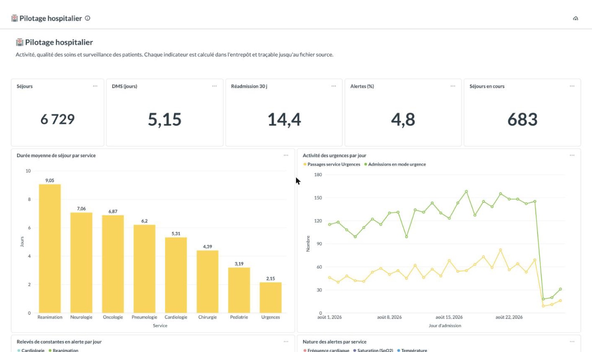

# Entrepôt de Données de Santé du CHU — dossier de conception

**M2 Big Data · épreuve E05** — Partie 1 : analyse, architecture et restitution.

---

## Sommaire

1. [Contexte et analyse du besoin](#1-contexte-et-analyse-du-besoin)
2. [Les données sources](#2-les-données-sources)
3. [Architecture](#3-architecture)
4. [Traitements et qualité](#4-traitements-et-qualité)
5. [Les indicateurs](#5-les-indicateurs)
6. [Restitution et cloisonnement](#6-restitution-et-cloisonnement)
7. [Gouvernance RGPD](#7-gouvernance-rgpd)
8. [Limites et recommandations](#8-limites-et-recommandations)

---

## 1. Contexte et analyse du besoin

### 1.1 Le problème posé

Le CHU dispose de données réparties dans plusieurs systèmes — dossier patient, urgences,
laboratoire, monitoring des chambres — qui n'exportent ni dans le même format ni avec les
mêmes conventions. Chaque jour, ces systèmes déposent leurs fichiers dans un espace commun.
En l'état, répondre à une question aussi simple que « quelle est notre durée moyenne de
séjour en cardiologie ? » suppose d'ouvrir plusieurs fichiers, de les rapprocher à la main
et d'espérer que personne n'a introduit d'incohérence.

> **Le laboratoire ne dépose pas encore.** Le dépôt fourni contient les patients, les
> séjours, les diagnostics, le monitoring et les référentiels — pas de résultats
> d'analyses. Aucun indicateur de ce dossier n'en dépend donc, et nous ne prétendons pas
> couvrir ce système. L'architecture l'accueillerait sans réécriture : un nouveau domaine
> se déclare dans `src/eds/collect.py` et dans `sql/15_bronze_load/`, et alimenterait une
> quatrième étoile (`fact_resultat_labo`, au grain « un résultat d'analyse »).

La direction veut deux choses de cet entrepôt, et elles ne se ressemblent pas :

- **Le pilotage hospitalier** a besoin de suivre l'activité au jour le jour : combien de
  passages aux urgences, combien de temps les patients restent, combien reviennent après
  leur sortie, combien d'alertes sur les constantes. Ce sont des chiffres d'exploitation,
  qui doivent être justes et disponibles rapidement.
- **La recherche clinique** a besoin de constituer des cohortes : combien de patients pour
  telle pathologie, quel âge, quel sexe. Ce sont des chiffres d'étude, qui doivent être
  comparables dans le temps et surtout **anonymes**.

### 1.2 Ce que cette différence implique

Ces deux usages n'ont pas besoin des mêmes données, et c'est ce qui structure toute
l'architecture. Le pilotage travaille sur l'activité : les séjours, les services, les
constantes. La recherche travaille sur des populations : des effectifs, des tranches d'âge,
jamais un patient identifiable.

Nous en avons tiré une décision de conception : **deux bases distinctes en sortie**, avec
deux comptes de lecture séparés. Ce n'est pas un raffinement cosmétique — c'est ce qui
permet de garantir qu'un chercheur ne peut pas, même par accident, remonter à un séjour
individuel, et qu'un cadre de santé ne consulte pas de données d'étude.

### 1.3 La contrainte RGPD

Les données de santé relèvent de l'article 9 du RGPD : leur traitement est interdit par
principe, sauf exceptions encadrées. Concrètement, cela impose quatre obligations que nous
avons traitées comme des contraintes de conception, pas comme une couche ajoutée à la fin :

| Obligation | Traduction technique retenue |
|---|---|
| Pseudonymisation | L'identité est remplacée par un pseudonyme **avant** toute écriture dans notre zone de travail |
| Minimisation | Une donnée qui ne sert aucun indicateur n'est pas conservée |
| Cloisonnement | Les droits d'accès sont portés par le moteur de base de données, pas seulement par l'outil de visualisation |
| Petits effectifs | Une cohorte de moins de cinq patients n'est jamais diffusée |

Le fichier `patients.csv` arrive avec le NIR, le nom, le prénom et la date de naissance
complète. Ces quatre colonnes sont, chacune, directement ou quasi-identifiantes. Notre
première décision a été de faire en sorte qu'elles ne franchissent jamais la porte de
l'entrepôt.

---

## 2. Les données sources

### 2.1 Ce que le CHU dépose

Trois jours de dépôt nous ont été fournis (26, 27 et 28 août 2026), organisés par domaine
puis par jour. Nous avons commencé par profiler l'intégralité de ces fichiers avant
d'écrire la moindre ligne de code : c'est ce profilage qui a révélé les pièges décrits
ci-dessous, et qui a dimensionné les règles de qualité.

| Fichier | Format | Volume | Contenu |
|---|---|---|---|
| `patients.csv` | CSV | 16 200 lignes | ⚠ Identité en clair : IPP, NIR, nom, prénom, date de naissance, sexe, département |
| `sejours.csv` | CSV | 15 000 lignes | Un passage à l'hôpital : dates d'admission et de sortie, service, modes d'entrée et de sortie |
| `diagnostics.json` | JSON imbriqué | 37 380 codes | Un ou plusieurs codes CIM-10 par séjour, avec leur type (principal ou associé) |
| `monitoring.parquet` | Parquet | 66 677 lignes | Constantes au chevet : fréquence cardiaque, saturation, température |
| `services.csv`, `cim10.csv` | CSV | 8 et 10 lignes | Nomenclatures : code → libellé |

Le monitoring est le flux qui dicte les choix techniques : sur trois jours il représente
déjà plus de lignes que tout le reste réuni, et en production il croîtrait linéairement
avec le nombre de lits équipés.

> **CIM-10** — Classification Internationale des Maladies, 10ᵉ révision. C'est la
> nomenclature de l'OMS utilisée pour coder les diagnostics : `I21` désigne l'infarctus du
> myocarde, `C34` un cancer du poumon. La lettre porte le chapitre (I pour cardiovasculaire,
> C pour tumeurs, J pour respiratoire…), les chiffres précisent la pathologie.

### 2.2 Ce que le profilage a révélé

Cinq observations ont directement orienté la conception.

**Les fichiers patients sont cumulatifs.** Le CHU ne dépose pas les nouveaux patients du
jour : il redépose l'intégralité de sa base. On passe de 4 800 lignes le premier jour à
5 400 puis 6 000, chaque fichier contenant tous les patients des jours précédents. Au total
16 200 lignes pour 6 000 patients réels. Sans déduplication, chaque patient serait compté
deux ou trois fois dans les cohortes.

**Les identifiants de séjour ne se recoupent pas d'un jour à l'autre.** Chaque fichier
apporte 5 000 séjours nouveaux. L'ingestion peut donc être strictement incrémentale.

**Le monitoring déborde de son jour de dépôt.** Le fichier du 26 août contient des relevés
allant jusqu'au 28. Ce n'est pas une erreur — ce sont les constantes futures des séjours
ouverts ce jour-là — et surtout ce ne sont pas des doublons : aucune paire
(séjour, horodatage) n'apparaît deux fois. Le partitionnement par jour de dépôt reste donc
valide.

**Seuls deux services sont monitorés.** Réanimation et cardiologie, soit 1 506 séjours sur
15 000, avec un relevé toutes les trente minutes. Tout indicateur bâti sur le monitoring ne
concerne que ces deux services, et il faut le dire explicitement pour éviter une lecture
faussée.

**Les anomalies suivent des motifs identifiables.** Les valeurs aberrantes de constantes ne
sont pas dispersées : la fréquence cardiaque et la saturation deviennent aberrantes
**ensemble, sur les mêmes lignes**, avec des valeurs extrêmes franches (0 ou 500 bpm, 0 ou
120 %). C'est la signature d'une panne de capteur, pas d'un patient en détresse. La
température, elle, reste toujours plausible.

---

## 3. Architecture

### 3.1 Vue d'ensemble

L'architecture suit le patron médaillon, avec une couche de collecte supplémentaire qui
porte la pseudonymisation :

```
source-filestorage  →  lake  →  bronze  →  silver  →  gold  →  Metabase
  (lecture seule)      (copie    (tables    (faits &   (KPI par   (dashboards
                   pseudonymisée) typées)  dimensions)  usage)     cloisonnés)
```

> **Un écart assumé avec l'architecture conseillée.** Le sujet décrit le lake comme une
> « copie brute, telle quelle », mais demande par ailleurs — c'est le bonus valorisé — que
> l'identifiant patient soit pseudonymisé **dès l'entrée du lake** et que les identifiants
> directs soient supprimés. Les deux ne peuvent pas être vrais en même temps.
>
> Nous avons tranché en faveur de la protection : notre lake est une copie *fidèle mais
> pseudonymisée*. Elle conserve toutes les lignes, tous les fichiers et toutes les
> anomalies — rien n'est filtré, la sélection qualité reste l'affaire de silver — mais
> l'identité en clair ne franchit jamais la frontière du dépôt du CHU. C'est le seul
> arbitrage qui rende vraie la phrase « aucune donnée identifiante n'entre dans
> l'entrepôt » ; l'alternative aurait été d'écrire le NIR et les noms sur notre disque pour
> les effacer une étape plus loin.

### 3.2 Le modèle de données

Voici l'entrepôt en entier — les trente-trois tables, leurs colonnes principales et les
relations qui les lient. C'est ce schéma qui fait foi : les DDL de `sql/` en découlent, et
un test refuse toute table présente dans l'entrepôt mais absente d'ici.


*Version vectorielle, lisible à toute échelle : [`eds-data-model.svg`](img/eds-data-model.svg)
— source PlantUML : [`data-model.puml`](data-model.puml).*

**Comment le lire.** Les quatre cadres colorés sont les quatre bases ClickHouse, disposées
dans l'ordre du flux : bronze en haut à gauche, silver au centre, les deux bases gold et
l'exploitation en bas. Les flèches épaisses entre cadres portent la nature de la
transformation ; celles de l'intérieur de silver sont les liens dimensionnels.

| Notation | Signification |
|---|---|
| `PK` | Clé du grain de la table |
| `FK dim_x` | Clé étrangère vers la dimension conformée `dim_x` |
| `DD` | **Dimension dégénérée** : un identifiant porté par le fait, sans table à lui |
| Cadre jaune pâle | Dimension conformée, partagée par plusieurs étoiles |
| Cadre rose | Table de rejets — les lignes écartées, avec leur motif |
| `⟨—o{` | Relation un-à-plusieurs (une dimension, plusieurs faits) |

**Les trois étoiles se lisent au centre.** Chaque fait est relié uniquement aux dimensions
dont il a besoin, et à aucun autre fait :

- **`fact_sejour`** ⋆ `dim_patient` + `dim_service` — répond à la DMS, à l'activité des
  urgences, aux réadmissions et à la charge des services ;
- **`fact_monitoring`** ⋆ `dim_service` — répond aux alertes de constantes. Il porte
  `service_code` directement, recopié depuis le séjour à la construction : c'est ce qui lui
  évite de devoir passer par `fact_sejour` ;
- **`fact_diagnostic`** ⋆ `dim_patient` + `dim_cim10` — répond à la prévalence, aux
  cohortes et à la démographie. Même principe : `patient_pseudo` y est propagé.

`stay_id` figure dans les trois faits sans jamais être une table : c'est la dimension
dégénérée. Elle permet de relier les étoiles quand une analyse transversale le demande,
mais aucun indicateur du dossier n'en a besoin — et c'est voulu (§3.4).

**Ce que le schéma dit aussi de la conformité.** Trois choses s'y lisent directement :

- **aucune colonne `nir`, `nom`, `prenom` ou `birth_date` n'apparaît nulle part**, pas même
  en bronze : elles n'entrent jamais dans l'entrepôt (§4.1) ;
- **`fact_monitoring` ne porte pas de `patient_pseudo`** : aucun indicateur de constantes
  n'en a besoin, la donnée ne descend donc pas jusque-là (§7.1) ;
- **`cellules_demographie` est rangée en silver et non en gold recherche**, alors qu'elle
  sert exclusivement aux cohortes : elle contient les effectifs *sous* le seuil de
  diffusion, et doit rester hors de portée des chercheurs (§7.2).

### 3.3 Justification des choix

| Décision | Choix retenu | Pourquoi |
|---|---|---|
| **Entrepôt** | ClickHouse | Base orientée colonnes, donc taillée pour l'analytique sur le flux de monitoring. Elle sait lire directement des fichiers CSV, JSON et Parquet, dispose d'une gestion fine des droits, et son SQL couvre nos besoins (fonctions de fenêtrage, `argMax`, agrégats conditionnels). |
| **Chargement** | Le moteur lit les fichiers lui-même | Le lake est monté dans le conteneur ClickHouse ; les fichiers sont chargés par la fonction `file()`. Aucune donnée ne transite par la mémoire de Python. C'est la différence entre un pipeline qui tient la charge et un script qui s'effondre dès que le monitoring grossit. |
| **Transformations** | SQL versionné dans `sql/` | Chaque règle métier est un fichier lisible, exécuté par le moteur. Python n'orchestre que l'ordre. Faire remonter les données côté client pour les transformer en mémoire serait l'anti-pattern classique : cela ne passe pas à l'échelle et rend les calculs impossibles à auditer. |
| **Modélisation silver** | Constellation Kimball | Trois tables de faits — séjour, diagnostic, monitoring — au **grain déclaré**, chacune formant sa propre étoile avec ses dimensions directes. Les dimensions patient, service et CIM-10 sont **conformées**, donc partagées : les deux usages comptent les mêmes patients. Aucune jointure entre deux tables de faits n'est nécessaire, ce qui est précisément l'objectif du modèle dimensionnel. |
| **Incrémentalité** | Partitionnement par jour + journal d'ingestion | Rejouer un jour revient à supprimer sa partition puis à la recharger. Le journal, indexé par empreinte du fichier source, permet de sauter ce qui n'a pas changé et de reprendre ce qui a échoué. |
| **Silver et gold** | Reconstruites à chaque exécution | À ce volume, la reconstruction complète prend moins d'une seconde. On y gagne un déterminisme total : le même bronze produit toujours exactement les mêmes indicateurs. |
| **Cloisonnement** | Deux comptes SQL distincts | La séparation est portée par le moteur. Un utilisateur « recherche » qui écrirait une requête SQL à la main dans Metabase se verrait refuser l'accès par ClickHouse — pas seulement masquer le lien dans l'interface. |
| **Restitution** | Metabase, provisionné par API | Dashboards sans code pour les utilisateurs, mais définis en Python et versionnés côté projet : après un clone, tout se recrée sans un seul clic. |
| **Orchestration** | Interface en ligne de commande + cron | Simple, testable, sans dépendance lourde. La montée vers un ordonnanceur dédié est décrite en §8. |

### 3.4 Pourquoi une constellation plutôt qu'une seule étoile

Le premier réflexe serait de faire du séjour la table centrale et d'y rattacher tout le
reste. Nous ne l'avons pas fait, pour une raison précise : chaque besoin métier interroge
un grain différent.

- « Quelle est la DMS par service ? » se compte **par séjour**.
- « Combien de relevés en alerte hier ? » se compte **par relevé**.
- « Combien de patients atteints de BPCO ? » se compte **par diagnostic**.

Chacun de ces faits porte donc directement les clés des dimensions dont il a besoin. Le
code du service est recopié dans la table des relevés au moment de la construction, et le
pseudonyme du patient dans la table des diagnostics. Cette propagation coûte un peu
d'espace et évite systématiquement les jointures entre tables de faits — qui, sur des grains
différents, produisent des comptages faux dès qu'on agrège.

L'identifiant de séjour reste présent dans les trois faits en **dimension dégénérée** : il
n'a pas de table à lui, mais il permet de relier les étoiles quand une analyse transversale
le demande.

### 3.5 Volumétrie et passage à l'échelle

Le sujet impose que « l'architecture tienne la charge » pour le flux de monitoring. Nous
avons préféré le mesurer plutôt que l'affirmer. Le banc d'essai
[`benchmarks/charge_monitoring.py`](../benchmarks/charge_monitoring.py) fabrique des
fichiers Parquet de taille croissante et les charge **par le chemin réel du pipeline**,
c'est-à-dire `INSERT … SELECT FROM file()`.

| Volume chargé | Fichier Parquet | Durée | Débit |
|---:|---:|---:|---:|
| 1 000 000 relevés | 17 Mo | 0,3 s | 3,4 M lignes/s |
| 5 000 000 relevés | 83 Mo | 1,1 s | 4,4 M lignes/s |
| **20 000 000 relevés** | **330 Mo** | **4,6 s** | **4,4 M lignes/s** |

**Ce que le banc mesure, et ce qu'il ne mesure pas.** Il couvre le chargement bronze et des
agrégations sur la table chargée. Il ne rejoue pas la reconstruction complète de silver et
gold sur ces volumes : les conclusions ci-dessous portent donc sur le maillon qui domine le
temps de traitement, pas sur la chaîne entière.

Trois enseignements, qui sont autant de validations de choix d'architecture :

**Le débit est stable et le temps croît linéairement.** Charger vingt fois plus de données
prend vingt fois plus de temps, pas davantage. Il n'y a donc pas de seuil au-delà duquel la
chaîne s'effondrerait : c'est la conséquence directe du fait que le moteur lit le fichier
lui-même, sans que rien ne remonte côté client. Un pipeline qui rapatrierait ces 20 millions
de lignes en mémoire Python aurait, lui, un mur.

**Les agrégations restent instantanées.** Sur ces 20 millions de relevés, compter les
alertes prend 0,04 seconde, et l'agrégation quotidienne autant. Ce sont exactement les deux
formes de calcul dont sont faites nos couches silver et gold — un filtre conditionnel et un
`GROUP BY` par jour et par service. La reconstruction complète à chaque run reste donc
soutenable bien au-delà des volumes du CHU ; c'est une extrapolation raisonnée à partir de
ces mesures, non un chronométrage direct de la reconstruction.

**La compression colonne fait son travail — et le chiffre est un plancher.** 20 millions de
relevés occupent 280 Mo sur disque, soit environ 14 octets par ligne pour cinq colonnes. Il
faut préciser d'où vient ce gain, sous peine de l'attribuer à la mauvaise cause : le jeu de
test tire ses constantes **au hasard et indépendamment** d'un relevé au suivant, ce qui est
le **pire cas** pour un compresseur. L'essentiel du gain vient donc de la clé de tri
(`stay_id`, `ts`), qui regroupe les valeurs identiques, et du typage entier compact — pas
d'une régularité du signal. Des constantes réelles, qui dérivent lentement, se
compresseraient **mieux** que cela. C'est précisément ce pour quoi une base orientée
colonnes est le bon choix ici.

Pour situer : **20 millions de relevés représentent 300 fois le volume des trois jours
fournis**, soit, au rythme observé d'un relevé toutes les trente minutes, environ **420 lits
équipés surveillés pendant un an**. À cette échelle, le chargement quotidien resterait sous
la seconde.

Deux points d'évolution restent identifiés, sans urgence à ce volume : la reconstruction
intégrale de silver et gold devrait passer à un traitement incrémental si l'entrepôt
dépassait la centaine de millions de lignes, et l'ingestion par fichier quotidien devrait
céder la place à un flux continu si le CHU passait au temps réel.

---

## 4. Traitements et qualité

### 4.1 La pseudonymisation, à l'entrée du lake

C'est le traitement le plus important du projet, et il intervient au tout premier moment
utile : pendant la copie depuis le dépôt du CHU.

```python
def pseudonymize_id(patient_id: str, salt: str) -> str:
    digest = hmac.new(salt.encode(), patient_id.encode(), hashlib.sha256).hexdigest()
    return f"P{digest[:16]}"
```

Trois propriétés justifient ce choix :

- **HMAC plutôt qu'un hachage simple.** Un `sha256(sel + identifiant)` naïf est vulnérable
  aux attaques par extension de longueur ; HMAC est la construction standard pour
  authentifier une valeur avec une clé.
- **Déterministe.** Le même IPP produit toujours le même pseudonyme, ce qui préserve les
  jointures entre patients et séjours, y compris entre deux jours d'ingestion différents.
- **Non réversible sans le sel.** Le sel vit dans un fichier non versionné et n'apparaît
  jamais dans les journaux. Le pipeline refuse de démarrer si ce sel est absent, trop court,
  ou s'il vaut encore la valeur d'exemple : mieux vaut ne rien ingérer qu'ingérer avec une
  protection illusoire.

**Ce que la pseudonymisation protège — et ce qu'elle ne protège pas.** Il faut être précis,
car c'est le point sur lequel un projet de santé se juge.

L'espace des identifiants du CHU est petit et prévisible : `IPP0000000` à `IPP0005999`.
Quiconque possède le sel peut donc recalculer les 6 000 pseudonymes en une fraction de
seconde et rétablir la correspondance intégrale. Ce n'est pas une faiblesse de HMAC — aucune
fonction de hachage ne résiste à un espace d'entrée aussi réduit — c'est une propriété
inhérente à la pseudonymisation.

La sécurité repose donc entièrement sur le **secret du sel**, et notre modèle de menace est
explicite :

| Attaquant | Ce qu'il obtient | Pourquoi |
|---|---|---|
| Lecteur d'un tableau de bord | Rien d'individuel | Les tables gold sont des agrégats, avec seuil k ≥ 5 en recherche |
| Compte SQL `chu_pilotage` ou `chu_recherche` | Rien d'individuel — **pas même un pseudonyme** | Aucune des deux bases gold n'expose de colonne `patient_pseudo` (vérifié : 0 dans `system.columns`) |
| Compte technique du pipeline | Des pseudonymes, sans identité | Il ne peut remonter à un patient sans le sel |
| Personne ayant accès à l'entrepôt **et** au sel | **L'identité complète** | C'est le risque résiduel assumé |
| Personne ayant accès au dépôt Git | Rien | Ni `.env`, ni `source-filestorage/`, ni `data/` ne sont versionnés |

La deuxième ligne mérite d'être soulignée : la minimisation ne s'arrête pas à la frontière de
l'entrepôt, elle se poursuit **à l'intérieur**. Les deux comptes de restitution travaillent
sur des agrégats, et le pseudonyme lui-même — pourtant déjà non identifiant — ne leur est
pas exposé, faute d'usage qui le justifie.

Trois conséquences opérationnelles en découlent, et elles sont appliquées : le sel n'est
jamais journalisé ni affiché, il n'est jamais commité, et il est généré aléatoirement à
l'installation plutôt que laissé à une valeur connue. En production, il devrait vivre dans
un coffre-fort de secrets, avec des accès tracés (cf. §8.2).

C'est précisément pour cette raison que la pseudonymisation **ne rend pas les données
anonymes au sens du RGPD** : elles restent des données personnelles, et leur traitement
reste soumis à base légale, analyse d'impact et registre (cf. §8.3). Ce qu'elle apporte est
réel mais borné — elle réduit drastiquement la surface d'exposition, elle ne l'annule pas.

Dans le même mouvement, le NIR, le nom et le prénom **ne sont simplement jamais écrits**,
et la date de naissance est réduite à l'année. À la sortie de cette étape, le fichier
`patients.csv` du lake contient quatre colonnes : pseudonyme, année de naissance, sexe,
département.

### 4.2 Les règles de qualité

Le principe est simple et constant : **on écarte, on trace, on ne corrige jamais en
silence.** Toute ligne rejetée part dans une table dédiée avec son motif, et reste
consultable.

Trois natures de règles cohabitent, et les confondre rendrait le rapport illisible :

- **Rejet** — la ligne quitte l'entrepôt et se retrouve dans une table `*_rejets` ;
- **Signalement** — la ligne est **conservée** mais marquée, parce qu'elle est légitime ou
  parce que l'anomalie relève de la source ;
- **Contrôle** — vérification attendue à zéro, dont le passage au vert est l'information.

Les chiffres ci-dessous sont ceux de la dernière exécution. Le tableau regroupe les cinq
contrôles Q6 sur une ligne et laisse de côté les quatre contrôles RGPD de la couche gold
(§7.2) : la table `ops.quality_report` compte donc **dix-huit règles** — quatorze en silver,
quatre en gold — recalculées à chaque run et consultables depuis le tableau de bord de
pilotage.

| Règle | Nature | Lues | Conservées | Écartées | Signalées |
|---|---|---:|---:|---:|---:|
| **Q1** Patients redéposés chaque jour | Déduplication | 16 200 | 6 000 | 10 200 | — |
| **Q2** Sortie antérieure à l'admission | Rejet | 15 000 | 14 864 | 136 | — |
| **Q4** Constantes hors plage physiologique | Rejet | 66 677 | 64 799 | 1 369 | — |
| **C1** Relevé dont le séjour est écarté | Rejet en cascade | 66 677 | 64 799 | 520 | — |
| **C2** Diagnostic dont le séjour est écarté | Rejet en cascade | 37 380 | 37 040 | 340 | — |
| **Q3** Séjour sans date de sortie | Signalement | 14 864 | 14 864 | 0 | 1 190 |
| **Q5** Sortie datée mais mode non renseigné | Signalement | 14 864 | 14 864 | 0 | 1 975 |
| **Q7** Admission après un décès antérieur | Signalement | 14 864 | 14 864 | 0 | 192 |
| **Q8** Relevé postérieur à la sortie | Contrôle | 64 799 | 64 799 | 0 | **0** |
| **Q6** Formats et intégrité référentielle (5 règles) | Contrôle | — | — | 0 | **0** |

Les deux règles de rejet du monitoring se recoupent partiellement. Comme chaque ligne
écartée porte **tous** ses motifs, concaténés, le recoupement se vérifie directement :

| Motif de rejet | Lignes |
|---|---:|
| `hr_out_of_range+spo2_out_of_range` | 1 358 |
| `parent_stay_rejected` | 509 |
| `hr_out_of_range+spo2_out_of_range+parent_stay_rejected` | 11 |
| **Total écarté** | **1 878** |

Soit 1 369 relevés hors plage (1 358 + 11) et 520 en cascade (509 + 11), pour **64 799
relevés conservés** sur 66 677.

Ce tableau confirme aussi l'hypothèse formulée au profilage : **la fréquence cardiaque et
la saturation sont toujours aberrantes ensemble**, jamais l'une sans l'autre, et la
température ne l'est jamais. C'est la signature d'un capteur défaillant, non d'un patient
en détresse — ce qui justifie de les écarter plutôt que de les traiter comme des alertes.

Quelques décisions méritent d'être explicitées.

**Une sortie non renseignée n'est pas une anomalie.** C'est un patient encore hospitalisé.
Le sujet le signalait, et le profilage le confirme : 1 190 séjours sont dans ce cas. Ils
sont conservés, marqués comme en cours, et exclus du seul calcul où ils fausseraient le
résultat — la durée moyenne de séjour.

**Les cascades sont nécessaires, pas cosmétiques.** Un relevé de constantes dont le séjour
parent a été écarté ne peut pas recevoir son code de service, puisque ce code vient du
séjour. Le conserver produirait une ligne inexploitable. Il part donc en rejet, avec le
motif `parent_stay_rejected`.

**Une découverte du profilage vaut d'être signalée.** Nous avions relevé 520 relevés de
constantes horodatés après la sortie du patient, et prévu de les signaler comme anomalie.
Après implémentation, ce compteur est tombé à zéro — et l'explication est instructive : ces
520 relevés appartenaient **tous** aux 136 séjours dont la date de sortie précède
l'admission. Une sortie antérieure à l'admission rend mécaniquement tout relevé
« postérieur à la sortie ». L'anomalie Q8 n'était donc qu'un symptôme de Q2. Nous avons
conservé le contrôle, désormais attendu à zéro : c'est son passage au vert qui a de la
valeur.

**Un cas a été délibérément écarté du rejet.** Le profilage montre que 8 362 séjours
chevauchent le séjour précédent du même patient. Sur des données réelles, ce serait une
incohérence majeure. Ici, cela concerne plus de la moitié des séjours : il s'agit d'un
artefact du jeu synthétique. Les rejeter viderait l'entrepôt. Nous les conservons, et nous
le documentons — mais cet artefact a une conséquence directe sur un indicateur, décrite
en §5.3.

### 4.3 Traçabilité

Chaque ligne de bronze et de silver — les huit tables, dimensions comprises — porte trois
colonnes de lignage : le fichier dont elle provient, le jour de dépôt correspondant, et
l'horodatage de son traitement. Les tables gold, qui sont des agrégats, n'ont pas de ligne
individuelle à tracer : elles se rattachent à leur exécution par `ops.quality_report`.

Chaque exécution du pipeline est enregistrée avec son identifiant, son statut et les jours
traités ; `ops.ingest_log` relie chaque fichier au run qui l'a chargé. Chaque règle de
qualité produit un comptage.

Concrètement, cela permet de répondre à « d'où sort ce 14 864 ? » sans ouvrir un seul
fichier : le tableau de bord de pilotage affiche le rapport qualité, et le journal
d'ingestion indique quel fichier a fourni combien de lignes.

---

## 5. Les indicateurs

Chaque indicateur est calculé dans l'entrepôt et exposé sous forme de table agrégée. Les
requêtes des tableaux de bord se réduisent à des `SELECT` simples : aucun calcul métier
n'est enfoui dans l'outil de visualisation, et tout chiffre affiché est reproductible en SQL.

### 5.1 Durée moyenne de séjour

**Définition.** Moyenne, par service et par jour de sortie, de la durée écoulée entre
l'admission et la sortie, exprimée en jours.

**Hypothèse assumée : seuls les séjours terminés entrent dans le calcul.** Un patient encore
hospitalisé a une durée partielle par construction ; l'inclure tirerait la moyenne vers le
bas et donnerait l'illusion d'une amélioration de la performance. Les 1 190 séjours en cours
sont donc exclus du numérateur comme du dénominateur.

**Résultat.** DMS globale de **6,08 jours**, très homogène entre services (de 6,01 en
cardiologie à 6,23 aux urgences).

### 5.2 Activité des urgences

Cet indicateur a la particularité d'admettre **deux définitions légitimes**, qui ne donnent
pas le même chiffre :

- le nombre de séjours **dont le service est URGENCES** (unité d'hospitalisation) ;
- le nombre d'admissions **en mode urgence**, tous services confondus (mode d'entrée).

Sur ces données, la seconde est environ 2,7 fois supérieure à la première : beaucoup de
patients entrent en urgence directement dans un service spécialisé. Plutôt que de trancher
à la place du métier, nous exposons **les deux côte à côte** sur le même graphique. C'est
le type d'ambiguïté qui, laissée implicite, produit deux services qui ne parlent pas des
mêmes chiffres.

### 5.3 Taux de réadmission à 30 jours

C'est l'indicateur qui a demandé le plus de soin, et celui où une définition naïve donne un
résultat faux.

**Définition retenue.** Un séjour est suivi d'une réadmission s'il existe, pour le même
patient, **une** admission postérieure à sa sortie et survenant dans les trente jours.
Dénominateur : les sorties vivantes uniquement — un patient décédé ne peut pas être
réadmis, et l'inclure minorerait artificiellement le taux.

**Le piège.** Notre première implémentation regardait l'admission chronologiquement
suivante, via une fonction de fenêtrage. Sur des données normales, cela revient au même.
Ici, avec 8 362 séjours qui se chevauchent (§4.2), l'admission « suivante » est très souvent
un séjour concurrent commencé **avant** la sortie considérée — et elle masquait alors la
réadmission réelle survenue plus tard. Le comptage passait de 687 à 370, soit près de la
moitié des réadmissions perdues.

Nous avons donc changé de logique : plutôt que la seule admission suivante, on teste
**l'ensemble des admissions du patient**. C'est aussi la définition cliniquement correcte.

**La limite qui commande tout le reste : la fenêtre d'observation.** C'est le point sur
lequel cet indicateur mérite d'être défendu, ou concédé.

Une réadmission ne peut être constatée que si l'entrepôt couvre la période où elle
surviendrait. Or nos admissions s'arrêtent au 28 août — dernier jour déposé — tandis que les
sorties s'étalent jusqu'au 9 septembre. Une sortie du 3 septembre a donc une probabilité
**structurellement nulle** d'être suivie d'une réadmission observable :

| Jour de sortie | Sorties | Réadmissions | Taux | Fenêtre observable |
|---|---:|---:|---:|---:|
| 26 août | 133 | 115 | 86,5 % | 3 jours sur 30 |
| 27 août | 474 | 323 | 68,1 % | 2 jours sur 30 |
| 28 août | 814 | 249 | 30,6 % | 1 jour sur 30 |
| 29 août → 9 septembre | 10 257 | 0 | 0 % | **aucune** |

Agréger ces lignes ensemble reviendrait à publier un taux de **5,9 %** dont **88 % du
dénominateur ne mesure rien**. Le chiffre serait arithmétiquement exact et parfaitement
trompeur — exactement ce que le sujet proscrit en demandant des indicateurs « fiables ».

**Ce que nous publions.** Chaque ligne de `kpi_readmissions_30j` porte désormais
`jours_observables` : la part de la fenêtre de trente jours réellement couverte. La tuile de
synthèse ne retient que les sorties dont cette fenêtre n'est pas vide, et le tableau de bord
affiche la couverture :

- **687 réadmissions sur 1 421 sorties observables, soit 48,3 %** ;
- ces 1 421 sorties représentent **12,2 % du total** ;
- **aucune** sortie ne dispose des trente jours complets.

Le tableau de bord porte l'avertissement **au-dessus** des deux cartes, et affiche la
couverture jour par jour à côté du taux : chaque sortie postérieure au 28 août est
explicitement marquée « hors fenêtre ».


Ce 48,3 % n'est pas non plus un « taux de réadmission à 30 jours » au sens clinique : il
porte sur une fenêtre de un à trois jours. Il est publié parce qu'il mesure quelque chose de
réel, accompagné de sa couverture, plutôt que dilué dans un chiffre qui n'en mesure aucun.

**Conséquence pratique.** Le classement des services par ce taux est à manier avec
précaution : les services diffèrent autant par leur profil de sortie dans la fenêtre
observable que par leur comportement de réadmission. Un tableau de bord de production
attendrait au minimum soixante jours d'historique avant de publier cet indicateur — c'est la
recommandation portée en §8.1.

### 5.4 Surveillance des constantes

**Seuils retenus** — ce sont des hypothèses de travail, à valider avec les équipes
soignantes avant tout usage réel :

| Constante | Seuil d'alerte | Motif clinique |
|---|---|---|
| Fréquence cardiaque | < 40 ou > 130 bpm | Bradycardie ou tachycardie |
| Saturation en oxygène | < 90 % | Désaturation |
| Température | ≥ 38,5 °C | Fièvre |

**À distinguer des rejets de qualité.** Une valeur à 500 bpm n'est pas une alerte clinique :
c'est un capteur en panne, et elle est écartée en amont (règle Q4). Les alertes ne portent
que sur des mesures physiologiquement plausibles.

**Résultat.** **3 053 relevés en alerte sur 64 799**, soit 4,7 %. Ne concerne que la
réanimation et la cardiologie, seuls services équipés.

### 5.5 Cohortes et prévalence

**Taille de cohorte.** Nombre de **patients distincts** — et non de séjours — portant un
diagnostic donné. Un patient hospitalisé trois fois pour la même pathologie compte une fois.

**Prévalence.** Part des patients de l'entrepôt concernés par la pathologie. Le dénominateur
(5 358 patients ayant au moins un séjour) est calculé comme un agrégat indépendant, jamais
par jointure entre deux tables de faits.

**Description démographique.** Croisement pathologie × sexe × tranche d'âge de dix ans.
L'âge est calculé à partir de la seule année de naissance disponible : c'est une
approximation d'un an au plus, conséquence directe et assumée de la minimisation.

Toutes ces tables appliquent le seuil de diffusion décrit en §7.

### 5.6 Retrouver n'importe quel chiffre

Le sujet demande de pouvoir « justifier chaque chiffre ». Voici le chemin exact, du nombre
affiché à l'expression SQL qui le produit — chaque ligne est vérifiable en copiant la
requête dans la console ClickHouse (`http://localhost:8123/play`).

| Chiffre affiché | Valeur | Table gold | Expression déterminante |
|---|---:|---|---|
| Séjours pris en charge | 14 864 | `kpi_synthese` | `count()` sur `fact_sejour` |
| Patients suivis | 5 358 | `kpi_synthese` | `uniqExact(patient_pseudo)` |
| DMS globale | 6,08 j | `kpi_synthese` | `avg(duree_jours)` **où** `discharge_ts IS NOT NULL` |
| DMS par service | 6,01 → 6,23 j | `kpi_dms_service` | `sum(dms_jours * nb_sorties) / sum(nb_sorties)` — moyenne **repondérée**, une moyenne de moyennes serait fausse |
| Passages aux urgences | 581 → 639 /j | `kpi_urgences_jour` | `countIf(is_service_urgences)` |
| Admissions en mode urgence | 1 627 → 1 721 /j | `kpi_urgences_jour` | `countIf(is_admission_urgence)` |
| Réadmissions à 30 jours | 687 / 1 421 observables | `kpi_readmissions_30j` | `arrayExists(adm -> adm > discharge_ts AND adm <= discharge_ts + INTERVAL 30 DAY, admissions_du_patient)` |
| Relevés en alerte | 3 053 / 64 799 | `kpi_alertes_monitoring` | `countIf(is_alert)`, soit FC hors [40;130] **ou** SpO2 < 90 **ou** T ≥ 38,5 |
| Séjours en cours | 1 190 | `kpi_synthese` | `countIf(is_ongoing)`, soit `discharge_ts IS NULL` |
| Taille des cohortes | 2 689 → 2 764 | `cohorte_pathologie` | `uniqExact(patient_pseudo)` **par code CIM-10**, `HAVING >= 5` |
| Prévalence | % de 5 358 | `prevalence_pathologie` | dénominateur calculé comme scalaire indépendant, jamais par jointure |
| Pyramide des âges | total 5 358 | `cohorte_demographie_globale` | grain sexe × tranche : un patient compté **une** fois |
| Cellules supprimées (k<5) | 4 / 1 600 | `k_anonymat_controle` | cellules calculées − cellules diffusées, au même périmètre |

Trois vérifications que le jury peut faire lui-même en une commande :

```bash
make quality              # les 18 contrôles qualité du dernier traitement
make test-e2e             # les invariants, dont chacun de ces chiffres
uv run eds check-cloisonnement   # les deux barrières de cloisonnement
```

La suite d'intégration **ancre ces valeurs** : modifier une règle sans le vouloir ferait
échouer un test nommé, pas dériver un chiffre en silence.

---

## 6. Restitution et cloisonnement

### 6.1 Deux tableaux de bord, deux publics

**🏥 Pilotage hospitalier** se lit de haut en bas, par bandes qui répondent chacune à une
question :

| Bande | Contenu | Question à laquelle elle répond |
|---|---|---|
| Chiffres clés | Séjours · DMS · réadmission 30 j · alertes (%) · séjours en cours | Où en est-on ? |
| Activité | DMS par service · activité des urgences (deux acceptions) | L'activité est-elle normale ? |
| Surveillance | Alertes de constantes par jour · nature des alertes par service | Faut-il s'inquiéter d'un patient ? |
| Réadmissions | Encart de portée, **puis** taux par service et couverture | Combien de patients reviennent — et sur quelle base ? |
| Flux et charge | Modes d'admission et de sortie · activité quotidienne par service | Comment les patients circulent-ils ? |
| Fiabilité | Rapport qualité du dernier traitement · journal d'ingestion | D'où sortent ces chiffres ? |

Deux points de conception méritent d'être signalés. D'abord, l'**encart sur la portée du
taux de réadmission précède les graphiques qu'il qualifie** : un avertissement placé sous le
chiffre qu'il corrige n'est pas lu. Ensuite, la dernière bande — rapport qualité et journal
d'ingestion — est ce qui distingue ce tableau de bord d'un tableau de bord ordinaire : un
utilisateur qui doute d'un chiffre voit, sans quitter l'interface et sans accès à la base
d'exploitation, combien de lignes ont été écartées et par quelle règle.

**La mise en page est du code, pas un réglage d'interface.** Les deux tableaux de bord sont
provisionnés en pleine largeur, leurs cartes pavent exactement la grille de vingt-quatre
colonnes, et chacune est dimensionnée pour son contenu — les dix-huit règles de qualité
tiennent sans défilement interne. Quatre défauts que seul l'écran révèle sont vérifiés par
des tests (`tests/test_dashboards.py`), donc avant même de provisionner : cartes qui se
chevauchent, ligne de grille incomplète, titre trop long pour sa carte, requête visant une
table gold inexistante. Les nombres suivent enfin la convention française — « 14 864 » et
« 6,08 », pas « 14,864 » et « 6.08 », qu'un lecteur francophone lirait de travers.



Le bas du tableau de bord porte cette traçabilité. Les **dix-huit règles** y figurent en
entier, du rejet le plus volumineux au contrôle attendu à zéro, avec pour chacune les lignes
lues, conservées, écartées et signalées :


**🔬 Recherche clinique** présente les tailles de cohortes, la prévalence par pathologie, la
distribution par âge et sexe, et le détail par département. Un encart explique le seuil de
diffusion, et un compteur affiche son effet réel. L'en-tête porte deux avertissements
d'égale importance : le seuil de cinq patients, et le fait que ces cohortes proviennent d'un
jeu synthétique dont les prévalences n'ont aucune valeur clinique (§8.1).


### 6.2 Le cloisonnement, à trois niveaux

| Niveau | Mécanisme | Effet |
|---|---|---|
| **Base de données** | Deux comptes SQL, chacun avec le seul droit de lecture sur sa base gold | Un accès hors périmètre est refusé **par le moteur** |
| **Connexions Metabase** | Une connexion par usage, utilisant le compte SQL correspondant | Aucune requête ne peut viser l'autre base |
| **Contenu Metabase** | Une collection par usage, visible du seul groupe concerné | Chaque utilisateur ne voit que son tableau de bord |

Le niveau qui compte est le premier. Les deux autres organisent l'interface ; celui-là
oppose un refus même à une requête SQL écrite à la main.

Le résultat se constate directement. Voici ce que voit un utilisateur connecté avec le
compte **pilotage** : une seule collection dans sa barre latérale, un seul tableau de bord.


Et une seule connexion dans l'explorateur de données — celle de son usage :


Il n'y a **pas de contenu grisé ni de connexion inaccessible** : l'autre usage n'existe
simplement pas de son point de vue. C'est une propriété plus forte qu'un masquage, et elle
est vérifiée par la suite d'intégration, qui interroge l'API avec les identifiants de
chaque utilisateur et exige exactement une entrée dans chaque liste.

S'il devine l'adresse de l'espace de recherche et la saisit à la main, il est refusé — la
barre latérale montre bien que c'est le compte pilotage qui se voit opposer ce refus :


**Un détail qui va dans le bon sens.** Sur un tableau de bord hors périmètre, Metabase ne
répond pas « accès refusé » mais « page introuvable ». La nuance n'est pas cosmétique : un
refus explicite confirmerait l'existence de la ressource, et permettrait d'énumérer par
essais successifs ce que contient l'espace de recherche. Ici, l'utilisateur n'apprend même
pas que ce tableau de bord existe.

**Une précaution qui ne relève pas de la confidentialité mais de la disponibilité.** Les
deux comptes autorisent le SQL libre depuis Metabase. Le `GRANT SELECT` empêche toute
écriture, mais rien n'empêcherait une requête maladroite de saturer la mémoire du moteur et
de priver l'autre usage de son tableau de bord. Un profil de réglages (`readonly = 2`,
temps d'exécution et mémoire bornés) et un quota horaire sont donc attachés aux deux
comptes. Les seuils sont très au-dessus d'un usage normal : ils n'interdisent rien, ils
arrêtent une boucle emballée.

**Démonstration.** Les captures ci-dessus montrent le résultat, mais une capture se périme
et ne prouve rien d'un état courant. La démonstration qui compte est donc **rejouable en une
commande** : `uv run eds check-cloisonnement` se connecte réellement avec chaque compte et
teste les deux barrières, sur l'installation de celui qui la lance :

```
            Cloisonnement des accès (ClickHouse)
┏━━━━━━━━━━━━━━━┳━━━━━━━━━━━━━━━━━━━━┳━━━━━━━━━┳━━━━━━━━━━━┓
┃ Compte        ┃ Base cible         ┃ Attendu ┃ Résultat  ┃
┡━━━━━━━━━━━━━━━╇━━━━━━━━━━━━━━━━━━━━╇━━━━━━━━━╇━━━━━━━━━━━┩
│ chu_pilotage  │ eds_gold_pilotage  │ lecture │ ✓ lecture │
│ chu_pilotage  │ eds_gold_recherche │ refus   │ ✓ refusé  │
│ chu_recherche │ eds_gold_recherche │ lecture │ ✓ lecture │
│ chu_recherche │ eds_gold_pilotage  │ refus   │ ✓ refusé  │
│ chu_recherche │ eds_silver         │ refus   │ ✓ refusé  │
└───────────────┴────────────────────┴─────────┴───────────┘

                 Cloisonnement du contenu (Metabase)
┏━━━━━━━━━━━━━━━━━━━━━┳━━━━━━━━━━━━━━━━━━━━━━━━━┳━━━━━━━━━┳━━━━━━━━━━┓
┃ Utilisateur         ┃ Tableau de bord         ┃ Attendu ┃ Résultat ┃
┡━━━━━━━━━━━━━━━━━━━━━╇━━━━━━━━━━━━━━━━━━━━━━━━━╇━━━━━━━━━╇━━━━━━━━━━┩
│ pilotage@chu.local  │ 🏥 Pilotage hospitalier │ accès   │ ✓ accès  │
│ pilotage@chu.local  │ 🔬 Recherche clinique   │ refus   │ ✓ refusé │
│ recherche@chu.local │ 🏥 Pilotage hospitalier │ refus   │ ✓ refusé │
│ recherche@chu.local │ 🔬 Recherche clinique   │ accès   │ ✓ accès  │
└─────────────────────┴─────────────────────────┴─────────┴──────────┘

✓ Cloisonnement conforme aux deux niveaux : l'entrepôt refuse la requête,
  et l'interface ne montre pas le contenu.
```

Les neuf scénarios sont également exécutés par la suite d'intégration (`make test-e2e`) :
une régression du cloisonnement ferait échouer les tests, elle ne pourrait pas passer
inaperçue.

Ni l'un ni l'autre compte n'a accès aux couches bronze, silver ou d'exploitation : celles-ci
restent réservées au compte technique du pipeline.

---

## 7. Gouvernance RGPD

### 7.1 Minimisation, colonne par colonne

| Donnée source | Devenir | Justification |
|---|---|---|
| `nir` | **Supprimée** | Identifiant national direct, aucun usage analytique |
| `nom`, `prenom` | **Supprimées** | Identifiants directs |
| `patient_id` (IPP) | **Pseudonymisé** | Nécessaire aux jointures, jamais à l'identification |
| `birth_date` | **Réduite à l'année** | L'année suffit aux tranches d'âge ; jour et mois sont des quasi-identifiants inutiles |
| `sex`, `region_code` | Conservés | Requis par la description de cohorte |

La minimisation s'applique aussi **à l'intérieur** de l'entrepôt : la table des constantes
ne porte pas de pseudonyme patient. Aucun indicateur n'en a besoin — les alertes se comptent
par jour et par service — donc la donnée ne descend pas jusque-là.

### 7.2 Protection des petits effectifs

Toute table diffusée à la recherche applique `HAVING uniqExact(patient_pseudo) >= 5` sur
chaque cellule, et les âges sont publiés en tranches de dix ans.

Cette règle ne doit pas rester théorique. Aux grains courants (pathologie, ou pathologie ×
sexe × âge), les cohortes de ce jeu de données comptent plusieurs centaines de patients :
aucune cellule ne tombe sous le seuil, et le mécanisme resterait invisible. Nous avons donc
ajouté une vue au grain le plus fin — **pathologie × sexe × tranche d'âge × département** —
où la règle mord réellement.

**Mais appliquer le seuil ne suffit pas.** C'est le piège classique du contrôle statistique
de la divulgation, et nous y sommes tombés avant de le corriger.

Publier à la fois une vue agrégée et sa décomposition, en appliquant le seuil séparément aux
deux, laisse fuiter les cellules supprimées :

```
   total de la marge  −  somme des cellules fines diffusées  =  cellule cachée
```

Concrètement, une simple jointure entre nos deux tables — avec le seul compte chercheur,
sans aucun privilège particulier — reconstituait la pathologie, le sexe, la tranche d'âge,
le département **et l'effectif exact** de patients censés être protégés. Notre table
`k_anonymat_controle`, conçue comme preuve du dispositif, aggravait même le cas en indiquant
combien de cellules chercher.

La parade appliquée est la **suppression complémentaire** : une marge n'est diffusée que si
toute sa décomposition l'est. Dès qu'une cellule fine tombe sous le seuil, la ligne agrégée
correspondante disparaît elle aussi — il n'y a alors plus rien à soustraire.

| Vue | Cellules calculées | Diffusées | Supprimées | Motif |
|---|---:|---:|---:|---|
| Grain fin (× département) | 1 600 | 1 596 | **4** | seuil k ≥ 5 |
| Marge (pathologie × sexe × âge) | 200 | 197 | **3** | décomposition incomplète |

Le coût est de trois lignes agrégées sur deux cents, et il est assumé : une donnée dont la
diffusion permettrait d'en déduire une autre ne se diffuse pas, même agrégée.

Le dispositif est exposé aux chercheurs eux-mêmes — l'encart explique la règle, le compteur
en mesure l'effet à chaque traitement :


Une précaution supplémentaire en découle : la table de travail qui porte les effectifs sous
le seuil vit dans `eds_silver`, **hors de portée des comptes de restitution**. La ranger
dans la base des chercheurs exposerait directement ce que toute cette mécanique protège.

L'attaque est rejouée à chaque exécution de la suite d'intégration : un test la reproduit et
exige qu'elle ne rende rien.

### 7.3 Contrôles automatiques

Quatre règles RGPD tournent à chaque run, au même titre que les contrôles de qualité, et
sont chiffrées dans `ops.quality_report` :

| Règle | Ce qu'elle mesure | Attendu |
|---|---|---|
| `RGPD_k_anonymat` | Cellules retirées par le seuil k ≥ 5, au grain le plus fin | 4 sur 1 600 |
| `RGPD_suppression_complementaire` | Marges retirées parce que leur décomposition est incomplète | 3 sur 200 |
| `RGPD_cohortes_diffusees` | Cohortes par pathologie effectivement diffusées | 10 sur 10 |
| `RGPD_minimisation` | Colonnes identifiantes **ou pseudonyme** présentes dans la base de recherche | **0** |

Ces contrôles sont doublés de tests d'intégration exécutables par `make test-e2e`, qui
vérifient en outre qu'aucune colonne nommée `nir`, `nom`, `prenom`, `birth_date` ou
`patient_id` n'existe dans **aucune** base de l'entrepôt, et rejouent l'attaque par
différenciation décrite en §7.2.

### 7.4 Registre des hypothèses

Ce que nous avons décidé sans que le sujet le tranche, et qu'il faudrait valider avec le
métier :

1. Les seuils d'alerte des constantes (§5.4).
2. L'exclusion des patients décédés du dénominateur des réadmissions.
3. L'exclusion des séjours en cours du calcul de la DMS.
4. Le maintien des séjours qui se chevauchent, jugés artefacts du jeu de données.
5. Le seuil k = 5, retenu d'après l'énoncé ; certaines autorités recommandent un seuil plus
   élevé selon la sensibilité des données.

---

## 8. Limites et recommandations

### 8.1 Limites tenant aux données

**Les données sont synthétiques, et cela se voit.** Les séjours qui se chevauchent (plus de
la moitié) et les 192 admissions postérieures à un décès du même patient sont impossibles
en réalité. Nous les avons conservés — les rejeter viderait l'entrepôt — mais ils rendent
certains indicateurs peu interprétables cliniquement. Le taux de réadmission, en
particulier, est correct au sens de sa définition mais reposerait sur des données
incohérentes en production.

**Les prévalences ne veulent rien dire, et il faut le dire.** Les dix pathologies du
référentiel affichent chacune une prévalence comprise entre 50,2 % et 51,6 %, soit une somme
de **508,9 %**. Autrement dit, chaque patient porte en moyenne cinq diagnostics distincts,
répartis de façon uniforme : les codes CIM-10 ont manifestement été tirés au hasard, sans
corrélation avec le service, l'âge ni le sexe. Aucune conclusion épidémiologique n'est donc
tirable de ces cohortes — ni sur le poids relatif des pathologies, ni sur leur profil
démographique. C'est précisément pourquoi le tableau de bord de recherche porte cet
avertissement en tête, plutôt qu'en note de bas de page : un graphique où dix barres sont
égales invite à conclure qu'elles se valent, alors qu'il indique en réalité que la donnée
est artificielle. Ce que ces cohortes valident, c'est la **chaîne de traitement** —
déduplication, k-anonymat, suppression complémentaire — et cela, elles le valident bien.

**Trois jours de profondeur, pour un indicateur à trente jours.** C'est la limite la plus
lourde du projet, et il faut la nommer sans l'atténuer : le taux de réadmission à 30 jours
**n'est pas calculable** sur ces données. Aucune sortie ne dispose de sa fenêtre complète,
et 88 % d'entre elles n'en ont aucune (cf. §5.3). Nous publions un taux restreint aux
sorties observables, assorti de sa couverture, plutôt qu'un chiffre agrégé qui serait exact
au sens arithmétique et faux au sens métier.

En production, cet indicateur ne devrait être publié qu'après **au moins soixante jours
d'historique** : trente pour la fenêtre, trente pour disposer d'un échantillon de sorties
dont la fenêtre est complète. Le marqueur `fenetre_complete` déjà présent dans la table
permettra ce basculement sans changer une ligne de code — il suffira de filtrer dessus.

**Le monitoring ne couvre que deux services.** Tout indicateur bâti dessus est
structurellement partiel, ce que les tableaux de bord signalent explicitement.

### 8.2 Limites techniques

| Point | État actuel | Recommandation |
|---|---|---|
| Base applicative de Metabase | H2 embarqué | PostgreSQL en production : H2 ne supporte ni la sauvegarde à chaud ni la montée en charge |
| Secrets | Fichier `.env` local, tiré au hasard à l'installation | Coffre-fort (Vault, gestionnaire de secrets du cloud), avec rotation tracée |
| Durée de conservation | Un an sur `ops.quality_report` (TTL) ; aucune sur les données | À arrêter avec le délégué à la protection des données (§8.3), puis à appliquer par partition |
| Ordonnancement | cron | Airflow ou Dagster dès que les dépendances entre traitements se complexifient : reprise fine, historique, alerting intégré |
| Reconstruction silver et gold | Intégrale à chaque run | Traitement incrémental (moteur `ReplacingMergeTree`) si le volume devient conséquent |
| Blocage des données dans Metabase | Restriction du droit de requête | Le blocage complet est réservé aux éditions payantes ; ici c'est ClickHouse qui porte l'interdiction réelle, ce qui suffit |
| Ingestion du monitoring | Par fichier quotidien | Ingestion en continu si le CHU passe à un flux temps réel |

### 8.3 Recommandations de gouvernance

**Le sel de pseudonymisation ne peut pas être changé à la légère.** Le modifier invalide
tous les pseudonymes existants et casse les jointures. Une rotation suppose de re-collecter
et de reconstruire l'intégralité de l'entrepôt depuis le dépôt du CHU. La procédure est
décrite dans le document d'exploitation ; elle doit être considérée comme une opération
exceptionnelle.

**Prévoir une durée de conservation.** Le sujet ne l'aborde pas, mais un entrepôt de santé
doit définir une durée au-delà de laquelle les données sont purgées ou archivées. Le
mécanisme est déjà en place là où la décision nous appartenait : `ops.quality_report` porte
un TTL d'un an, largement suffisant pour auditer un exercice. Sur les données de santé
elles-mêmes, la durée relève d'une décision de gouvernance et non d'un choix technique —
elle reste donc à arrêter. Le partitionnement par jour rend la purge triviale le moment venu
(cf. document d'exploitation, §6.5).

**Associer le délégué à la protection des données.** La pseudonymisation ne rend pas les
données anonymes au sens du RGPD : elles restent des données personnelles, et leur
traitement suppose une base légale, une analyse d'impact et une inscription au registre.

**Documenter les définitions auprès du métier.** Le cas de l'activité des urgences (§5.2)
montre qu'un même mot recouvre deux chiffres différents. Un glossaire partagé, adossé aux
définitions SQL, éviterait les désaccords ultérieurs.

---

## Annexes

- [Modèle de données détaillé](img/eds-data-model.png) — commenté en §3.2, également en
  [vectoriel](img/eds-data-model.svg), lisible à toute échelle à l'impression
- [Documentation d'exploitation](EXPLOITATION.md)
- [Plan d'implémentation et profilage complet](PLAN.md)
